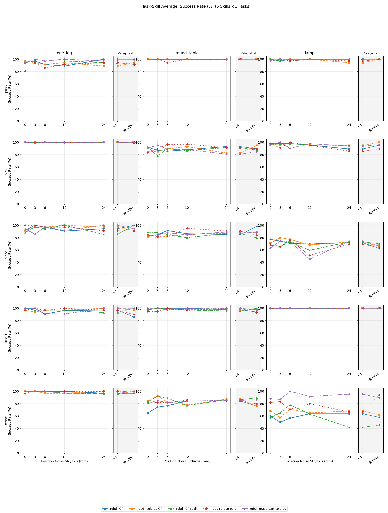
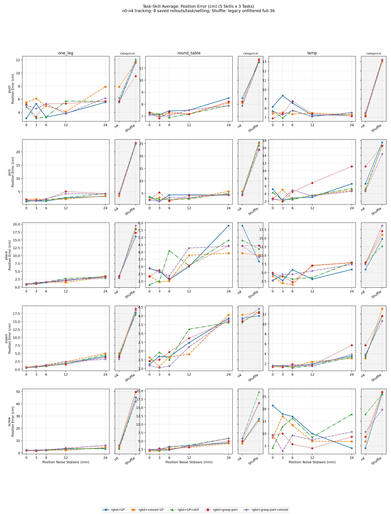
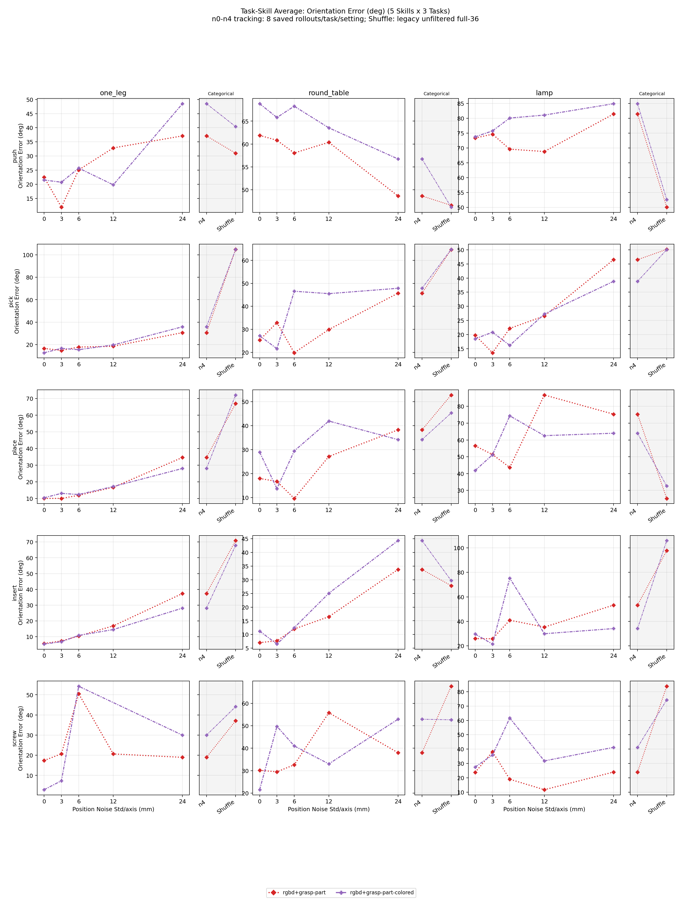
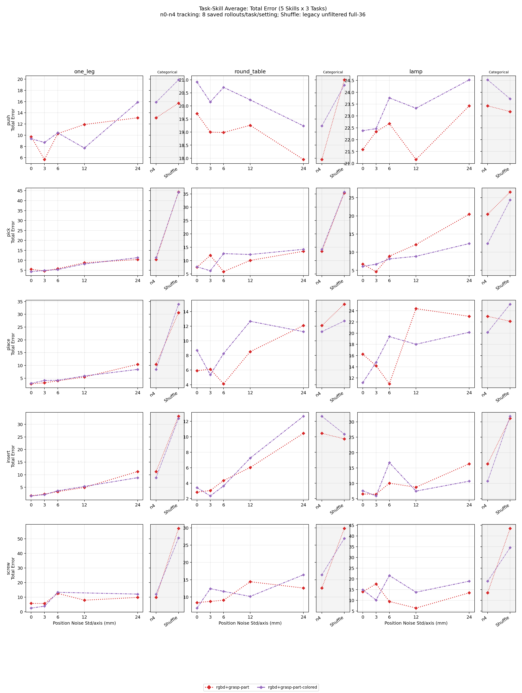

# 打点噪声鲁棒性实验：Clean Train -> Noisy Eval

> [!NOTE]
> **成功率与 tracking 的样本量不同。** n0-n4 成功率使用每个 task/setting 的 36 个 rollout；n0-n4 tracking 从每个 task/setting 已保存的 8 个 rollout pickle 重新计算，用作整体 tracking 趋势的估计。Tracking 图照常画出 Shuffle 并与 n4 连线，但该端点来自旧 full-36 summary，无法事后执行 workspace 过滤，只作为 legacy 参考，不进入正式 tracking 表格、拟合或结论。

## 1. 结果图

### 1.1 Task Overall Success

### 1.2 Task Overall Tracking

> 图中灰色分类区的 Shuffle tracking 来自 legacy unfiltered full-36 summary；其纵轴与 n0-n4 共享，但不共享数值噪声横轴。

### 1.3 Task-Skill Average（5 Skills × 3 Tasks）

每张总图为 5 行 skill × 3 列 task：行顺序为 `push/pick/place/insert/screw`，列顺序为 `one_leg/round_table/lamp`；每个子图中的曲线表示不同 condition。不同单位的 success、position、orientation 和 total 分图展示；GP 系列不定义 orientation/total。Tracking 子图中 n0-n4 为 workspace-filtered saved-8，Shuffle 为 legacy unfiltered full-36 参考端点。

#### Success Rate (%)

#### Position Error (cm)

#### Orientation Error (deg)

#### Total Error

### 1.4 主要结论

- **`rgbd+colored GP` 是数值噪声下最稳定的 condition。** n0-n4 overall range/std 为 `3.7/1.4 pp`，略优于 `rgbd+GP` 的 `4.6/1.6 pp`；one_leg 与 round_table 的 task 内 range 分别为 `5.6/8.3 pp`，明显小于 GP 的 `19.4/16.7 pp`，lamp 均为 `11.1 pp`。两者 n4 overall 都是 `55.6%`，因此结论为“colored GP 最稳定，GP 在总体上仍稳定但对 task/reset randomization 更敏感”。
- **现有 tracking 不支持推断 GP 与 colored GP 使用了不同机制。** 排除 workspace 外的 guidance target 后，两者 position tracking 与噪声均保持正相关：GP `r=0.945`，colored GP `r=0.921`。原 colored GP round_table n2 极值来自单个部件飞出工作空间的仿真失败，并非噪声响应。由于两个 checkpoint 不同且 tracking 只有 saved-8，当前只能比较经验稳定性，不能据此解释内部机制。
- **`rgbd+GP` 在 round_table 上随噪声上升的现象集中在第一段 screw，并非所有 skill 都受益。** task success 从 `10/36 = 27.8%` 增至 `16/36 = 44.4%`。但 `leg-top-pick` 完成数保持 `33/36 -> 33/36`，`leg-top-place` 反而从 `27/33` 降为 `26/33`；主要变化是 `leg-top-screw` 条件完成率按 n0-n4 呈 `53.8% -> 68.0% -> 78.6% -> 84.6% -> 84.6%`，完成数从 `14/26` 增至 `22/26`。其他 condition 的同一 step 不呈现一致单调提升，因此不是 round_table 对噪声的普遍收益。所有幅度共用 annotation noise seed 0，在相同 env/phase 上相当于将同一噪声方向按 std 放大，可能恰好补偿该 checkpoint 在 screw 上的局部动作偏差；同时各 setting 的 reset 未配对。n0/n4 的 95% Wilson 区间分别为 `[15.8, 44.0]%` 与 `[29.5, 60.4]%`，明显重叠，所以该曲线应解释为 seed/checkpoint-specific 局部补偿加抽样波动，而不是更大噪声能提高成功率。要验证是否存在真实的有益偏移，需要固定一组 paired reset seeds，并对多个 annotation noise seeds 汇总均值。
- **`rgbd+GP+skill` 对连续数值噪声不稳定，但可能更容易拒绝明显错误的 guidance。** 它的 n0-n4 range 为 `13.9 pp`，n4 overall 为 `47.2%`，低于 GP/colored GP；但它是唯一从 n4 到 Shuffle 回升的模型：`47.2% -> 52.8%` (`+5.6 pp`, `51 -> 57`/108)。回升几乎全部来自 one_leg (`72.2% -> 88.9%`)；round_table/lamp 仅变化 `-2.8/+2.8 pp`。一种解释是 n4 仍是“可信但偏移”的点，模型会被误导；Shuffle 与 one-hot skill/场景明显冲突，触发对 guidance 的 gating，退回 RGBD+skill 路径。由于两组 reset 未配对且只差 6 次成功，这不是统计显著性证据。
- **Grasp annotation 总体可容忍噪声，但单 task 波动更大。** grasp-part 与 colored grasp-part 的 n0-n4 overall range 为 `9.3/13.0 pp`；最大 task range 都达到 `27.8 pp`（分别出现在 round_table/lamp）。同时 position/orientation tracking 与噪声保持正相关，更符合“仍围绕视觉语义完成动作，但对零件初始随机化较敏感”的解释。
- **Strong Shuffle 表明语义正确的 guidance 仍然有用，policy 并非只依赖 RGBD。** 五个 condition 合计从 n4 的 `300/540 = 55.6%` 到 Shuffle 的 `284/540 = 52.6%`，只变化 `-3.0 pp`；其中 `4/5` 个 condition 下降：rgbd+GP `-4.6 pp`、rgbd+colored GP `-3.7 pp`、rgbd+grasp-part `-7.4 pp`、rgbd+grasp-part-colored `-4.6 pp`，只有 rgbd+GP+skill 回升 `+5.6 pp`。图像与深度保持不变而 semantic-state guidance 被置乱后，大多数模型同向下降，支持正确 guidance 确实参与决策；Shuffle 后成功率仍约为一半，则说明模型同时保留了视觉/低维 fallback，而不是 guidance 是唯一输入。由于每组只有 108 rollout 且 reset 未配对，单个 condition 的 3.7-7.4 pp 降幅仍应视为趋势证据。

#### Tracking workspace 排除统计

仅统计用于 n0-n4 tracking 曲线的 saved-8 rollout。单元格为 `workspace 外 final skill segment 数 / 具有有限 guidance target 的 final skill segment 总数`；同一 semantic state 重复进入时，过滤发生在取最小 tracking error 之前。`Invalid Target` 单列记录缺失或非有限 target，不与 workspace 外数据混合。

| Condition | one_leg Excluded | round_table Excluded | lamp Excluded | Invalid Target |
| --- | --- | --- | --- | --- |
| rgbd+GP | 35/243 (14.40%) | 31/477 (6.50%) | 25/199 (12.56%) | 2 |
| rgbd+colored GP | 30/227 (13.22%) | 36/385 (9.35%) | 24/226 (10.62%) | 0 |
| rgbd+GP+skill | 32/241 (13.28%) | 35/424 (8.25%) | 26/219 (11.87%) | 1 |
| rgbd+grasp-part | 36/235 (15.32%) | 37/858 (4.31%) | 25/212 (11.79%) | 1 |
| rgbd+grasp-part-colored | 34/231 (14.72%) | 32/802 (3.99%) | 31/238 (13.03%) | 1 |

历史排除项主要包含两类：任务完成后的 annotation 早退分支错误返回 robot-local 缓存坐标，以及家具部件被物理仿真抛出工作空间。前者已改为缓存并返回实际用于绘图的 sim-local noisy/clean guidance；该表反映历史数据质量，不应解释为 condition 本身的失败率。

#### n0-n4 成功率稳定性

Range/std 越小表示对数值噪声幅度越稳定；task range 是同一 task 在 n0-n4 间的最大成功率差。

| Condition | Overall Range | Overall Std | one_leg Range | round_table Range | lamp Range | n4->Shuffle |
| --- | --- | --- | --- | --- | --- | --- |
| rgbd+GP | 4.6 pp | 1.6 pp | 19.4 pp | 16.7 pp | 11.1 pp | -4.6 pp |
| rgbd+colored GP | 3.7 pp | 1.4 pp | 5.6 pp | 8.3 pp | 11.1 pp | -3.7 pp |
| rgbd+GP+skill | 13.9 pp | 5.0 pp | 19.4 pp | 16.7 pp | 22.2 pp | +5.6 pp |
| rgbd+grasp-part | 9.3 pp | 3.0 pp | 19.4 pp | 27.8 pp | 13.9 pp | -7.4 pp |
| rgbd+grasp-part-colored | 13.0 pp | 4.9 pp | 13.9 pp | 8.3 pp | 27.8 pp | -4.6 pp |

## 2. 实验设置

- 只包含有空间 guidance 的 5 个 condition：`rgbd+GP`、`rgbd+colored GP`、`rgbd+GP+skill`、`rgbd+grasp-part`、`rgbd+grasp-part-colored`。
- 训练 checkpoint 均为 clean-train 模型；本轮只评测 clean train -> noisy/shuffled eval。
- 每个 condition、noise level、task 的成功率使用 36 个 rollout，randomness 为 low。
- n0-n4 tracking 使用每个 condition、noise level、task 已保存的 8 个 rollout；旧 Shuffle full-36 tracking 不含 workspace exclusion 明细，仅在 tracking 图中作为 legacy 参考端点，表格中仍标记为 unavailable。
- 旧 pickle 仅保存通用 skill 标签；重算时将连续 skill 阶段按 task 的有序状态机 schema 对齐回 semantic state，同一推断 semantic state 多次进入时仍保留最小误差。
- point 的 position noise 为 xyz 每轴独立的 Gaussian std，并逐轴裁剪到 ±2σ；n0-n4 为 0/3/6/12/24 mm per axis。
- grasp-part 使用相同 position noise，并耦合 0/2.5/5/10/20 deg orientation noise。
- n1-n4 均使用 annotation noise seed 0；相同 env/phase 的标准高斯方向相同，仅按 noise std 缩放。因此单条幅度曲线仍包含 noise-seed-specific 效应，不等价于对零均值噪声分布取期望。
- Shuffle 优先从同 task、同 skill type 的其他 semantic state 选择 donor；若不存在，则从同 task 的任意其他 semantic state 选择，禁止回退到当前 state。
- tracking error 比较每个连续 skill 阶段最后一帧 final EE pose 与实际画出的 noisy/shuffled guidance pose。
- tracking 只接收 sim-local workspace `x=[0.000, 0.500] m, y=[-0.550, 0.550] m, z=[0.415, 0.815] m` 内的 guidance target；workspace 外 target 会被计数并排除。z 下界取桌面高度，因为 guidance 是物体表面点而不是 EE origin。
- 同一 episode 多次进入同一 semantic skill state 时，point 保留最小 position error，grasp-part 保留最小 total error。
- point 只报告 position tracking；grasp-part 报告 position/orientation/total，其中 `total = pos_m / 0.01 + ori_deg / 5`。
- 当前完成组数：`30`；task-level 数据行：`90`。
- n0-n4 Tracking 可发布覆盖：`75/75` 个 task/setting；来源为 saved-8 重算。Shuffle 正式 tracking 覆盖为 `0/15`；图中 legacy 端点等待按新 workspace 规则重跑后替换。

## 3. Task Overall 表

每个 task 大列内给出成功率和适用 tracking 指标；GP 显示 `P`，grasp-part 显示 `P/O/T`。括号中的 tracking `n` 是进入汇总的 skill-state 记录数，不是 rollout 数。

| Condition | one_leg | round_table | lamp |
| --- | --- | --- | --- |
| rgbd+GP | n0: SR 88.9% (32/36) P 1.62 (n=41)  n1: SR 97.2% (35/36) P 2.12 (n=39)  n2: SR 80.6% (29/36) P 1.79 (n=43)  n3: SR 77.8% (28/36) P 2.63 (n=38)  n4: SR 88.9% (32/36) P 3.93 (n=36)  shuffle: SR 80.6% (29/36) Tracking unavailable (workspace filtering unavailable) | n0: SR 27.8% (10/36) P 3.33 (n=53)  n1: SR 33.3% (12/36) P 2.77 (n=51)  n2: SR 38.9% (14/36) P 3.22 (n=52)  n3: SR 41.7% (15/36) P 4.13 (n=32)  n4: SR 44.4% (16/36) P 4.93 (n=42)  shuffle: SR 41.7% (15/36) Tracking unavailable (workspace filtering unavailable) | n0: SR 41.7% (15/36) P 6.54 (n=28)  n1: SR 30.6% (11/36) P 5.96 (n=32)  n2: SR 33.3% (12/36) P 6.13 (n=37)  n3: SR 36.1% (13/36) P 4.53 (n=35)  n4: SR 33.3% (12/36) P 6.17 (n=27)  shuffle: SR 30.6% (11/36) Tracking unavailable (workspace filtering unavailable) |
| rgbd+colored GP | n0: SR 86.1% (31/36) P 2.30 (n=38)  n1: SR 86.1% (31/36) P 2.70 (n=35)  n2: SR 83.3% (30/36) P 2.38 (n=38)  n3: SR 88.9% (32/36) P 2.49 (n=40)  n4: SR 86.1% (31/36) P 4.73 (n=30)  shuffle: SR 80.6% (29/36) Tracking unavailable (workspace filtering unavailable) | n0: SR 30.6% (11/36) P 3.02 (n=46)  n1: SR 38.9% (14/36) P 2.94 (n=49)  n2: SR 36.1% (13/36) P 2.68 (n=48)  n3: SR 36.1% (13/36) P 3.49 (n=44)  n4: SR 38.9% (14/36) P 4.87 (n=40)  shuffle: SR 38.9% (14/36) Tracking unavailable (workspace filtering unavailable) | n0: SR 38.9% (14/36) P 4.52 (n=40)  n1: SR 38.9% (14/36) P 5.64 (n=35)  n2: SR 47.2% (17/36) P 4.83 (n=43)  n3: SR 36.1% (13/36) P 5.63 (n=29)  n4: SR 41.7% (15/36) P 6.24 (n=27)  shuffle: SR 36.1% (13/36) Tracking unavailable (workspace filtering unavailable) |
| rgbd+GP+skill | n0: SR 83.3% (30/36) P 1.97 (n=38)  n1: SR 91.7% (33/36) P 1.67 (n=43)  n2: SR 88.9% (32/36) P 1.97 (n=39)  n3: SR 91.7% (33/36) P 3.28 (n=38)  n4: SR 72.2% (26/36) P 4.36 (n=33)  shuffle: SR 88.9% (32/36) Tracking unavailable (workspace filtering unavailable) | n0: SR 44.4% (16/36) P 3.05 (n=55)  n1: SR 44.4% (16/36) P 2.83 (n=56)  n2: SR 47.2% (17/36) P 3.31 (n=48)  n3: SR 30.6% (11/36) P 3.72 (n=34)  n4: SR 44.4% (16/36) P 4.95 (n=44)  shuffle: SR 41.7% (15/36) Tracking unavailable (workspace filtering unavailable) | n0: SR 33.3% (12/36) P 4.46 (n=32)  n1: SR 36.1% (13/36) P 4.96 (n=34)  n2: SR 47.2% (17/36) P 5.15 (n=40)  n3: SR 27.8% (10/36) P 4.46 (n=33)  n4: SR 25.0% (9/36) P 7.92 (n=35)  shuffle: SR 27.8% (10/36) Tracking unavailable (workspace filtering unavailable) |
| rgbd+grasp-part | n0: SR 75.0% (27/36) P 2.25 / O 14.72 / T 5.20 (n=39)  n1: SR 94.4% (34/36) P 1.73 / O 12.40 / T 4.21 (n=43)  n2: SR 80.6% (29/36) P 2.57 / O 17.76 / T 6.12 (n=38)  n3: SR 88.9% (32/36) P 3.91 / O 20.80 / T 8.07 (n=35)  n4: SR 83.3% (30/36) P 4.31 / O 34.06 / T 11.12 (n=35)  shuffle: SR 75.0% (27/36) Tracking unavailable (workspace filtering unavailable) | n0: SR 30.6% (11/36) P 2.99 / O 26.81 / T 8.36 (n=50)  n1: SR 33.3% (12/36) P 3.92 / O 28.14 / T 9.55 (n=44)  n2: SR 41.7% (15/36) P 2.54 / O 20.33 / T 6.61 (n=58)  n3: SR 58.3% (21/36) P 3.75 / O 33.38 / T 10.42 (n=48)  n4: SR 52.8% (19/36) P 4.60 / O 40.48 / T 12.69 (n=41)  shuffle: SR 30.6% (11/36) Tracking unavailable (workspace filtering unavailable) | n0: SR 47.2% (17/36) P 4.68 / O 43.37 / T 13.35 (n=34)  n1: SR 41.7% (15/36) P 4.20 / O 41.75 / T 12.55 (n=32)  n2: SR 44.4% (16/36) P 4.69 / O 37.76 / T 12.24 (n=41)  n3: SR 33.3% (12/36) P 6.10 / O 51.48 / T 16.40 (n=29)  n4: SR 33.3% (12/36) P 8.62 / O 63.53 / T 21.33 (n=24)  shuffle: SR 41.7% (15/36) Tracking unavailable (workspace filtering unavailable) |
| rgbd+grasp-part-colored | n0: SR 88.9% (32/36) P 2.12 / O 12.73 / T 4.66 (n=37)  n1: SR 83.3% (30/36) P 2.03 / O 14.63 / T 4.95 (n=41)  n2: SR 86.1% (31/36) P 2.66 / O 17.23 / T 6.11 (n=38)  n3: SR 80.6% (29/36) P 3.42 / O 18.20 / T 7.06 (n=37)  n4: SR 94.4% (34/36) P 4.22 / O 34.93 / T 11.20 (n=34)  shuffle: SR 91.7% (33/36) Tracking unavailable (workspace filtering unavailable) | n0: SR 41.7% (15/36) P 3.03 / O 30.61 / T 9.15 (n=50)  n1: SR 47.2% (17/36) P 2.74 / O 26.64 / T 8.07 (n=49)  n2: SR 41.7% (15/36) P 3.36 / O 40.57 / T 11.47 (n=34)  n3: SR 38.9% (14/36) P 3.88 / O 41.35 / T 12.15 (n=44)  n4: SR 38.9% (14/36) P 4.80 / O 44.87 / T 13.78 (n=42)  shuffle: SR 38.9% (14/36) Tracking unavailable (workspace filtering unavailable) | n0: SR 38.9% (14/36) P 4.27 / O 37.98 / T 11.87 (n=37)  n1: SR 58.3% (21/36) P 3.89 / O 41.01 / T 12.09 (n=40)  n2: SR 52.8% (19/36) P 5.57 / O 55.96 / T 16.76 (n=31)  n3: SR 30.6% (11/36) P 4.94 / O 48.54 / T 14.65 (n=32)  n4: SR 55.6% (20/36) P 6.29 / O 53.77 / T 17.04 (n=34)  shuffle: SR 44.4% (16/36) Tracking unavailable (workspace filtering unavailable) |

## 4. 端点结果

跨三个 task 汇总 n0、n4 与 Shuffle；Shuffle 差值以 n4 为基准。

| Condition | n0 Success | n4 Success | n0->n4 Success Delta | Shuffle Success | n4->Shuffle Success Delta | Tracking Metric | n0 Tracking | n4 Tracking | n0->n4 Tracking Delta | Shuffle Tracking | n4->Shuffle Tracking Delta |
| --- | --- | --- | --- | --- | --- | --- | --- | --- | --- | --- | --- |
| rgbd+GP | 52.8% | 55.6% | +2.8 pp | 50.9% | -4.6 pp | Position (cm) | 3.49 | 4.91 | +1.42 | unavailable | unavailable |
| rgbd+colored GP | 51.9% | 55.6% | +3.7 pp | 51.9% | -3.7 pp | Position (cm) | 3.28 | 5.21 | +1.93 | unavailable | unavailable |
| rgbd+GP+skill | 53.7% | 47.2% | -6.5 pp | 52.8% | +5.6 pp | Position (cm) | 3.08 | 5.70 | +2.62 | unavailable | unavailable |
| rgbd+grasp-part | 50.9% | 56.5% | +5.6 pp | 49.1% | -7.4 pp | Total | 8.74 | 14.22 | +5.48 | unavailable | unavailable |
| rgbd+grasp-part-colored | 56.5% | 63.0% | +6.5 pp | 58.3% | -4.6 pp | Total | 8.62 | 13.99 | +5.37 | unavailable | unavailable |

### 4.1 Shuffle 成功率结果

成功率以 n0 为基准；Shuffle 成功率来自完整 36 rollout。旧 tracking summary 不含 workspace exclusion 明细，相关列标记为 unavailable。

| Condition | n0 Success | Shuffle Success | Delta | Shuffle Pos (cm) | Shuffle Ori (deg) | Shuffle Total | Tracked States |
| --- | --- | --- | --- | --- | --- | --- | --- |
| rgbd+GP | 52.8% | 50.9% | -1.9 pp | unavailable | N/A | N/A | 0 |
| rgbd+colored GP | 51.9% | 51.9% | +0.0 pp | unavailable | N/A | N/A | 0 |
| rgbd+GP+skill | 53.7% | 52.8% | -0.9 pp | unavailable | N/A | N/A | 0 |
| rgbd+grasp-part | 50.9% | 49.1% | -1.9 pp | unavailable | N/A | N/A | 0 |
| rgbd+grasp-part-colored | 56.5% | 58.3% | +1.9 pp | unavailable | N/A | N/A | 0 |

### 4.2 Fallback 修复前后

旧 Shuffle 允许回退到当前 semantic state；新 Shuffle 禁止 same-state donor，并在同类型无候选时从任意其他 skill state 取点。仅比较成功率。

| Condition | n0 | Old Shuffle | Old - n0 | Strong Shuffle | Strong - n0 |
| --- | --- | --- | --- | --- | --- |
| rgbd+GP | 52.8% | 54.6% | +1.9 pp | 50.9% | -1.9 pp |
| rgbd+colored GP | 51.9% | 50.0% | -1.9 pp | 51.9% | +0.0 pp |
| rgbd+GP+skill | 53.7% | 68.5% | +14.8 pp | 52.8% | -0.9 pp |
| rgbd+grasp-part | 50.9% | 58.3% | +7.4 pp | 49.1% | -1.9 pp |
| rgbd+grasp-part-colored | 56.5% | 64.8% | +8.3 pp | 58.3% | +1.9 pp |
| All conditions | 53.1% | 59.3% | +6.1 pp | 52.6% | -0.6 pp |

### 4.3 结论

- 五个 condition 合计：n4 为 `300/540 = 55.6%`，强 Shuffle 为 `284/540 = 52.6%`，变化 `-3.0 pp`。
- `4/5` 个 condition 从 n4 到 Shuffle 下降：rgbd+GP `-4.6 pp`、rgbd+colored GP `-3.7 pp`、rgbd+grasp-part `-7.4 pp`、rgbd+grasp-part-colored `-4.6 pp`；只有 rgbd+GP+skill 回升 `+5.6 pp`。
- 图像与深度不变时，破坏 guidance 的 semantic-state 对应关系会在大多数 condition 上降低成功率，说明 policy 并非只依赖 RGBD；语义正确的 guidance 仍提供有效信息。Shuffle 后仍保留约一半成功率，则说明模型也能使用视觉或低维输入 fallback，guidance 不是唯一的信息源。
- 旧 Shuffle full-36 summary 没有 workspace exclusion 明细，且受完成态坐标早退 bug 影响，因此其 tracking error 已撤下；仅保留不依赖 tracking 的成功率结果。
- task-level 正负波动仍较大，且 clean 与 Shuffle rollout 未按相同 reset seed 配对；这些波动不能解释为错误 guidance 带来的真实提升。

### 4.4 Numeric-Noise Tracking Response

本节只拟合 n0-n4 的 saved-8 tracking 估计；8-rollout 的抽样波动会直接影响 slope、Pearson r 和 R^2，应结合曲线而不是单独作为显著性结论。

| Condition | Metric | n0 | n4 | Delta | Slope | Pearson r | R^2 |
| --- | --- | --- | --- | --- | --- | --- | --- |
| rgbd+GP | Position | 3.49 | 4.91 | +1.42 | 0.618 cm/cm | 0.945 | 0.893 |
| rgbd+colored GP | Position | 3.28 | 5.21 | +1.93 | 0.771 cm/cm | 0.921 | 0.849 |
| rgbd+GP+skill | Position | 3.08 | 5.70 | +2.62 | 1.132 cm/cm | 0.972 | 0.945 |
| rgbd+grasp-part | Position | 3.22 | 5.46 | +2.24 | 1.038 cm/cm | 0.967 | 0.935 |
| rgbd+grasp-part | Orientation | 27.55 | 43.76 | +16.21 | 0.932 deg/deg | 0.940 | 0.883 |
| rgbd+grasp-part | Total | 8.74 | 14.22 | +5.48 | 0.972 total/unit | 0.953 | 0.907 |
| rgbd+grasp-part-colored | Position | 3.13 | 5.08 | +1.95 | 0.879 cm/cm | 0.962 | 0.925 |
| rgbd+grasp-part-colored | Orientation | 27.48 | 44.55 | +17.07 | 0.850 deg/deg | 0.931 | 0.866 |
| rgbd+grasp-part-colored | Total | 8.62 | 13.99 | +5.37 | 0.861 total/unit | 0.947 | 0.896 |

### 4.5 Tracking 解释

- 从 n0 到 n4，五个 condition 的平均 position tracking error 均增加 `1.42-2.62 cm`；grasp-part 的 orientation error 增加 `16.21-17.07 deg`。
- Position error 与 position noise 的相关性均为正；最强为 `rgbd+GP+skill` (`r=0.972`)，最弱为 `rgbd+colored GP` (`r=0.921`)。弱相关曲线主要受 saved-8 小样本及 task/skill 极值影响，不宜解释为真实非单调响应。
- 这里的 target 是 noisy guidance，而不是真实 semantic target。若 policy 完全跟随 noisy guidance，tracking error 应保持低且近似平坦；tracking error 随噪声增加，同时成功率没有同步下降，说明动作仍受 RGBD、skill 或 clean semantic prior 约束，只部分跟随甚至主动拒绝偏移 guidance。
- 旧 Shuffle tracking 不满足 workspace 过滤要求，仅作为曲线中的 legacy 参考端点，不进入 tracking 表格、拟合或正式结论；需要用修复后的 evaluator 重跑后才能正式比较 n4 与 Shuffle tracking。

## 5. 成功率阈值对应的最大数值噪声

### 5.1 `success_rate >= 80%`

| Condition | Threshold | Max Pos Std/axis (mm) | Max Ori Std (deg) |
| --- | --- | --- | --- |
| rgbd+GP | 80% | none | none |
| rgbd+colored GP | 80% | none | none |
| rgbd+GP+skill | 80% | none | none |
| rgbd+grasp-part | 80% | none | none |
| rgbd+grasp-part-colored | 80% | none | none |

### 5.2 `success_rate >= 60%`

| Condition | Threshold | Max Pos Std/axis (mm) | Max Ori Std (deg) |
| --- | --- | --- | --- |
| rgbd+GP | 60% | none | none |
| rgbd+colored GP | 60% | none | none |
| rgbd+GP+skill | 60% | 6 | 0.0 |
| rgbd+grasp-part | 60% | 12 | 10.0 |
| rgbd+grasp-part-colored | 60% | 24 | 20.0 |

## 6. Skill Average 表

跨三个 task 汇总同类 skill；point 每格为 `SR/P`，grasp-part 为 `SR/P/O/T`。

| Condition | Skill Type | n0 | n1 | n2 | n3 | n4 | shuffle |
| --- | --- | --- | --- | --- | --- | --- | --- |
| rgbd+GP | insert | SR 98.9% (94/95) P 1.06 (n=21) | SR 100.0% (98/98) P 1.42 (n=23) | SR 96.9% (95/98) P 1.41 (n=24) | SR 98.9% (94/95) P 2.09 (n=18) | SR 98.0% (100/102) P 3.91 (n=20) | SR 92.3% (96/104) Tracking unavailable (workspace filtering unavailable) |
| rgbd+GP | pick | SR 97.0% (161/166) P 3.10 (n=39) | SR 95.2% (160/168) P 1.74 (n=37) | SR 94.7% (160/169) P 2.86 (n=42) | SR 94.7% (162/171) P 3.30 (n=35) | SR 94.9% (167/176) P 4.54 (n=34) | SR 94.7% (162/171) Tracking unavailable (workspace filtering unavailable) |
| rgbd+GP | place | SR 83.2% (104/125) P 2.69 (n=26) | SR 85.5% (106/124) P 2.26 (n=26) | SR 85.5% (106/124) P 3.09 (n=29) | SR 81.7% (103/126) P 2.71 (n=23) | SR 83.7% (108/129) P 5.10 (n=26) | SR 87.3% (110/126) Tracking unavailable (workspace filtering unavailable) |
| rgbd+GP | push | SR 99.1% (107/108) P 6.12 (n=24) | SR 98.1% (106/108) P 7.27 (n=23) | SR 97.2% (105/108) P 6.28 (n=21) | SR 96.3% (103/107) P 6.06 (n=19) | SR 100.0% (108/108) P 6.78 (n=17) | SR 100.0% (107/107) Tracking unavailable (workspace filtering unavailable) |
| rgbd+GP | screw | SR 75.5% (71/94) P 5.50 (n=12) | SR 77.6% (76/98) P 7.04 (n=13) | SR 78.9% (75/95) P 6.00 (n=16) | SR 84.0% (79/94) P 6.03 (n=10) | SR 84.0% (84/100) P 4.36 (n=8) | SR 78.9% (75/95) Tracking unavailable (workspace filtering unavailable) |
| rgbd+colored GP | insert | SR 97.9% (92/94) P 1.33 (n=22) | SR 98.0% (98/100) P 1.18 (n=21) | SR 97.9% (95/97) P 1.45 (n=24) | SR 98.0% (98/100) P 2.13 (n=18) | SR 98.9% (93/94) P 4.17 (n=17) | SR 98.0% (100/102) Tracking unavailable (workspace filtering unavailable) |
| rgbd+colored GP | pick | SR 93.8% (167/178) P 2.27 (n=40) | SR 93.8% (166/177) P 3.30 (n=37) | SR 96.0% (167/174) P 2.23 (n=41) | SR 96.6% (169/175) P 2.86 (n=37) | SR 92.7% (152/164) P 4.70 (n=31) | SR 98.3% (170/173) Tracking unavailable (workspace filtering unavailable) |
| rgbd+colored GP | place | SR 80.6% (104/129) P 2.46 (n=25) | SR 84.6% (110/130) P 1.76 (n=25) | SR 84.0% (110/131) P 1.76 (n=28) | SR 83.3% (110/132) P 4.08 (n=28) | SR 85.3% (99/116) P 5.00 (n=25) | SR 82.1% (110/134) Tracking unavailable (workspace filtering unavailable) |
| rgbd+colored GP | push | SR 99.1% (107/108) P 6.74 (n=24) | SR 98.1% (106/108) P 6.90 (n=23) | SR 97.2% (105/108) P 6.42 (n=21) | SR 98.1% (106/108) P 6.06 (n=20) | SR 94.4% (102/108) P 7.68 (n=17) | SR 98.1% (106/108) Tracking unavailable (workspace filtering unavailable) |
| rgbd+colored GP | screw | SR 85.9% (79/92) P 4.93 (n=13) | SR 85.7% (84/98) P 6.62 (n=13) | SR 84.2% (80/95) P 7.76 (n=15) | SR 81.6% (80/98) P 3.68 (n=10) | SR 87.0% (80/92) P 4.67 (n=7) | SR 79.0% (79/100) Tracking unavailable (workspace filtering unavailable) |
| rgbd+GP+skill | insert | SR 99.0% (98/99) P 1.22 (n=22) | SR 98.9% (91/92) P 1.49 (n=25) | SR 99.0% (99/100) P 1.28 (n=22) | SR 97.8% (88/90) P 2.24 (n=18) | SR 96.0% (95/99) P 3.83 (n=21) | SR 100.0% (93/93) Tracking unavailable (workspace filtering unavailable) |
| rgbd+GP+skill | pick | SR 96.0% (166/173) P 2.88 (n=40) | SR 92.3% (155/168) P 2.13 (n=41) | SR 96.0% (168/175) P 2.22 (n=42) | SR 94.6% (158/167) P 3.04 (n=33) | SR 95.9% (164/171) P 4.83 (n=32) | SR 94.6% (158/167) Tracking unavailable (workspace filtering unavailable) |
| rgbd+GP+skill | place | SR 82.0% (105/128) P 1.83 (n=26) | SR 83.2% (99/119) P 2.35 (n=30) | SR 83.3% (110/132) P 3.18 (n=30) | SR 78.7% (96/122) P 3.14 (n=24) | SR 82.0% (105/128) P 5.35 (n=29) | SR 82.0% (100/122) Tracking unavailable (workspace filtering unavailable) |
| rgbd+GP+skill | push | SR 98.1% (106/108) P 6.64 (n=24) | SR 98.1% (106/108) P 5.68 (n=23) | SR 98.1% (106/108) P 5.85 (n=21) | SR 99.1% (107/108) P 6.57 (n=20) | SR 98.1% (106/108) P 6.82 (n=17) | SR 97.2% (105/108) Tracking unavailable (workspace filtering unavailable) |
| rgbd+GP+skill | screw | SR 82.7% (81/98) P 2.77 (n=13) | SR 89.0% (81/91) P 5.26 (n=14) | SR 89.9% (89/99) P 8.54 (n=12) | SR 81.8% (72/88) P 5.10 (n=10) | SR 77.9% (74/95) P 10.23 (n=13) | SR 81.7% (76/93) Tracking unavailable (workspace filtering unavailable) |
| rgbd+grasp-part | insert | SR 96.6% (86/89) P 1.10 / O 11.10 / T 3.32 (n=21) | SR 97.8% (91/93) P 1.21 / O 11.68 / T 3.54 (n=22) | SR 99.0% (96/97) P 1.73 / O 19.12 / T 5.56 (n=27) | SR 98.1% (104/106) P 2.17 / O 20.37 / T 6.25 (n=20) | SR 99.0% (97/98) P 3.96 / O 37.54 / T 11.47 (n=18) | SR 93.3% (83/89) Tracking unavailable (workspace filtering unavailable) |
| rgbd+grasp-part | pick | SR 93.9% (153/163) P 2.41 / O 20.59 / T 6.52 (n=38) | SR 94.1% (160/170) P 3.01 / O 20.72 / T 7.15 (n=38) | SR 98.8% (169/171) P 2.72 / O 19.79 / T 6.68 (n=43) | SR 97.7% (171/175) P 5.12 / O 24.79 / T 10.08 (n=37) | SR 93.5% (159/170) P 6.01 / O 40.74 / T 14.16 (n=32) | SR 93.5% (159/170) Tracking unavailable (workspace filtering unavailable) |
| rgbd+grasp-part | place | SR 82.9% (97/117) P 2.78 / O 28.37 / T 8.45 (n=28) | SR 81.5% (101/124) P 2.62 / O 25.34 / T 7.69 (n=26) | SR 83.5% (111/133) P 2.06 / O 18.12 / T 5.68 (n=30) | SR 82.8% (111/134) P 3.88 / O 40.40 / T 11.96 (n=26) | SR 84.6% (104/123) P 4.95 / O 45.70 / T 14.09 (n=26) | SR 78.9% (97/123) Tracking unavailable (workspace filtering unavailable) |
| rgbd+grasp-part | push | SR 92.6% (100/108) P 6.49 / O 52.56 / T 17.00 (n=24) | SR 98.1% (106/108) P 5.80 / O 48.61 / T 15.52 (n=23) | SR 92.6% (100/108) P 7.10 / O 49.88 / T 17.08 (n=21) | SR 97.2% (105/108) P 6.58 / O 53.34 / T 17.25 (n=19) | SR 97.2% (105/108) P 6.73 / O 57.40 / T 18.21 (n=17) | SR 97.2% (105/108) Tracking unavailable (workspace filtering unavailable) |
| rgbd+grasp-part | screw | SR 86.0% (74/86) P 4.06 / O 26.45 / T 9.35 (n=12) | SR 89.0% (81/91) P 3.87 / O 28.60 / T 9.59 (n=10) | SR 84.4% (81/96) P 3.92 / O 27.76 / T 9.47 (n=16) | SR 89.4% (93/104) P 3.47 / O 43.46 / T 12.16 (n=10) | SR 86.6% (84/97) P 5.67 / O 33.28 / T 12.32 (n=7) | SR 89.2% (74/83) Tracking unavailable (workspace filtering unavailable) |
| rgbd+grasp-part-colored | insert | SR 100.0% (90/90) P 1.10 / O 14.08 / T 3.91 (n=20) | SR 100.0% (101/101) P 1.11 / O 10.90 / T 3.29 (n=21) | SR 96.0% (95/99) P 1.44 / O 28.44 / T 7.12 (n=15) | SR 96.6% (86/89) P 2.19 / O 21.58 / T 6.50 (n=17) | SR 100.0% (98/98) P 3.62 / O 36.49 / T 10.92 (n=21) | SR 99.0% (95/96) Tracking unavailable (workspace filtering unavailable) |
| rgbd+grasp-part-colored | pick | SR 95.9% (165/172) P 2.11 / O 19.37 / T 5.98 (n=41) | SR 97.8% (174/178) P 1.93 / O 19.50 / T 5.83 (n=42) | SR 93.8% (167/178) P 3.32 / O 25.77 / T 8.47 (n=37) | SR 95.4% (166/174) P 3.66 / O 30.45 / T 9.75 (n=39) | SR 92.1% (163/177) P 4.48 / O 41.26 / T 12.73 (n=35) | SR 93.9% (169/180) Tracking unavailable (workspace filtering unavailable) |
| rgbd+grasp-part-colored | place | SR 79.1% (102/129) P 2.34 / O 27.98 / T 7.94 (n=27) | SR 81.2% (112/138) P 2.94 / O 25.27 / T 7.99 (n=32) | SR 85.5% (112/131) P 2.73 / O 36.27 / T 9.98 (n=22) | SR 73.8% (96/130) P 4.10 / O 40.76 / T 12.25 (n=28) | SR 86.6% (110/127) P 4.89 / O 41.71 / T 13.23 (n=26) | SR 82.0% (109/133) Tracking unavailable (workspace filtering unavailable) |
| rgbd+grasp-part-colored | push | SR 97.2% (105/108) P 6.62 / O 54.68 / T 17.56 (n=24) | SR 100.0% (108/108) P 6.26 / O 53.58 / T 16.97 (n=23) | SR 99.1% (107/108) P 6.64 / O 56.55 / T 17.95 (n=21) | SR 100.0% (108/108) P 5.98 / O 53.88 / T 16.76 (n=19) | SR 99.1% (107/108) P 7.04 / O 64.96 / T 20.03 (n=17) | SR 99.1% (107/108) Tracking unavailable (workspace filtering unavailable) |
| rgbd+grasp-part-colored | screw | SR 88.9% (80/90) P 4.77 / O 21.97 / T 9.16 (n=12) | SR 90.0% (90/100) P 2.61 / O 38.05 / T 10.22 (n=12) | SR 91.6% (87/95) P 5.49 / O 50.42 / T 15.57 (n=8) | SR 89.5% (77/86) P 4.72 / O 32.64 / T 11.25 (n=10) | SR 91.8% (89/97) P 7.22 / O 45.54 / T 16.32 (n=11) | SR 91.6% (87/95) Tracking unavailable (workspace filtering unavailable) |

## 7. Per-Step 表

| Condition | Task | Skill State | n0 | n1 | n2 | n3 | n4 | shuffle |
| --- | --- | --- | --- | --- | --- | --- | --- | --- |
| rgbd+GP | lamp | base-bulb-push | SR 100.0% (36/36) P 8.17 (n=8) | SR 97.2% (35/36) P 9.35 (n=8) | SR 100.0% (36/36) P 8.56 (n=8) | SR 100.0% (35/35) P 7.24 (n=7) | SR 100.0% (36/36) P 7.30 (n=7) | SR 100.0% (36/36) Tracking unavailable (workspace filtering unavailable) |
| rgbd+GP | lamp | bulb-base-insert | SR 100.0% (25/25) P 1.55 (n=4) | SR 100.0% (24/24) P 1.59 (n=5) | SR 100.0% (23/23) P 1.37 (n=5) | SR 100.0% (22/22) P 1.94 (n=5) | SR 100.0% (22/22) P 3.56 (n=3) | SR 100.0% (19/19) Tracking unavailable (workspace filtering unavailable) |
| rgbd+GP | lamp | bulb-base-pick | SR 97.2% (35/36) P 5.17 (n=8) | SR 100.0% (35/35) P 1.94 (n=7) | SR 100.0% (36/36) P 2.52 (n=8) | SR 97.2% (35/36) P 3.03 (n=8) | SR 91.7% (33/36) P 6.85 (n=8) | SR 94.4% (34/36) Tracking unavailable (workspace filtering unavailable) |
| rgbd+GP | lamp | bulb-base-place | SR 71.4% (25/35) P 4.56 (n=6) | SR 68.6% (24/35) P 2.73 (n=7) | SR 63.9% (23/36) P 6.19 (n=8) | SR 62.9% (22/35) P 3.09 (n=8) | SR 66.7% (22/33) P 5.92 (n=7) | SR 55.9% (19/34) Tracking unavailable (workspace filtering unavailable) |
| rgbd+GP | lamp | bulb-base-screw | SR 60.0% (15/25) P 21.36 (n=2) | SR 50.0% (12/24) P 17.92 (n=4) | SR 56.5% (13/23) P 16.92 (n=4) | SR 63.6% (14/22) P 9.97 (n=4) | SR 63.6% (14/22) P 4.11 (n=1) | SR 57.9% (11/19) Tracking unavailable (workspace filtering unavailable) |
| rgbd+GP | lamp | hood-base-pick | SR 100.0% (9/9) P -- (n=0) | SR 88.9% (8/9) P 3.73 (n=1) | SR 88.9% (8/9) P 3.70 (n=3) | SR 88.9% (8/9) P 3.16 (n=3) | SR 80.0% (8/10) P 4.57 (n=1) | SR 100.0% (7/7) Tracking unavailable (workspace filtering unavailable) |
| rgbd+GP | lamp | hood-base-place | SR 100.0% (9/9) P -- (n=0) | SR 100.0% (8/8) P -- (n=0) | SR 100.0% (8/8) P 3.12 (n=1) | SR 100.0% (8/8) P -- (n=0) | SR 100.0% (6/6) P -- (n=0) | SR 100.0% (6/6) Tracking unavailable (workspace filtering unavailable) |
| rgbd+GP | one_leg | leg-top-insert | SR 100.0% (32/32) P 0.52 (n=7) | SR 100.0% (35/35) P 0.87 (n=7) | SR 90.6% (29/32) P 1.08 (n=8) | SR 96.6% (28/29) P 1.87 (n=7) | SR 97.1% (33/34) P 4.09 (n=8) | SR 85.7% (30/35) Tracking unavailable (workspace filtering unavailable) |
| rgbd+GP | one_leg | leg-top-pick | SR 100.0% (35/35) P 1.05 (n=8) | SR 100.0% (35/35) P 0.97 (n=7) | SR 100.0% (33/33) P 1.31 (n=8) | SR 100.0% (32/32) P 2.27 (n=7) | SR 100.0% (36/36) P 3.26 (n=5) | SR 100.0% (35/35) Tracking unavailable (workspace filtering unavailable) |
| rgbd+GP | one_leg | leg-top-place | SR 91.4% (32/35) P 1.02 (n=8) | SR 100.0% (35/35) P 1.02 (n=7) | SR 97.0% (32/33) P 1.46 (n=8) | SR 90.6% (29/32) P 2.08 (n=8) | SR 94.4% (34/36) P 3.39 (n=8) | SR 100.0% (35/35) Tracking unavailable (workspace filtering unavailable) |
| rgbd+GP | one_leg | leg-top-screw | SR 100.0% (32/32) P 2.08 (n=2) | SR 100.0% (35/35) P 2.07 (n=2) | SR 100.0% (29/29) P 2.39 (n=3) | SR 100.0% (28/28) P 3.05 (n=2) | SR 97.0% (32/33) P 3.80 (n=1) | SR 96.7% (29/30) Tracking unavailable (workspace filtering unavailable) |
| rgbd+GP | one_leg | top-leg-pick | SR 100.0% (36/36) P 2.21 (n=8) | SR 100.0% (36/36) P 2.01 (n=8) | SR 100.0% (36/36) P 1.62 (n=8) | SR 100.0% (36/36) P 3.06 (n=7) | SR 100.0% (36/36) P 3.28 (n=7) | SR 97.2% (35/36) Tracking unavailable (workspace filtering unavailable) |
| rgbd+GP | one_leg | top-leg-push | SR 97.2% (35/36) P 3.07 (n=8) | SR 97.2% (35/36) P 5.30 (n=8) | SR 91.7% (33/36) P 3.26 (n=8) | SR 88.9% (32/36) P 3.84 (n=7) | SR 100.0% (36/36) P 5.53 (n=7) | SR 100.0% (35/35) Tracking unavailable (workspace filtering unavailable) |
| rgbd+GP | round_table | base-leg-insert | SR 100.0% (11/11) P 2.89 (n=3) | SR 100.0% (14/14) P 2.87 (n=5) | SR 100.0% (15/15) P 3.02 (n=4) | SR 100.0% (18/18) P 3.28 (n=2) | SR 95.0% (19/20) P 4.51 (n=3) | SR 90.5% (19/21) Tracking unavailable (workspace filtering unavailable) |
| rgbd+GP | round_table | base-leg-pick | SR 92.9% (13/14) P 5.35 (n=7) | SR 88.2% (15/17) P 0.94 (n=6) | SR 84.2% (16/19) P 5.89 (n=7) | SR 86.4% (19/22) P 1.93 (n=3) | SR 95.5% (21/22) P 3.02 (n=6) | SR 100.0% (21/21) Tracking unavailable (workspace filtering unavailable) |
| rgbd+GP | round_table | base-leg-place | SR 84.6% (11/13) P 5.56 (n=5) | SR 93.3% (14/15) P 4.15 (n=5) | SR 93.8% (15/16) P 2.90 (n=5) | SR 94.7% (18/19) P 3.54 (n=2) | SR 95.2% (20/21) P 7.58 (n=5) | SR 100.0% (21/21) Tracking unavailable (workspace filtering unavailable) |
| rgbd+GP | round_table | base-leg-screw | SR 90.9% (10/11) P 1.85 (n=1) | SR 85.7% (12/14) P 1.66 (n=1) | SR 73.3% (11/15) P 1.89 (n=2) | SR 83.3% (15/18) P -- (n=0) | SR 84.2% (16/19) P -- (n=0) | SR 78.9% (15/19) Tracking unavailable (workspace filtering unavailable) |
| rgbd+GP | round_table | leg-top-insert | SR 96.3% (26/27) P 0.54 (n=7) | SR 100.0% (25/25) P 0.71 (n=6) | SR 100.0% (28/28) P 0.89 (n=7) | SR 100.0% (26/26) P 2.07 (n=4) | SR 100.0% (26/26) P 3.54 (n=6) | SR 96.6% (28/29) Tracking unavailable (workspace filtering unavailable) |
| rgbd+GP | round_table | leg-top-pick | SR 91.7% (33/36) P 1.98 (n=8) | SR 86.1% (31/36) P 2.33 (n=8) | SR 86.1% (31/36) P 3.02 (n=8) | SR 88.9% (32/36) P 5.51 (n=7) | SR 91.7% (33/36) P 5.35 (n=7) | SR 83.3% (30/36) Tracking unavailable (workspace filtering unavailable) |
| rgbd+GP | round_table | leg-top-place | SR 81.8% (27/33) P 0.94 (n=7) | SR 80.6% (25/31) P 1.67 (n=7) | SR 90.3% (28/31) P 1.53 (n=7) | SR 81.2% (26/32) P 2.79 (n=5) | SR 78.8% (26/33) P 4.35 (n=6) | SR 96.7% (29/30) Tracking unavailable (workspace filtering unavailable) |
| rgbd+GP | round_table | leg-top-screw | SR 53.8% (14/26) P 2.46 (n=7) | SR 68.0% (17/25) P 2.34 (n=6) | SR 78.6% (22/28) P 2.49 (n=7) | SR 84.6% (22/26) P 3.57 (n=4) | SR 84.6% (22/26) P 4.50 (n=6) | SR 74.1% (20/27) Tracking unavailable (workspace filtering unavailable) |
| rgbd+GP | round_table | top-leg-push | SR 100.0% (36/36) P 7.12 (n=8) | SR 100.0% (36/36) P 7.15 (n=7) | SR 100.0% (36/36) P 7.45 (n=5) | SR 100.0% (36/36) P 7.51 (n=5) | SR 100.0% (36/36) P 8.51 (n=3) | SR 100.0% (36/36) Tracking unavailable (workspace filtering unavailable) |
| rgbd+colored GP | lamp | base-bulb-push | SR 100.0% (36/36) P 7.43 (n=8) | SR 100.0% (36/36) P 7.54 (n=8) | SR 100.0% (36/36) P 7.37 (n=8) | SR 100.0% (36/36) P 7.49 (n=7) | SR 94.4% (34/36) P 7.28 (n=7) | SR 100.0% (36/36) Tracking unavailable (workspace filtering unavailable) |
| rgbd+colored GP | lamp | bulb-base-insert | SR 100.0% (22/22) P 1.53 (n=6) | SR 100.0% (26/26) P 1.43 (n=6) | SR 100.0% (24/24) P 1.42 (n=7) | SR 100.0% (20/20) P 2.38 (n=2) | SR 100.0% (22/22) P 3.08 (n=3) | SR 100.0% (21/21) Tracking unavailable (workspace filtering unavailable) |
| rgbd+colored GP | lamp | bulb-base-pick | SR 97.2% (35/36) P 1.58 (n=8) | SR 97.2% (35/36) P 5.00 (n=8) | SR 97.2% (35/36) P 1.90 (n=8) | SR 94.4% (34/36) P 3.71 (n=8) | SR 94.1% (32/34) P 4.89 (n=7) | SR 100.0% (36/36) Tracking unavailable (workspace filtering unavailable) |
| rgbd+colored GP | lamp | bulb-base-place | SR 62.9% (22/35) P 3.98 (n=8) | SR 74.3% (26/35) P 1.99 (n=7) | SR 68.6% (24/35) P 1.49 (n=8) | SR 58.8% (20/34) P 7.10 (n=8) | SR 68.8% (22/32) P 7.83 (n=8) | SR 58.3% (21/36) Tracking unavailable (workspace filtering unavailable) |
| rgbd+colored GP | lamp | bulb-base-screw | SR 68.2% (15/22) P 8.34 (n=6) | SR 57.7% (15/26) P 16.99 (n=4) | SR 70.8% (17/24) P 13.44 (n=7) | SR 65.0% (13/20) P 6.92 (n=2) | SR 68.2% (15/22) P 6.83 (n=1) | SR 61.9% (13/21) Tracking unavailable (workspace filtering unavailable) |
| rgbd+colored GP | lamp | hood-base-pick | SR 92.3% (12/13) P 4.39 (n=4) | SR 90.9% (10/11) P 5.13 (n=1) | SR 100.0% (13/13) P 3.49 (n=5) | SR 100.0% (11/11) P 2.85 (n=2) | SR 100.0% (5/5) P 4.58 (n=1) | SR 100.0% (8/8) Tracking unavailable (workspace filtering unavailable) |
| rgbd+colored GP | lamp | hood-base-place | SR 100.0% (10/10) P -- (n=0) | SR 100.0% (10/10) P 1.44 (n=1) | SR 100.0% (13/13) P -- (n=0) | SR 100.0% (10/10) P -- (n=0) | SR 100.0% (5/5) P -- (n=0) | SR 100.0% (8/8) Tracking unavailable (workspace filtering unavailable) |
| rgbd+colored GP | one_leg | leg-top-insert | SR 96.9% (31/32) P 0.77 (n=7) | SR 93.9% (31/33) P 1.02 (n=6) | SR 96.9% (31/32) P 1.17 (n=7) | SR 97.1% (33/34) P 2.39 (n=8) | SR 100.0% (31/31) P 5.03 (n=5) | SR 96.8% (30/31) Tracking unavailable (workspace filtering unavailable) |
| rgbd+colored GP | one_leg | leg-top-pick | SR 100.0% (35/35) P 1.47 (n=7) | SR 100.0% (34/34) P 1.38 (n=6) | SR 100.0% (33/33) P 1.44 (n=7) | SR 100.0% (34/34) P 1.88 (n=7) | SR 100.0% (32/32) P 3.34 (n=4) | SR 100.0% (34/34) Tracking unavailable (workspace filtering unavailable) |
| rgbd+colored GP | one_leg | leg-top-place | SR 91.4% (32/35) P 0.86 (n=7) | SR 97.1% (33/34) P 1.19 (n=6) | SR 97.0% (32/33) P 1.61 (n=7) | SR 100.0% (34/34) P 1.52 (n=8) | SR 96.9% (31/32) P 3.22 (n=6) | SR 91.2% (31/34) Tracking unavailable (workspace filtering unavailable) |
| rgbd+colored GP | one_leg | leg-top-screw | SR 100.0% (31/31) P 1.81 (n=1) | SR 100.0% (31/31) P 1.73 (n=1) | SR 96.8% (30/31) P 2.18 (n=1) | SR 97.0% (32/33) P 2.14 (n=2) | SR 100.0% (30/30) P 4.44 (n=1) | SR 96.7% (29/30) Tracking unavailable (workspace filtering unavailable) |
| rgbd+colored GP | one_leg | top-leg-pick | SR 100.0% (36/36) P 2.49 (n=8) | SR 100.0% (36/36) P 2.81 (n=8) | SR 100.0% (36/36) P 2.39 (n=8) | SR 100.0% (36/36) P 2.60 (n=7) | SR 100.0% (36/36) P 3.48 (n=7) | SR 100.0% (36/36) Tracking unavailable (workspace filtering unavailable) |
| rgbd+colored GP | one_leg | top-leg-push | SR 97.2% (35/36) P 5.51 (n=8) | SR 94.4% (34/36) P 6.08 (n=8) | SR 91.7% (33/36) P 4.96 (n=8) | SR 94.4% (34/36) P 4.10 (n=8) | SR 88.9% (32/36) P 7.90 (n=7) | SR 94.4% (34/36) Tracking unavailable (workspace filtering unavailable) |
| rgbd+colored GP | round_table | base-leg-insert | SR 93.8% (15/16) P 2.98 (n=4) | SR 100.0% (16/16) P 1.58 (n=3) | SR 100.0% (17/17) P 2.49 (n=4) | SR 100.0% (18/18) P 2.72 (n=3) | SR 93.3% (14/15) P 5.67 (n=4) | SR 95.5% (21/22) Tracking unavailable (workspace filtering unavailable) |
| rgbd+colored GP | round_table | base-leg-pick | SR 86.4% (19/22) P 1.10 (n=5) | SR 87.5% (21/24) P 1.37 (n=6) | SR 85.0% (17/20) P 2.04 (n=5) | SR 90.9% (20/22) P 3.44 (n=5) | SR 90.5% (19/21) P 2.86 (n=5) | SR 100.0% (23/23) Tracking unavailable (workspace filtering unavailable) |
| rgbd+colored GP | round_table | base-leg-place | SR 84.2% (16/19) P 3.79 (n=5) | SR 76.2% (16/21) P 2.64 (n=5) | SR 100.0% (17/17) P 2.68 (n=5) | SR 90.0% (18/20) P 3.49 (n=4) | SR 78.9% (15/19) P 3.42 (n=5) | SR 95.7% (22/23) Tracking unavailable (workspace filtering unavailable) |
| rgbd+colored GP | round_table | base-leg-screw | SR 73.3% (11/15) P 2.45 (n=1) | SR 87.5% (14/16) P 1.38 (n=2) | SR 76.5% (13/17) P 2.89 (n=1) | SR 72.2% (13/18) P 1.67 (n=1) | SR 100.0% (14/14) P -- (n=0) | SR 66.7% (14/21) Tracking unavailable (workspace filtering unavailable) |
| rgbd+colored GP | round_table | leg-top-insert | SR 100.0% (24/24) P 0.55 (n=5) | SR 100.0% (25/25) P 0.89 (n=6) | SR 95.8% (23/24) P 1.11 (n=6) | SR 96.4% (27/28) P 1.28 (n=5) | SR 100.0% (26/26) P 2.78 (n=5) | SR 100.0% (28/28) Tracking unavailable (workspace filtering unavailable) |
| rgbd+colored GP | round_table | leg-top-pick | SR 83.3% (30/36) P 3.08 (n=8) | SR 83.3% (30/36) P 4.76 (n=8) | SR 91.7% (33/36) P 2.43 (n=8) | SR 94.4% (34/36) P 2.74 (n=8) | SR 77.8% (28/36) P 7.86 (n=7) | SR 91.7% (33/36) Tracking unavailable (workspace filtering unavailable) |
| rgbd+colored GP | round_table | leg-top-place | SR 80.0% (24/30) P 0.92 (n=5) | SR 83.3% (25/30) P 1.37 (n=6) | SR 72.7% (24/33) P 1.58 (n=8) | SR 82.4% (28/34) P 3.92 (n=8) | SR 92.9% (26/28) P 4.34 (n=6) | SR 84.8% (28/33) Tracking unavailable (workspace filtering unavailable) |
| rgbd+colored GP | round_table | leg-top-screw | SR 91.7% (22/24) P 1.94 (n=5) | SR 96.0% (24/25) P 2.26 (n=6) | SR 87.0% (20/23) P 2.87 (n=6) | SR 81.5% (22/27) P 3.40 (n=5) | SR 80.8% (21/26) P 4.28 (n=5) | SR 82.1% (23/28) Tracking unavailable (workspace filtering unavailable) |
| rgbd+colored GP | round_table | top-leg-push | SR 100.0% (36/36) P 7.28 (n=8) | SR 100.0% (36/36) P 7.11 (n=7) | SR 100.0% (36/36) P 7.25 (n=5) | SR 100.0% (36/36) P 7.19 (n=5) | SR 100.0% (36/36) P 8.12 (n=3) | SR 100.0% (36/36) Tracking unavailable (workspace filtering unavailable) |
| rgbd+GP+skill | lamp | base-bulb-push | SR 100.0% (36/36) P 7.74 (n=8) | SR 97.2% (35/36) P 6.96 (n=8) | SR 97.2% (35/36) P 7.78 (n=8) | SR 100.0% (36/36) P 7.11 (n=7) | SR 100.0% (36/36) P 7.52 (n=7) | SR 100.0% (36/36) Tracking unavailable (workspace filtering unavailable) |
| rgbd+GP+skill | lamp | bulb-base-insert | SR 100.0% (21/21) P 1.53 (n=4) | SR 100.0% (20/20) P 1.58 (n=4) | SR 100.0% (23/23) P 1.16 (n=7) | SR 100.0% (19/19) P 1.60 (n=5) | SR 100.0% (24/24) P 3.31 (n=5) | SR 100.0% (22/22) Tracking unavailable (workspace filtering unavailable) |
| rgbd+GP+skill | lamp | bulb-base-pick | SR 94.4% (34/36) P 4.69 (n=8) | SR 97.1% (34/35) P 2.17 (n=8) | SR 100.0% (35/35) P 1.82 (n=8) | SR 100.0% (36/36) P 3.44 (n=8) | SR 94.4% (34/36) P 4.94 (n=7) | SR 94.4% (34/36) Tracking unavailable (workspace filtering unavailable) |
| rgbd+GP+skill | lamp | bulb-base-place | SR 61.8% (21/34) P 2.71 (n=7) | SR 58.8% (20/34) P 4.03 (n=8) | SR 65.7% (23/35) P 3.15 (n=8) | SR 52.8% (19/36) P 3.56 (n=8) | SR 70.6% (24/34) P 6.98 (n=8) | SR 64.7% (22/34) Tracking unavailable (workspace filtering unavailable) |
| rgbd+GP+skill | lamp | bulb-base-screw | SR 57.1% (12/21) P 4.23 (n=3) | SR 65.0% (13/20) P 12.89 (n=4) | SR 78.3% (18/23) P 16.22 (n=5) | SR 63.2% (12/19) P 8.50 (n=3) | SR 41.7% (10/24) P 17.82 (n=5) | SR 45.5% (10/22) Tracking unavailable (workspace filtering unavailable) |
| rgbd+GP+skill | lamp | hood-base-pick | SR 100.0% (8/8) P 2.74 (n=2) | SR 100.0% (7/7) P 2.82 (n=2) | SR 90.9% (10/11) P 3.75 (n=4) | SR 75.0% (6/8) P 3.94 (n=2) | SR 100.0% (7/7) P 6.59 (n=2) | SR 100.0% (6/6) Tracking unavailable (workspace filtering unavailable) |
| rgbd+GP+skill | lamp | hood-base-place | SR 100.0% (6/6) P -- (n=0) | SR 100.0% (7/7) P -- (n=0) | SR 100.0% (10/10) P -- (n=0) | SR 100.0% (6/6) P -- (n=0) | SR 85.7% (6/7) P 15.21 (n=1) | SR 100.0% (6/6) Tracking unavailable (workspace filtering unavailable) |
| rgbd+GP+skill | one_leg | leg-top-insert | SR 100.0% (30/30) P 0.59 (n=6) | SR 97.1% (33/34) P 0.72 (n=8) | SR 97.0% (32/33) P 1.07 (n=6) | SR 97.1% (34/35) P 1.83 (n=7) | SR 93.1% (27/29) P 4.59 (n=6) | SR 100.0% (33/33) Tracking unavailable (workspace filtering unavailable) |
| rgbd+GP+skill | one_leg | leg-top-pick | SR 100.0% (34/34) P 0.85 (n=7) | SR 100.0% (35/35) P 1.07 (n=8) | SR 100.0% (35/35) P 1.51 (n=8) | SR 100.0% (35/35) P 2.33 (n=6) | SR 100.0% (34/34) P 2.90 (n=4) | SR 100.0% (33/33) Tracking unavailable (workspace filtering unavailable) |
| rgbd+GP+skill | one_leg | leg-top-place | SR 88.2% (30/34) P 1.07 (n=7) | SR 97.1% (34/35) P 1.25 (n=8) | SR 94.3% (33/35) P 1.63 (n=8) | SR 100.0% (35/35) P 2.75 (n=7) | SR 85.3% (29/34) P 3.30 (n=8) | SR 100.0% (33/33) Tracking unavailable (workspace filtering unavailable) |
| rgbd+GP+skill | one_leg | leg-top-screw | SR 100.0% (30/30) P 2.40 (n=2) | SR 100.0% (33/33) P 1.97 (n=3) | SR 100.0% (32/32) P 2.03 (n=1) | SR 97.1% (33/34) P 3.46 (n=3) | SR 96.3% (26/27) P 3.39 (n=1) | SR 97.0% (32/33) Tracking unavailable (workspace filtering unavailable) |
| rgbd+GP+skill | one_leg | top-leg-pick | SR 100.0% (36/36) P 1.74 (n=8) | SR 100.0% (36/36) P 2.11 (n=8) | SR 100.0% (36/36) P 2.18 (n=8) | SR 100.0% (36/36) P 3.21 (n=7) | SR 100.0% (36/36) P 5.05 (n=7) | SR 100.0% (36/36) Tracking unavailable (workspace filtering unavailable) |
| rgbd+GP+skill | one_leg | top-leg-push | SR 94.4% (34/36) P 4.88 (n=8) | SR 97.2% (35/36) P 3.09 (n=8) | SR 97.2% (35/36) P 3.25 (n=8) | SR 97.2% (35/36) P 5.70 (n=8) | SR 94.4% (34/36) P 5.67 (n=7) | SR 91.7% (33/36) Tracking unavailable (workspace filtering unavailable) |
| rgbd+GP+skill | round_table | base-leg-insert | SR 94.7% (18/19) P 2.29 (n=5) | SR 100.0% (17/17) P 3.22 (n=6) | SR 100.0% (18/18) P 2.52 (n=3) | SR 100.0% (13/13) P 2.47 (n=1) | SR 88.9% (16/18) P 4.18 (n=4) | SR 100.0% (15/15) Tracking unavailable (workspace filtering unavailable) |
| rgbd+GP+skill | round_table | base-leg-pick | SR 91.3% (21/23) P 4.91 (n=7) | SR 94.7% (18/19) P 1.73 (n=7) | SR 100.0% (22/22) P 2.05 (n=6) | SR 93.8% (15/16) P 3.46 (n=3) | SR 95.5% (21/22) P 3.64 (n=5) | SR 95.0% (19/20) Tracking unavailable (workspace filtering unavailable) |
| rgbd+GP+skill | round_table | base-leg-place | SR 90.5% (19/21) P 2.42 (n=5) | SR 94.4% (17/18) P 3.03 (n=7) | SR 81.8% (18/22) P 4.02 (n=6) | SR 86.7% (13/15) P 4.33 (n=3) | SR 85.7% (18/21) P 5.93 (n=5) | SR 84.2% (16/19) Tracking unavailable (workspace filtering unavailable) |
| rgbd+GP+skill | round_table | base-leg-screw | SR 88.9% (16/18) P 4.17 (n=1) | SR 94.1% (16/17) P -- (n=0) | SR 94.4% (17/18) P -- (n=0) | SR 84.6% (11/13) P -- (n=0) | SR 87.5% (14/16) P 2.69 (n=1) | SR 93.3% (14/15) Tracking unavailable (workspace filtering unavailable) |
| rgbd+GP+skill | round_table | leg-top-insert | SR 100.0% (29/29) P 0.80 (n=7) | SR 100.0% (21/21) P 0.82 (n=7) | SR 100.0% (26/26) P 1.00 (n=6) | SR 95.7% (22/23) P 3.40 (n=5) | SR 100.0% (28/28) P 3.26 (n=6) | SR 100.0% (23/23) Tracking unavailable (workspace filtering unavailable) |
| rgbd+GP+skill | round_table | leg-top-pick | SR 91.7% (33/36) P 2.27 (n=8) | SR 69.4% (25/36) P 3.35 (n=8) | SR 83.3% (30/36) P 2.75 (n=8) | SR 83.3% (30/36) P 2.58 (n=7) | SR 88.9% (32/36) P 5.93 (n=7) | SR 83.3% (30/36) Tracking unavailable (workspace filtering unavailable) |
| rgbd+GP+skill | round_table | leg-top-place | SR 87.9% (29/33) P 1.29 (n=7) | SR 84.0% (21/25) P 1.01 (n=7) | SR 86.7% (26/30) P 4.15 (n=8) | SR 76.7% (23/30) P 2.45 (n=6) | SR 87.5% (28/32) P 4.02 (n=7) | SR 76.7% (23/30) Tracking unavailable (workspace filtering unavailable) |
| rgbd+GP+skill | round_table | leg-top-screw | SR 79.3% (23/29) P 2.06 (n=7) | SR 90.5% (19/21) P 2.30 (n=7) | SR 84.6% (22/26) P 3.23 (n=6) | SR 72.7% (16/22) P 3.77 (n=4) | SR 85.7% (24/28) P 6.31 (n=6) | SR 87.0% (20/23) Tracking unavailable (workspace filtering unavailable) |
| rgbd+GP+skill | round_table | top-leg-push | SR 100.0% (36/36) P 7.31 (n=8) | SR 100.0% (36/36) P 7.19 (n=7) | SR 100.0% (36/36) P 6.90 (n=5) | SR 100.0% (36/36) P 7.19 (n=5) | SR 100.0% (36/36) P 7.89 (n=3) | SR 100.0% (36/36) Tracking unavailable (workspace filtering unavailable) |
| rgbd+grasp-part | lamp | base-bulb-push | SR 97.2% (35/36) P 6.92 / O 73.35 / T 21.59 (n=8) | SR 100.0% (36/36) P 7.40 / O 74.65 / T 22.33 (n=8) | SR 97.2% (35/36) P 8.75 / O 69.59 / T 22.67 (n=8) | SR 100.0% (36/36) P 7.40 / O 68.80 / T 21.16 (n=7) | SR 97.2% (35/36) P 7.14 / O 81.43 / T 23.43 (n=7) | SR 100.0% (36/36) Tracking unavailable (workspace filtering unavailable) |
| rgbd+grasp-part | lamp | bulb-base-insert | SR 100.0% (22/22) P 1.35 / O 25.99 / T 6.55 (n=5) | SR 100.0% (18/18) P 1.29 / O 25.86 / T 6.46 (n=5) | SR 100.0% (24/24) P 1.86 / O 40.99 / T 10.06 (n=7) | SR 100.0% (15/15) P 1.68 / O 35.37 / T 8.75 (n=4) | SR 100.0% (18/18) P 5.70 / O 53.29 / T 16.36 (n=2) | SR 100.0% (17/17) Tracking unavailable (workspace filtering unavailable) |
| rgbd+grasp-part | lamp | bulb-base-pick | SR 97.1% (34/35) P 2.04 / O 15.73 / T 5.19 (n=8) | SR 88.9% (32/36) P 1.75 / O 12.49 / T 4.25 (n=8) | SR 100.0% (35/35) P 2.35 / O 23.86 / T 7.12 (n=7) | SR 94.4% (34/36) P 7.14 / O 26.88 / T 12.51 (n=8) | SR 82.9% (29/35) P 11.15 / O 46.49 / T 20.45 (n=8) | SR 88.9% (32/36) Tracking unavailable (workspace filtering unavailable) |
| rgbd+grasp-part | lamp | bulb-base-place | SR 64.7% (22/34) P 3.32 / O 45.29 / T 12.38 (n=8) | SR 56.2% (18/32) P 3.90 / O 51.38 / T 14.17 (n=8) | SR 68.6% (24/35) P 2.23 / O 43.64 / T 10.96 (n=7) | SR 44.1% (15/34) P 7.02 / O 86.77 / T 24.38 (n=7) | SR 62.1% (18/29) P 7.94 / O 75.36 / T 23.01 (n=6) | SR 53.1% (17/32) Tracking unavailable (workspace filtering unavailable) |
| rgbd+grasp-part | lamp | bulb-base-screw | SR 81.8% (18/22) P 9.27 / O 23.81 / T 14.03 (n=3) | SR 83.3% (15/18) P 10.05 / O 38.13 / T 17.67 (n=2) | SR 70.8% (17/24) P 5.70 / O 18.96 / T 9.49 (n=7) | SR 80.0% (12/15) P 4.08 / O 11.68 / T 6.42 (n=2) | SR 66.7% (12/18) P 8.72 / O 23.98 / T 13.52 (n=1) | SR 94.1% (16/17) Tracking unavailable (workspace filtering unavailable) |
| rgbd+grasp-part | lamp | hood-base-pick | SR 100.0% (9/9) P 8.31 / O 52.14 / T 18.74 (n=1) | SR 100.0% (8/8) P 3.42 / O 22.08 / T 7.84 (n=1) | SR 100.0% (15/15) P 7.42 / O 19.85 / T 11.39 (n=5) | SR 100.0% (6/6) P 4.08 / O 24.12 / T 8.91 (n=1) | SR 100.0% (7/7) P -- / O -- / T -- (n=0) | SR 90.0% (9/10) Tracking unavailable (workspace filtering unavailable) |
| rgbd+grasp-part | lamp | hood-base-place | SR 88.9% (8/9) P 17.88 / O 146.09 / T 47.10 (n=1) | SR 100.0% (8/8) P -- / O -- / T -- (n=0) | SR 93.3% (14/15) P -- / O -- / T -- (n=0) | SR 100.0% (5/5) P -- / O -- / T -- (n=0) | SR 100.0% (7/7) P -- / O -- / T -- (n=0) | SR 100.0% (9/9) Tracking unavailable (workspace filtering unavailable) |
| rgbd+grasp-part | one_leg | leg-top-insert | SR 96.6% (28/29) P 0.51 / O 5.72 / T 1.65 (n=7) | SR 100.0% (34/34) P 0.83 / O 7.28 / T 2.28 (n=8) | SR 96.7% (29/30) P 1.23 / O 10.42 / T 3.31 (n=7) | SR 100.0% (32/32) P 1.58 / O 16.84 / T 4.95 (n=6) | SR 96.8% (30/31) P 3.79 / O 37.37 / T 11.26 (n=8) | SR 90.0% (27/30) Tracking unavailable (workspace filtering unavailable) |
| rgbd+grasp-part | one_leg | leg-top-pick | SR 100.0% (29/29) P 1.12 / O 12.97 / T 3.71 (n=7) | SR 100.0% (34/34) P 1.31 / O 13.89 / T 4.08 (n=8) | SR 100.0% (31/31) P 1.46 / O 13.15 / T 4.09 (n=7) | SR 100.0% (33/33) P 7.59 / O 16.07 / T 10.80 (n=7) | SR 100.0% (34/34) P 4.08 / O 22.62 / T 8.61 (n=4) | SR 100.0% (33/33) Tracking unavailable (workspace filtering unavailable) |
| rgbd+grasp-part | one_leg | leg-top-place | SR 100.0% (29/29) P 0.80 / O 10.01 / T 2.80 (n=7) | SR 100.0% (34/34) P 1.18 / O 10.01 / T 3.18 (n=8) | SR 96.8% (30/31) P 1.60 / O 11.86 / T 3.97 (n=7) | SR 97.0% (32/33) P 2.12 / O 16.70 / T 5.46 (n=7) | SR 91.2% (31/34) P 3.49 / O 34.60 / T 10.41 (n=8) | SR 90.9% (30/33) Tracking unavailable (workspace filtering unavailable) |
| rgbd+grasp-part | one_leg | leg-top-screw | SR 96.4% (27/28) P 2.28 / O 17.41 / T 5.76 (n=2) | SR 100.0% (34/34) P 1.54 / O 20.74 / T 5.69 (n=3) | SR 100.0% (29/29) P 2.49 / O 50.54 / T 12.60 (n=1) | SR 100.0% (32/32) P 3.83 / O 20.66 / T 7.96 (n=1) | SR 100.0% (30/30) P 6.05 / O 18.98 / T 9.85 (n=1) | SR 100.0% (27/27) Tracking unavailable (workspace filtering unavailable) |
| rgbd+grasp-part | one_leg | top-leg-pick | SR 100.0% (36/36) P 3.09 / O 19.84 / T 7.05 (n=8) | SR 100.0% (36/36) P 2.12 / O 15.80 / T 5.29 (n=8) | SR 100.0% (36/36) P 2.87 / O 21.98 / T 7.26 (n=8) | SR 100.0% (36/36) P 2.59 / O 20.99 / T 6.79 (n=7) | SR 100.0% (36/36) P 4.36 / O 35.30 / T 11.43 (n=7) | SR 100.0% (36/36) Tracking unavailable (workspace filtering unavailable) |
| rgbd+grasp-part | one_leg | top-leg-push | SR 80.6% (29/36) P 5.21 / O 22.45 / T 9.70 (n=8) | SR 94.4% (34/36) P 3.29 / O 11.89 / T 5.67 (n=8) | SR 86.1% (31/36) P 5.28 / O 25.07 / T 10.29 (n=8) | SR 91.7% (33/36) P 5.34 / O 32.86 / T 11.91 (n=7) | SR 94.4% (34/36) P 5.68 / O 37.12 / T 13.10 (n=7) | SR 91.7% (33/36) Tracking unavailable (workspace filtering unavailable) |
| rgbd+grasp-part | round_table | base-leg-insert | SR 87.5% (14/16) P 3.13 / O 9.04 / T 4.94 (n=3) | SR 88.2% (15/17) P 2.32 / O 7.25 / T 3.76 (n=4) | SR 100.0% (17/17) P 3.15 / O 10.87 / T 5.32 (n=5) | SR 92.3% (24/26) P 4.18 / O 17.89 / T 7.76 (n=4) | SR 100.0% (21/21) P 4.73 / O 25.53 / T 9.84 (n=3) | SR 93.8% (15/16) Tracking unavailable (workspace filtering unavailable) |
| rgbd+grasp-part | round_table | base-leg-pick | SR 94.4% (17/18) P 3.25 / O 28.32 / T 8.91 (n=6) | SR 100.0% (20/20) P 6.04 / O 10.30 / T 8.09 (n=5) | SR 100.0% (20/20) P 1.57 / O 18.64 / T 5.29 (n=8) | SR 96.4% (27/28) P 3.56 / O 30.58 / T 9.67 (n=6) | SR 90.9% (20/22) P 3.29 / O 25.31 / T 8.35 (n=5) | SR 94.7% (18/19) Tracking unavailable (workspace filtering unavailable) |
| rgbd+grasp-part | round_table | base-leg-place | SR 94.1% (16/17) P 3.71 / O 17.74 / T 7.25 (n=5) | SR 85.0% (17/20) P 4.04 / O 23.31 / T 8.70 (n=5) | SR 85.0% (17/20) P 3.11 / O 10.84 / T 5.28 (n=8) | SR 96.3% (26/27) P 4.24 / O 43.53 / T 12.95 (n=5) | SR 100.0% (20/20) P 4.91 / O 41.59 / T 13.23 (n=5) | SR 83.3% (15/18) Tracking unavailable (workspace filtering unavailable) |
| rgbd+grasp-part | round_table | base-leg-screw | SR 78.6% (11/14) P 1.80 / O 10.65 / T 3.93 (n=1) | SR 80.0% (12/15) P -- / O -- / T -- (n=0) | SR 82.4% (14/17) P -- / O -- / T -- (n=0) | SR 87.5% (21/24) P 2.51 / O 28.20 / T 8.15 (n=1) | SR 90.5% (19/21) P -- / O -- / T -- (n=0) | SR 73.3% (11/15) Tracking unavailable (workspace filtering unavailable) |
| rgbd+grasp-part | round_table | leg-top-insert | SR 100.0% (22/22) P 0.57 / O 6.02 / T 1.78 (n=6) | SR 100.0% (24/24) P 0.85 / O 8.07 / T 2.47 (n=5) | SR 100.0% (26/26) P 1.18 / O 12.74 / T 3.73 (n=8) | SR 100.0% (33/33) P 1.76 / O 15.56 / T 4.87 (n=6) | SR 100.0% (28/28) P 3.08 / O 38.70 / T 10.82 (n=5) | SR 92.3% (24/26) Tracking unavailable (workspace filtering unavailable) |
| rgbd+grasp-part | round_table | leg-top-pick | SR 77.8% (28/36) P 1.84 / O 23.13 / T 6.47 (n=8) | SR 83.3% (30/36) P 4.91 / O 47.06 / T 14.32 (n=8) | SR 94.1% (32/34) P 2.20 / O 20.94 / T 6.39 (n=8) | SR 97.2% (35/36) P 4.45 / O 29.38 / T 10.33 (n=8) | SR 91.7% (33/36) P 4.98 / O 58.46 / T 16.67 (n=8) | SR 86.1% (31/36) Tracking unavailable (workspace filtering unavailable) |
| rgbd+grasp-part | round_table | leg-top-place | SR 78.6% (22/28) P 1.31 / O 18.19 / T 4.95 (n=7) | SR 80.0% (24/30) P 1.47 / O 10.21 / T 3.52 (n=5) | SR 81.2% (26/32) P 1.26 / O 8.52 / T 2.97 (n=8) | SR 94.3% (33/35) P 2.25 / O 15.50 / T 5.35 (n=7) | SR 84.8% (28/33) P 4.07 / O 35.91 / T 11.26 (n=7) | SR 83.9% (26/31) Tracking unavailable (workspace filtering unavailable) |
| rgbd+grasp-part | round_table | leg-top-screw | SR 81.8% (18/22) P 2.42 / O 33.42 / T 9.10 (n=6) | SR 83.3% (20/24) P 2.80 / O 29.50 / T 8.70 (n=5) | SR 80.8% (21/26) P 2.54 / O 32.61 / T 9.06 (n=8) | SR 84.8% (28/33) P 3.37 / O 60.40 / T 15.45 (n=6) | SR 82.1% (23/28) P 4.98 / O 37.99 / T 12.58 (n=5) | SR 83.3% (20/24) Tracking unavailable (workspace filtering unavailable) |
| rgbd+grasp-part | round_table | top-leg-push | SR 100.0% (36/36) P 7.33 / O 61.89 / T 19.70 (n=8) | SR 100.0% (36/36) P 6.83 / O 60.82 / T 19.00 (n=7) | SR 94.4% (34/36) P 7.37 / O 58.05 / T 18.99 (n=5) | SR 100.0% (36/36) P 7.18 / O 60.38 / T 19.26 (n=5) | SR 100.0% (36/36) P 8.22 / O 48.67 / T 17.95 (n=3) | SR 100.0% (36/36) Tracking unavailable (workspace filtering unavailable) |
| rgbd+grasp-part-colored | lamp | base-bulb-push | SR 97.2% (35/36) P 7.63 / O 73.75 / T 22.38 (n=8) | SR 100.0% (36/36) P 7.31 / O 75.76 / T 22.46 (n=8) | SR 100.0% (36/36) P 7.74 / O 80.09 / T 23.76 (n=8) | SR 100.0% (36/36) P 7.11 / O 81.08 / T 23.33 (n=7) | SR 100.0% (36/36) P 7.54 / O 84.92 / T 24.52 (n=7) | SR 100.0% (36/36) Tracking unavailable (workspace filtering unavailable) |
| rgbd+grasp-part-colored | lamp | bulb-base-insert | SR 100.0% (17/17) P 1.64 / O 29.68 / T 7.58 (n=5) | SR 100.0% (24/24) P 1.61 / O 21.52 / T 5.92 (n=6) | SR 100.0% (21/21) P 1.67 / O 75.28 / T 16.73 (n=4) | SR 100.0% (12/12) P 1.49 / O 29.95 / T 7.48 (n=3) | SR 100.0% (22/22) P 3.88 / O 34.16 / T 10.71 (n=5) | SR 100.0% (19/19) Tracking unavailable (workspace filtering unavailable) |
| rgbd+grasp-part-colored | lamp | bulb-base-pick | SR 97.1% (34/35) P 1.93 / O 17.01 / T 5.33 (n=8) | SR 100.0% (36/36) P 2.10 / O 13.92 / T 4.88 (n=8) | SR 91.7% (33/36) P 5.17 / O 14.82 / T 8.14 (n=8) | SR 97.2% (35/36) P 3.08 / O 26.00 / T 8.28 (n=8) | SR 94.4% (34/36) P 4.70 / O 38.73 / T 12.45 (n=8) | SR 94.4% (34/36) Tracking unavailable (workspace filtering unavailable) |
| rgbd+grasp-part-colored | lamp | bulb-base-place | SR 50.0% (17/34) P 2.78 / O 41.88 / T 11.15 (n=8) | SR 66.7% (24/36) P 3.77 / O 45.12 / T 12.80 (n=8) | SR 63.6% (21/33) P 4.51 / O 74.37 / T 19.38 (n=6) | SR 34.3% (12/35) P 5.50 / O 62.58 / T 18.01 (n=8) | SR 64.7% (22/34) P 7.36 / O 64.01 / T 20.16 (n=8) | SR 55.9% (19/34) Tracking unavailable (workspace filtering unavailable) |
| rgbd+grasp-part-colored | lamp | bulb-base-screw | SR 88.2% (15/17) P 9.48 / O 27.51 / T 14.98 (n=4) | SR 87.0% (20/23) P 2.95 / O 35.87 / T 10.13 (n=4) | SR 100.0% (21/21) P 9.26 / O 61.67 / T 21.59 (n=3) | SR 91.7% (11/12) P 7.45 / O 31.77 / T 13.81 (n=3) | SR 95.5% (21/22) P 10.70 / O 41.21 / T 18.95 (n=3) | SR 89.5% (17/19) Tracking unavailable (workspace filtering unavailable) |
| rgbd+grasp-part-colored | lamp | hood-base-pick | SR 92.3% (12/13) P 3.32 / O 21.47 / T 7.62 (n=4) | SR 100.0% (11/11) P 3.37 / O 34.66 / T 10.30 (n=4) | SR 86.7% (13/15) P 3.87 / O 21.62 / T 8.19 (n=2) | SR 100.0% (7/7) P 4.27 / O 30.60 / T 10.39 (n=3) | SR 92.3% (12/13) P 4.35 / O 39.07 / T 12.17 (n=3) | SR 100.0% (14/14) Tracking unavailable (workspace filtering unavailable) |
| rgbd+grasp-part-colored | lamp | hood-base-place | SR 100.0% (12/12) P -- / O -- / T -- (n=0) | SR 100.0% (11/11) P 7.62 / O 75.35 / T 22.69 (n=2) | SR 100.0% (13/13) P -- / O -- / T -- (n=0) | SR 100.0% (7/7) P -- / O -- / T -- (n=0) | SR 100.0% (12/12) P -- / O -- / T -- (n=0) | SR 92.9% (13/14) Tracking unavailable (workspace filtering unavailable) |
| rgbd+grasp-part-colored | one_leg | leg-top-insert | SR 100.0% (32/32) P 0.52 / O 5.32 / T 1.59 (n=6) | SR 100.0% (30/30) P 0.75 / O 6.82 / T 2.11 (n=7) | SR 91.2% (31/34) P 1.47 / O 10.79 / T 3.63 (n=7) | SR 90.9% (30/33) P 2.45 / O 14.51 / T 5.35 (n=7) | SR 100.0% (35/35) P 3.20 / O 28.11 / T 8.83 (n=7) | SR 100.0% (33/33) Tracking unavailable (workspace filtering unavailable) |
| rgbd+grasp-part-colored | one_leg | leg-top-pick | SR 100.0% (34/34) P 1.44 / O 12.65 / T 3.97 (n=7) | SR 97.2% (35/36) P 1.14 / O 21.81 / T 5.50 (n=8) | SR 100.0% (35/35) P 1.46 / O 13.48 / T 4.16 (n=7) | SR 100.0% (36/36) P 5.76 / O 15.97 / T 8.95 (n=8) | SR 100.0% (35/35) P 3.71 / O 41.34 / T 11.98 (n=4) | SR 100.0% (35/35) Tracking unavailable (workspace filtering unavailable) |
| rgbd+grasp-part-colored | one_leg | leg-top-place | SR 94.1% (32/34) P 0.88 / O 10.40 / T 2.96 (n=7) | SR 85.7% (30/35) P 1.50 / O 13.04 / T 4.11 (n=8) | SR 97.1% (34/35) P 1.68 / O 12.35 / T 4.15 (n=7) | SR 91.7% (33/36) P 2.43 / O 17.15 / T 5.85 (n=8) | SR 100.0% (35/35) P 2.83 / O 27.99 / T 8.43 (n=7) | SR 94.3% (33/35) Tracking unavailable (workspace filtering unavailable) |
| rgbd+grasp-part-colored | one_leg | leg-top-screw | SR 100.0% (32/32) P 1.98 / O 2.92 / T 2.57 (n=1) | SR 100.0% (30/30) P 2.36 / O 7.34 / T 3.83 (n=2) | SR 100.0% (31/31) P 2.50 / O 54.24 / T 13.35 (n=1) | SR 96.7% (29/30) P -- / O -- / T -- (n=0) | SR 97.1% (33/34) P 6.13 / O 29.98 / T 12.12 (n=2) | SR 100.0% (33/33) Tracking unavailable (workspace filtering unavailable) |
| rgbd+grasp-part-colored | one_leg | top-leg-pick | SR 100.0% (36/36) P 2.05 / O 12.87 / T 4.62 (n=8) | SR 100.0% (36/36) P 1.95 / O 11.59 / T 4.26 (n=8) | SR 100.0% (36/36) P 3.01 / O 17.33 / T 6.48 (n=8) | SR 100.0% (36/36) P 2.54 / O 24.06 / T 7.35 (n=7) | SR 100.0% (36/36) P 4.41 / O 32.84 / T 10.97 (n=7) | SR 100.0% (36/36) Tracking unavailable (workspace filtering unavailable) |
| rgbd+grasp-part-colored | one_leg | top-leg-push | SR 94.4% (34/36) P 5.08 / O 21.48 / T 9.37 (n=8) | SR 100.0% (36/36) P 4.56 / O 20.72 / T 8.70 (n=8) | SR 97.2% (35/36) P 5.28 / O 25.71 / T 10.42 (n=8) | SR 100.0% (36/36) P 3.76 / O 19.78 / T 7.71 (n=7) | SR 97.2% (35/36) P 6.17 / O 48.52 / T 15.88 (n=7) | SR 97.2% (35/36) Tracking unavailable (workspace filtering unavailable) |
| rgbd+grasp-part-colored | round_table | base-leg-insert | SR 100.0% (13/13) P 2.88 / O 7.06 / T 4.29 (n=2) | SR 100.0% (19/19) P 1.90 / O 9.03 / T 3.71 (n=2) | SR 100.0% (18/18) P -- / O -- / T -- (n=0) | SR 100.0% (18/18) P 4.51 / O 12.50 / T 7.01 (n=2) | SR 100.0% (15/15) P 4.69 / O 25.51 / T 9.80 (n=3) | SR 94.7% (18/19) Tracking unavailable (workspace filtering unavailable) |
| rgbd+grasp-part-colored | round_table | base-leg-pick | SR 83.3% (15/18) P 3.18 / O 20.58 / T 7.29 (n=6) | SR 100.0% (23/23) P 1.62 / O 23.07 / T 6.24 (n=6) | SR 90.0% (18/20) P 2.72 / O 37.52 / T 10.22 (n=4) | SR 82.6% (19/23) P 3.63 / O 45.17 / T 12.66 (n=5) | SR 76.2% (16/21) P 3.52 / O 39.90 / T 11.50 (n=6) | SR 87.0% (20/23) Tracking unavailable (workspace filtering unavailable) |
| rgbd+grasp-part-colored | round_table | base-leg-place | SR 86.7% (13/15) P 4.93 / O 18.82 / T 8.69 (n=4) | SR 82.6% (19/23) P 3.76 / O 8.97 / T 5.56 (n=6) | SR 100.0% (18/18) P 2.97 / O 31.29 / T 9.23 (n=3) | SR 94.7% (18/19) P 7.28 / O 64.76 / T 20.23 (n=4) | SR 93.8% (15/16) P 4.42 / O 46.72 / T 13.76 (n=4) | SR 95.0% (19/20) Tracking unavailable (workspace filtering unavailable) |
| rgbd+grasp-part-colored | round_table | base-leg-screw | SR 100.0% (13/13) P -- / O -- / T -- (n=0) | SR 89.5% (17/19) P -- / O -- / T -- (n=0) | SR 83.3% (15/18) P -- / O -- / T -- (n=0) | SR 77.8% (14/18) P 2.78 / O 19.48 / T 6.68 (n=2) | SR 86.7% (13/15) P -- / O -- / T -- (n=0) | SR 77.8% (14/18) Tracking unavailable (workspace filtering unavailable) |
| rgbd+grasp-part-colored | round_table | leg-top-insert | SR 100.0% (28/28) P 0.69 / O 12.44 / T 3.18 (n=7) | SR 100.0% (28/28) P 0.76 / O 5.67 / T 1.89 (n=6) | SR 96.2% (25/26) P 1.14 / O 12.48 / T 3.63 (n=4) | SR 100.0% (26/26) P 1.32 / O 30.09 / T 7.34 (n=5) | SR 100.0% (26/26) P 3.35 / O 53.69 / T 14.09 (n=6) | SR 100.0% (25/25) Tracking unavailable (workspace filtering unavailable) |
| rgbd+grasp-part-colored | round_table | leg-top-pick | SR 94.4% (34/36) P 1.52 / O 32.14 / T 7.94 (n=8) | SR 91.7% (33/36) P 2.02 / O 20.43 / T 6.11 (n=8) | SR 88.9% (32/36) P 3.57 / O 51.08 / T 13.79 (n=8) | SR 91.7% (33/36) P 2.88 / O 45.73 / T 12.03 (n=8) | SR 83.3% (30/36) P 5.61 / O 54.65 / T 16.54 (n=7) | SR 83.3% (30/36) Tracking unavailable (workspace filtering unavailable) |
| rgbd+grasp-part-colored | round_table | leg-top-place | SR 82.4% (28/34) P 1.91 / O 34.04 / T 8.71 (n=8) | SR 84.8% (28/33) P 1.74 / O 17.34 / T 5.21 (n=8) | SR 81.2% (26/32) P 2.06 / O 28.57 / T 7.77 (n=6) | SR 78.8% (26/33) P 2.78 / O 30.55 / T 8.88 (n=8) | SR 86.7% (26/30) P 4.40 / O 27.07 / T 9.81 (n=7) | SR 83.3% (25/30) Tracking unavailable (workspace filtering unavailable) |
| rgbd+grasp-part-colored | round_table | leg-top-screw | SR 71.4% (20/28) P 2.47 / O 21.53 / T 6.78 (n=7) | SR 82.1% (23/28) P 2.45 / O 49.74 / T 12.40 (n=6) | SR 80.0% (20/25) P 3.41 / O 41.02 / T 11.61 (n=4) | SR 88.5% (23/26) P 3.85 / O 38.44 / T 11.54 (n=5) | SR 84.6% (22/26) P 5.84 / O 52.89 / T 16.41 (n=6) | SR 92.0% (23/25) Tracking unavailable (workspace filtering unavailable) |
| rgbd+grasp-part-colored | round_table | top-leg-push | SR 100.0% (36/36) P 7.15 / O 68.81 / T 20.92 (n=8) | SR 100.0% (36/36) P 6.99 / O 65.80 / T 20.15 (n=7) | SR 100.0% (36/36) P 7.06 / O 68.26 / T 20.71 (n=5) | SR 100.0% (36/36) P 7.52 / O 63.54 / T 20.23 (n=5) | SR 100.0% (36/36) P 7.89 / O 56.75 / T 19.24 (n=3) | SR 100.0% (36/36) Tracking unavailable (workspace filtering unavailable) |

## 8. 原始导出

- overall csv: `reports/data/fresh36/annotation_noise_clean_train_overall.csv`
- by-task csv: `reports/data/fresh36/annotation_noise_clean_train_by_task.csv`
- task-skill csv: `reports/data/fresh36/annotation_noise_clean_train_task_skill_type.csv`
- cross-task skill-type csv: `reports/data/fresh36/annotation_noise_clean_train_skill_type.csv`
- per-step csv: `reports/data/fresh36/annotation_noise_clean_train_per_step.csv`
- tracking response csv: `reports/data/fresh36/annotation_noise_clean_train_tracking_response.csv`
- tracking workspace exclusions csv: `reports/data/fresh36/annotation_noise_clean_train_tracking_workspace_exclusions.csv`
- saved-8 tracking json: `reports/data/fresh36/annotation_noise_clean_train_tracking_saved8.json`
- manifest jsonl: `logs/annotation_noise_clean_train_fresh36_manifest.jsonl`
