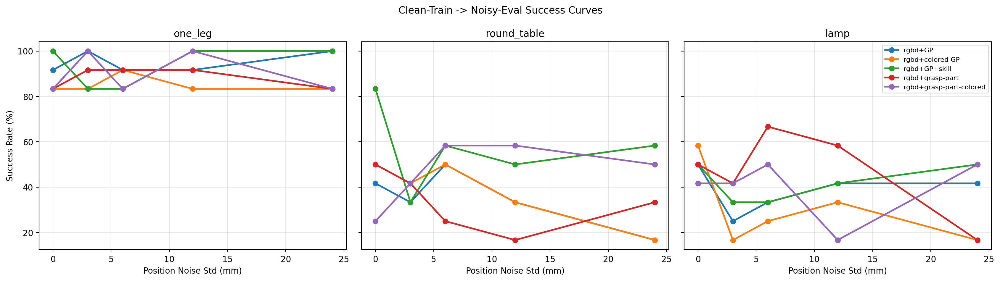
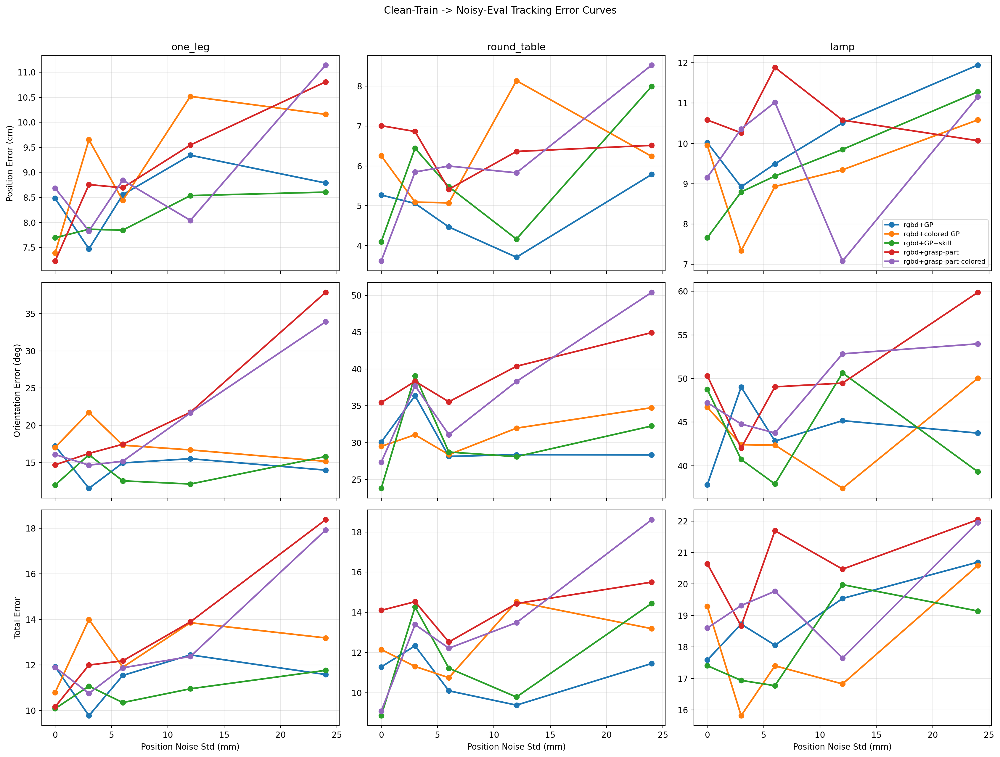

# 打点噪声鲁棒性实验：Clean Train -> Noisy Eval

## 1. 设置

- 只包含有空间 guidance 的 5 个 condition：`rgbd+GP`、`rgbd+colored GP`、`rgbd+GP+skill`、`rgbd+grasp-part`、`rgbd+grasp-part-colored`。
- 训练 checkpoint 统一使用 clean-train 的现有模型；本轮不包含 noisy-train 曲线。
- tracking error 统一定义为：每个 skill state 最后一帧 `final EE pose` 与当前画在图上的 `guidance pose` 的差。
- 同一 episode 多次进入同名 skill state 时保留 `total error` 最小的一次；跨 episode、task 的汇总按有效 skill-state 记录数加权平均。
- `P/O/T` 分别为 position error (cm)、orientation error (deg)、total error；`total = pos_m / 0.01 + ori_deg / 5`，越低越好。
- point guidance 的 x 轴为位置噪声；grasp-part 的位置噪声相同，同时 n1-n4 分别耦合 2.5/5/10/20 deg orientation noise。
- 噪声档位：point 为 n0=0、n1=3、n2=6、n3=12、n4=24 mm；grasp-part 在相同位置档位上分别叠加 0/2.5/5/10/20 deg。
- 完成组数：`25/25`；task-level 数据行：`75/75`。

## 2. 曲线

## 3. 端点结果摘要

下表比较跨三个 task 加权汇总后的 n0 与 n4；成功率变化单位为百分点，tracking total 越低越好。

| Condition | n0 Success | n4 Success | Success Delta | n0 Track Total | n4 Track Total | Tracking Delta |
| --- | --- | --- | --- | --- | --- | --- |
| rgbd+GP | 61.1% | 52.8% | -8.3 pp | 13.24 | 13.84 | +0.59 |
| rgbd+colored GP | 63.9% | 38.9% | -25.0 pp | 13.66 | 15.42 | +1.76 |
| rgbd+GP+skill | 77.8% | 69.4% | -8.3 pp | 11.23 | 14.94 | +3.71 |
| rgbd+grasp-part | 61.1% | 44.4% | -16.7 pp | 14.51 | 18.21 | +3.70 |
| rgbd+grasp-part-colored | 50.0% | 61.1% | +11.1 pp | 12.31 | 19.27 | +6.96 |

### 3.1 主要观察

- `one_leg` 在最大噪声下五个 condition 的成功率仍为 83.3%--100.0%，说明简单任务对本轮最大测试噪声仍有较高容忍度。
- point condition 的 n0 -> n4 跨任务端点变化：`rgbd+GP` SR -8.3 pp, T +0.59；`rgbd+colored GP` SR -25.0 pp, T +1.76；`rgbd+GP+skill` SR -8.3 pp, T +3.71。成功率总体下降，但 tracking 退化幅度和单调性依 condition 而异。
- grasp-part condition 的 n0 -> n4 端点变化：`rgbd+grasp-part` SR -16.7 pp, O +14.03 deg, T +3.70；`rgbd+grasp-part-colored` SR +11.1 pp, O +17.39 deg, T +6.96。两者 orientation/total tracking 都明显变差；colored 条件的成功率上升不能解释为噪声带来收益。
- hard task 的 clean 上限本身有限：`round_table` 最好为 83.3%，`lamp` 最好为 58.3%。因此当前数据只能给出 condition/task-specific 容忍度，不能给出一个适用于所有任务的 VLM 打点精度阈值。

### 3.2 结论边界

- 每个 task 只有 12 个 rollout，单个成败会使 task 曲线变化 8.33 个百分点；跨三任务汇总仍以 2.78 个百分点为离散步长。
- 当前只使用一个 noise seed 和每个 checkpoint 一次评测，成功率曲线存在明显非单调波动；平台或拐点需要更多 rollout 和多个 seed 才能可靠确认。
- 目前能够支持的结论是：clean-trained policy 的 guidance-noise 鲁棒性强烈依赖任务和 condition；grasp-part 的 6D 噪声会稳定增大 tracking error，而成功率退化在 hard task 上更明显。

## 4. Table 1: Task Overall

每个 task 大列内按 n0 -> n4 给出 `SR` 和 `P/O/T`；括号内 `n` 是 tracking 有效 skill-state 数。

| Condition | one_leg | round_table | lamp |
| --- | --- | --- | --- |
| rgbd+GP | n0: SR 91.7% (11/12) P/O/T 8.48/17.22/11.92 (n=56)  n1: SR 100.0% (12/12) P/O/T 7.47/11.53/9.78 (n=57)  n2: SR 91.7% (11/12) P/O/T 8.55/14.94/11.54 (n=56)  n3: SR 91.7% (11/12) P/O/T 9.34/15.51/12.44 (n=55)  n4: SR 100.0% (12/12) P/O/T 8.79/13.98/11.58 (n=57) | n0: SR 41.7% (5/12) P/O/T 5.27/30.06/11.28 (n=73)  n1: SR 33.3% (4/12) P/O/T 5.06/36.37/12.33 (n=46)  n2: SR 50.0% (6/12) P/O/T 4.47/28.13/10.09 (n=64)  n3: SR 33.3% (4/12) P/O/T 3.71/28.35/9.38 (n=62)  n4: SR 16.7% (2/12) P/O/T 5.79/28.33/11.45 (n=64) | n0: SR 50.0% (6/12) P/O/T 10.02/37.84/17.59 (n=50)  n1: SR 25.0% (3/12) P/O/T 8.92/49.02/18.73 (n=43)  n2: SR 33.3% (4/12) P/O/T 9.49/42.83/18.06 (n=50)  n3: SR 41.7% (5/12) P/O/T 10.51/45.17/19.54 (n=42)  n4: SR 41.7% (5/12) P/O/T 11.94/43.74/20.69 (n=41) |
| rgbd+colored GP | n0: SR 83.3% (10/12) P/O/T 7.39/17.04/10.79 (n=55)  n1: SR 83.3% (10/12) P/O/T 9.65/21.73/14.00 (n=52)  n2: SR 91.7% (11/12) P/O/T 8.44/17.32/11.90 (n=56)  n3: SR 83.3% (10/12) P/O/T 10.52/16.69/13.86 (n=52)  n4: SR 83.3% (10/12) P/O/T 10.16/15.16/13.19 (n=56) | n0: SR 50.0% (6/12) P/O/T 6.25/29.49/12.15 (n=71)  n1: SR 41.7% (5/12) P/O/T 5.09/31.06/11.31 (n=76)  n2: SR 50.0% (6/12) P/O/T 5.07/28.36/10.75 (n=78)  n3: SR 33.3% (4/12) P/O/T 8.14/31.96/14.53 (n=61)  n4: SR 16.7% (2/12) P/O/T 6.24/34.74/13.19 (n=41) | n0: SR 58.3% (7/12) P/O/T 9.95/46.70/19.29 (n=47)  n1: SR 16.7% (2/12) P/O/T 7.34/42.42/15.82 (n=41)  n2: SR 25.0% (3/12) P/O/T 8.93/42.37/17.40 (n=44)  n3: SR 33.3% (4/12) P/O/T 9.35/37.41/16.83 (n=48)  n4: SR 16.7% (2/12) P/O/T 10.58/50.03/20.59 (n=42) |
| rgbd+GP+skill | n0: SR 100.0% (12/12) P/O/T 7.69/11.97/10.09 (n=57)  n1: SR 83.3% (10/12) P/O/T 7.86/16.05/11.07 (n=52)  n2: SR 83.3% (10/12) P/O/T 7.85/12.54/10.35 (n=57)  n3: SR 100.0% (12/12) P/O/T 8.54/12.11/10.96 (n=57)  n4: SR 100.0% (12/12) P/O/T 8.61/15.81/11.77 (n=56) | n0: SR 83.3% (10/12) P/O/T 4.10/23.79/8.86 (n=82)  n1: SR 33.3% (4/12) P/O/T 6.44/39.08/14.26 (n=50)  n2: SR 58.3% (7/12) P/O/T 5.48/28.72/11.22 (n=70)  n3: SR 50.0% (6/12) P/O/T 4.17/28.10/9.79 (n=65)  n4: SR 58.3% (7/12) P/O/T 8.00/32.26/14.45 (n=75) | n0: SR 50.0% (6/12) P/O/T 7.66/48.74/17.41 (n=42)  n1: SR 33.3% (4/12) P/O/T 8.80/40.73/16.94 (n=50)  n2: SR 33.3% (4/12) P/O/T 9.19/37.91/16.77 (n=50)  n3: SR 41.7% (5/12) P/O/T 9.85/50.64/19.98 (n=42)  n4: SR 50.0% (6/12) P/O/T 11.28/39.32/19.14 (n=51) |
| rgbd+grasp-part | n0: SR 83.3% (10/12) P/O/T 7.23/14.69/10.17 (n=54)  n1: SR 91.7% (11/12) P/O/T 8.76/16.22/12.00 (n=53)  n2: SR 91.7% (11/12) P/O/T 8.69/17.45/12.18 (n=53)  n3: SR 91.7% (11/12) P/O/T 9.55/21.74/13.90 (n=52)  n4: SR 83.3% (10/12) P/O/T 10.81/37.85/18.38 (n=48) | n0: SR 50.0% (6/12) P/O/T 7.01/35.44/14.10 (n=71)  n1: SR 41.7% (5/12) P/O/T 6.86/38.32/14.53 (n=56)  n2: SR 25.0% (3/12) P/O/T 5.42/35.54/12.52 (n=58)  n3: SR 16.7% (2/12) P/O/T 6.36/40.37/14.44 (n=60)  n4: SR 33.3% (4/12) P/O/T 6.52/44.94/15.50 (n=58) | n0: SR 50.0% (6/12) P/O/T 10.58/50.32/20.64 (n=43)  n1: SR 41.7% (5/12) P/O/T 10.26/42.02/18.67 (n=52)  n2: SR 66.7% (8/12) P/O/T 11.88/49.04/21.69 (n=51)  n3: SR 58.3% (7/12) P/O/T 10.58/49.48/20.47 (n=46)  n4: SR 16.7% (2/12) P/O/T 10.07/59.87/22.04 (n=39) |
| rgbd+grasp-part-colored | n0: SR 83.3% (10/12) P/O/T 8.68/16.08/11.90 (n=53)  n1: SR 100.0% (12/12) P/O/T 7.83/14.65/10.76 (n=57)  n2: SR 83.3% (10/12) P/O/T 8.85/15.17/11.88 (n=55)  n3: SR 100.0% (12/12) P/O/T 8.04/21.67/12.37 (n=57)  n4: SR 83.3% (10/12) P/O/T 11.14/33.90/17.92 (n=53) | n0: SR 25.0% (3/12) P/O/T 3.62/27.32/9.08 (n=75)  n1: SR 41.7% (5/12) P/O/T 5.85/37.71/13.39 (n=53)  n2: SR 58.3% (7/12) P/O/T 6.00/31.08/12.21 (n=61)  n3: SR 58.3% (7/12) P/O/T 5.83/38.30/13.49 (n=54)  n4: SR 50.0% (6/12) P/O/T 8.53/50.40/18.61 (n=71) | n0: SR 41.7% (5/12) P/O/T 9.16/47.23/18.60 (n=42)  n1: SR 41.7% (5/12) P/O/T 10.36/44.79/19.32 (n=43)  n2: SR 50.0% (6/12) P/O/T 11.02/43.76/19.77 (n=46)  n3: SR 16.7% (2/12) P/O/T 7.08/52.83/17.65 (n=37)  n4: SR 50.0% (6/12) P/O/T 11.16/53.97/21.95 (n=44) |

## 5. 成功率阈值对应的最大噪声

### 5.1 `success_rate >= 80%`

| Condition | Threshold | Max Pos Std (mm) | Max Ori Std (deg) |
| --- | --- | --- | --- |
| rgbd+GP | 80% | none | none |
| rgbd+colored GP | 80% | none | none |
| rgbd+GP+skill | 80% | none | none |
| rgbd+grasp-part | 80% | none | none |
| rgbd+grasp-part-colored | 80% | none | none |

### 5.2 `success_rate >= 60%`

| Condition | Threshold | Max Pos Std (mm) | Max Ori Std (deg) |
| --- | --- | --- | --- |
| rgbd+GP | 60% | 0 | 0.0 |
| rgbd+colored GP | 60% | 0 | 0.0 |
| rgbd+GP+skill | 60% | 24 | 0.0 |
| rgbd+grasp-part | 60% | 6 | 5.0 |
| rgbd+grasp-part-colored | 60% | 24 | 20.0 |

## 6. Skill Average 表

跨三个 task 汇总同类 skill（push/pick/place/insert/screw）；每格仍为 `SR` 与 `P/O/T`。

| Condition | Skill Type | n0 | n1 | n2 | n3 | n4 |
| --- | --- | --- | --- | --- | --- | --- |
| rgbd+GP | insert | SR 97.5% (39/40) P/O/T 1.06/11.67/3.39 (n=31) | SR 100.0% (26/26) P/O/T 0.87/13.94/3.66 (n=20) | SR 94.7% (36/38) P/O/T 1.35/15.89/4.53 (n=29) | SR 97.1% (34/35) P/O/T 1.95/20.24/6.00 (n=25) | SR 90.9% (30/33) P/O/T 3.55/10.19/5.58 (n=26) |
| rgbd+GP | pick | SR 95.0% (57/60) P/O/T 2.75/18.85/6.52 (n=49) | SR 98.1% (53/54) P/O/T 3.35/20.11/7.37 (n=43) | SR 96.6% (57/59) P/O/T 3.05/17.10/6.47 (n=47) | SR 96.5% (55/57) P/O/T 3.55/16.28/6.81 (n=45) | SR 90.0% (54/60) P/O/T 5.32/18.50/9.02 (n=48) |
| rgbd+GP | place | SR 95.6% (43/45) P/O/T 7.05/18.18/10.69 (n=36) | SR 68.3% (28/41) P/O/T 4.21/27.70/9.75 (n=30) | SR 91.1% (41/45) P/O/T 5.95/22.91/10.53 (n=33) | SR 86.0% (37/43) P/O/T 4.96/23.85/9.73 (n=31) | SR 88.1% (37/42) P/O/T 7.86/22.84/12.43 (n=31) |
| rgbd+GP | push | SR 100.0% (36/36) P/O/T 8.26/57.34/19.72 (n=33) | SR 100.0% (36/36) P/O/T 7.35/57.49/18.84 (n=33) | SR 100.0% (36/36) P/O/T 7.65/56.99/19.04 (n=33) | SR 100.0% (36/36) P/O/T 8.00/54.97/18.99 (n=33) | SR 97.2% (35/36) P/O/T 9.05/54.58/19.97 (n=33) |
| rgbd+GP | screw | SR 79.5% (31/39) P/O/T 22.22/40.62/30.35 (n=30) | SR 88.5% (23/26) P/O/T 25.61/28.34/31.28 (n=20) | SR 80.6% (29/36) P/O/T 21.74/31.33/28.00 (n=28) | SR 79.4% (27/34) P/O/T 22.35/28.65/28.08 (n=25) | SR 93.3% (28/30) P/O/T 19.63/30.89/25.80 (n=24) |
| rgbd+colored GP | insert | SR 100.0% (38/38) P/O/T 1.00/13.47/3.69 (n=28) | SR 97.0% (32/33) P/O/T 1.45/15.94/4.64 (n=27) | SR 97.4% (37/38) P/O/T 1.32/8.75/3.06 (n=29) | SR 93.3% (28/30) P/O/T 2.20/9.91/4.18 (n=25) | SR 96.2% (25/26) P/O/T 4.22/16.07/7.43 (n=18) |
| rgbd+colored GP | pick | SR 95.1% (58/61) P/O/T 2.75/16.75/6.10 (n=49) | SR 96.6% (57/59) P/O/T 3.01/17.92/6.60 (n=48) | SR 100.0% (62/62) P/O/T 2.83/16.70/6.17 (n=50) | SR 96.4% (54/56) P/O/T 3.73/16.43/7.02 (n=46) | SR 92.3% (48/52) P/O/T 4.97/21.80/9.33 (n=43) |
| rgbd+colored GP | place | SR 89.1% (41/46) P/O/T 5.46/25.86/10.63 (n=35) | SR 77.8% (35/45) P/O/T 3.87/22.07/8.29 (n=35) | SR 82.0% (41/50) P/O/T 6.90/22.13/11.33 (n=38) | SR 78.6% (33/42) P/O/T 8.96/22.39/13.43 (n=33) | SR 75.0% (27/36) P/O/T 6.97/34.35/13.84 (n=28) |
| rgbd+colored GP | push | SR 100.0% (36/36) P/O/T 7.40/54.17/18.23 (n=33) | SR 97.2% (35/36) P/O/T 8.01/54.91/19.00 (n=33) | SR 100.0% (36/36) P/O/T 7.72/54.53/18.63 (n=33) | SR 97.2% (35/36) P/O/T 8.51/56.31/19.77 (n=33) | SR 97.2% (35/36) P/O/T 8.88/51.39/19.15 (n=33) |
| rgbd+colored GP | screw | SR 86.8% (33/38) P/O/T 25.71/47.67/35.25 (n=28) | SR 84.4% (27/32) P/O/T 23.31/52.12/33.74 (n=26) | SR 83.8% (31/37) P/O/T 20.16/47.07/29.57 (n=28) | SR 85.7% (24/28) P/O/T 28.71/42.21/37.15 (n=24) | SR 72.0% (18/25) P/O/T 28.92/28.83/34.69 (n=17) |
| rgbd+GP+skill | insert | SR 100.0% (40/40) P/O/T 0.92/6.94/2.31 (n=29) | SR 96.7% (29/30) P/O/T 1.14/12.14/3.57 (n=23) | SR 94.6% (35/37) P/O/T 1.52/11.94/3.90 (n=31) | SR 100.0% (35/35) P/O/T 1.97/10.27/4.03 (n=25) | SR 97.4% (37/38) P/O/T 3.51/8.92/5.30 (n=30) |
| rgbd+GP+skill | pick | SR 100.0% (65/65) P/O/T 2.81/15.61/5.93 (n=51) | SR 91.1% (51/56) P/O/T 3.81/24.03/8.61 (n=45) | SR 96.6% (57/59) P/O/T 3.00/19.77/6.95 (n=48) | SR 98.3% (59/60) P/O/T 4.58/17.83/8.14 (n=47) | SR 95.3% (61/64) P/O/T 4.73/19.13/8.55 (n=52) |
| rgbd+GP+skill | place | SR 86.8% (46/53) P/O/T 5.49/26.81/10.85 (n=39) | SR 84.6% (33/39) P/O/T 8.21/24.19/13.05 (n=29) | SR 88.9% (40/45) P/O/T 5.45/20.86/9.62 (n=35) | SR 80.9% (38/47) P/O/T 6.32/32.73/12.87 (n=34) | SR 89.8% (44/49) P/O/T 10.90/21.45/15.19 (n=38) |
| rgbd+GP+skill | push | SR 100.0% (36/36) P/O/T 7.56/53.99/18.36 (n=33) | SR 97.2% (35/36) P/O/T 7.82/58.68/19.55 (n=33) | SR 97.2% (35/36) P/O/T 7.29/53.09/17.90 (n=33) | SR 100.0% (36/36) P/O/T 7.49/54.90/18.47 (n=33) | SR 100.0% (36/36) P/O/T 8.53/57.36/20.01 (n=33) |
| rgbd+GP+skill | screw | SR 97.5% (39/40) P/O/T 15.96/29.50/21.86 (n=29) | SR 82.8% (24/29) P/O/T 21.69/37.58/29.20 (n=22) | SR 85.7% (30/35) P/O/T 22.26/27.31/27.72 (n=30) | SR 91.4% (32/35) P/O/T 17.78/24.98/22.77 (n=25) | SR 94.4% (34/36) P/O/T 21.04/46.18/30.27 (n=29) |
| rgbd+grasp-part | insert | SR 94.6% (35/37) P/O/T 1.60/27.30/7.06 (n=27) | SR 100.0% (34/34) P/O/T 1.19/20.35/5.26 (n=25) | SR 100.0% (33/33) P/O/T 1.49/25.98/6.68 (n=27) | SR 97.1% (33/34) P/O/T 2.12/26.15/7.35 (n=24) | SR 96.6% (28/29) P/O/T 3.74/35.91/10.92 (n=20) |
| rgbd+grasp-part | pick | SR 96.7% (58/60) P/O/T 3.23/18.42/6.92 (n=49) | SR 94.8% (55/58) P/O/T 3.57/20.27/7.62 (n=46) | SR 92.6% (50/54) P/O/T 2.89/18.93/6.68 (n=44) | SR 94.9% (56/59) P/O/T 4.73/26.61/10.05 (n=46) | SR 96.4% (53/55) P/O/T 4.95/39.56/12.86 (n=44) |
| rgbd+grasp-part | place | SR 89.1% (41/46) P/O/T 7.00/27.13/12.43 (n=35) | SR 86.0% (37/43) P/O/T 7.70/24.04/12.51 (n=32) | SR 92.1% (35/38) P/O/T 3.85/22.94/8.44 (n=31) | SR 82.2% (37/45) P/O/T 6.62/32.47/13.12 (n=32) | SR 75.6% (31/41) P/O/T 8.84/42.08/17.26 (n=30) |
| rgbd+grasp-part | push | SR 97.2% (35/36) P/O/T 7.37/57.41/18.86 (n=33) | SR 97.2% (35/36) P/O/T 8.46/58.91/20.24 (n=33) | SR 97.2% (35/36) P/O/T 7.77/58.78/19.53 (n=33) | SR 100.0% (35/35) P/O/T 8.07/58.77/19.82 (n=32) | SR 91.7% (33/36) P/O/T 8.96/71.66/23.29 (n=33) |
| rgbd+grasp-part | screw | SR 88.2% (30/34) P/O/T 27.20/41.22/35.45 (n=24) | SR 85.3% (29/34) P/O/T 26.51/41.45/34.80 (n=25) | SR 81.8% (27/33) P/O/T 31.02/48.23/40.67 (n=27) | SR 87.9% (29/33) P/O/T 26.08/44.05/34.89 (n=24) | SR 85.2% (23/27) P/O/T 24.21/37.38/31.68 (n=18) |
| rgbd+grasp-part-colored | insert | SR 100.0% (34/34) P/O/T 0.96/14.83/3.92 (n=27) | SR 100.0% (32/32) P/O/T 1.01/16.97/4.40 (n=22) | SR 100.0% (33/33) P/O/T 1.25/14.46/4.15 (n=24) | SR 100.0% (27/27) P/O/T 2.27/22.83/6.84 (n=20) | SR 100.0% (34/34) P/O/T 3.63/31.39/9.91 (n=25) |
| rgbd+grasp-part-colored | pick | SR 96.7% (58/60) P/O/T 2.75/16.72/6.10 (n=48) | SR 89.8% (53/59) P/O/T 4.04/23.91/8.83 (n=46) | SR 95.0% (57/60) P/O/T 4.04/22.28/8.49 (n=48) | SR 92.9% (52/56) P/O/T 3.61/27.49/9.11 (n=45) | SR 98.4% (61/62) P/O/T 5.01/37.53/12.52 (n=49) |
| rgbd+grasp-part-colored | place | SR 80.4% (37/46) P/O/T 5.66/24.29/10.51 (n=35) | SR 87.8% (36/41) P/O/T 8.03/26.15/13.26 (n=30) | SR 80.0% (36/45) P/O/T 8.27/25.22/13.31 (n=33) | SR 72.5% (29/40) P/O/T 4.58/37.59/12.09 (n=30) | SR 79.6% (39/49) P/O/T 9.32/39.12/17.14 (n=36) |
| rgbd+grasp-part-colored | push | SR 97.2% (35/36) P/O/T 7.96/56.58/19.28 (n=33) | SR 100.0% (36/36) P/O/T 7.36/53.51/18.06 (n=33) | SR 100.0% (36/36) P/O/T 7.42/53.09/18.03 (n=33) | SR 100.0% (36/36) P/O/T 7.57/55.25/18.62 (n=33) | SR 100.0% (36/36) P/O/T 8.04/61.18/20.28 (n=33) |
| rgbd+grasp-part-colored | screw | SR 82.4% (28/34) P/O/T 18.42/35.73/25.56 (n=27) | SR 90.6% (29/32) P/O/T 23.16/33.46/29.85 (n=22) | SR 97.0% (32/33) P/O/T 25.74/30.94/31.93 (n=24) | SR 100.0% (27/27) P/O/T 22.01/30.66/28.14 (n=20) | SR 91.2% (31/34) P/O/T 30.00/67.96/43.59 (n=25) |

## 7. Per-Step 表

| Condition | Task | Skill State | n0 | n1 | n2 | n3 | n4 |
| --- | --- | --- | --- | --- | --- | --- | --- |
| rgbd+GP | lamp | base-bulb-push | SR 100.0% (12/12) P/O/T 9.81/71.65/24.14 (n=12) | SR 100.0% (12/12) P/O/T 9.18/77.20/24.62 (n=12) | SR 100.0% (12/12) P/O/T 8.88/77.71/24.42 (n=12) | SR 100.0% (12/12) P/O/T 10.46/73.00/25.06 (n=12) | SR 91.7% (11/12) P/O/T 10.94/70.06/24.95 (n=12) |
| rgbd+GP | lamp | bulb-base-insert | SR 100.0% (10/10) P/O/T 1.54/29.64/7.47 (n=7) | SR 100.0% (6/6) P/O/T 1.12/38.63/8.85 (n=5) | SR 100.0% (9/9) P/O/T 1.70/37.80/9.26 (n=8) | SR 100.0% (7/7) P/O/T 1.77/44.56/10.68 (n=5) | SR 100.0% (7/7) P/O/T 3.43/23.67/8.17 (n=5) |
| rgbd+GP | lamp | bulb-base-pick | SR 100.0% (12/12) P/O/T 1.88/16.24/5.13 (n=9) | SR 100.0% (12/12) P/O/T 2.39/19.72/6.34 (n=9) | SR 100.0% (12/12) P/O/T 1.60/12.42/4.09 (n=9) | SR 100.0% (12/12) P/O/T 2.15/12.92/4.74 (n=9) | SR 90.9% (10/11) P/O/T 7.98/12.57/10.50 (n=8) |
| rgbd+GP | lamp | bulb-base-place | SR 83.3% (10/12) P/O/T 3.58/42.29/12.04 (n=9) | SR 50.0% (6/12) P/O/T 3.58/56.41/14.86 (n=9) | SR 75.0% (9/12) P/O/T 1.87/46.84/11.23 (n=9) | SR 58.3% (7/12) P/O/T 4.44/55.41/15.52 (n=9) | SR 70.0% (7/10) P/O/T 5.32/42.56/13.83 (n=7) |
| rgbd+GP | lamp | bulb-base-screw | SR 60.0% (6/10) P/O/T 19.34/18.58/23.06 (n=7) | SR 66.7% (4/6) P/O/T 25.71/37.48/33.21 (n=5) | SR 44.4% (4/9) P/O/T 23.98/24.74/28.93 (n=8) | SR 71.4% (5/7) P/O/T 37.02/20.10/41.04 (n=5) | SR 71.4% (5/7) P/O/T 22.86/37.72/30.41 (n=5) |
| rgbd+GP | lamp | hood-base-pick | SR 100.0% (3/3) P/O/T 2.84/22.20/7.28 (n=3) | SR 66.7% (2/3) P/O/T 14.27/40.50/22.36 (n=2) | SR 100.0% (3/3) P/O/T 2.63/23.53/7.34 (n=2) | SR 100.0% (2/2) P/O/T 2.48/21.06/6.69 (n=1) | SR 100.0% (4/4) P/O/T 4.15/22.10/8.57 (n=2) |
| rgbd+GP | lamp | hood-base-place | SR 100.0% (3/3) P/O/T 59.79/33.66/66.52 (n=3) | SR 100.0% (2/2) P/O/T 57.02/34.90/64.00 (n=1) | SR 100.0% (3/3) P/O/T 63.04/64.14/75.87 (n=2) | SR 100.0% (2/2) P/O/T 59.98/61.77/72.34 (n=1) | SR 100.0% (4/4) P/O/T 58.76/101.56/79.07 (n=2) |
| rgbd+GP | one_leg | leg-top-insert | SR 91.7% (11/12) P/O/T 0.64/7.25/2.09 (n=9) | SR 100.0% (12/12) P/O/T 0.70/6.10/1.92 (n=9) | SR 91.7% (11/12) P/O/T 1.21/6.68/2.54 (n=9) | SR 100.0% (11/11) P/O/T 2.02/6.83/3.39 (n=8) | SR 100.0% (12/12) P/O/T 4.10/6.43/5.39 (n=9) |
| rgbd+GP | one_leg | leg-top-pick | SR 100.0% (12/12) P/O/T 0.82/20.38/4.89 (n=9) | SR 100.0% (12/12) P/O/T 1.07/13.25/3.72 (n=9) | SR 100.0% (12/12) P/O/T 1.57/12.97/4.16 (n=9) | SR 100.0% (12/12) P/O/T 2.27/12.95/4.86 (n=9) | SR 100.0% (12/12) P/O/T 3.97/13.38/6.65 (n=9) |
| rgbd+GP | one_leg | leg-top-place | SR 100.0% (12/12) P/O/T 0.99/9.70/2.93 (n=9) | SR 100.0% (12/12) P/O/T 1.06/11.05/3.27 (n=9) | SR 100.0% (12/12) P/O/T 1.36/10.85/3.53 (n=9) | SR 91.7% (11/12) P/O/T 2.65/10.31/4.71 (n=9) | SR 100.0% (12/12) P/O/T 3.58/11.67/5.92 (n=9) |
| rgbd+GP | one_leg | leg-top-screw | SR 100.0% (11/11) P/O/T 42.53/23.52/47.23 (n=8) | SR 100.0% (12/12) P/O/T 34.33/6.80/35.69 (n=9) | SR 100.0% (11/11) P/O/T 42.42/27.94/48.01 (n=8) | SR 100.0% (11/11) P/O/T 42.40/33.93/49.19 (n=8) | SR 100.0% (12/12) P/O/T 29.06/20.40/33.14 (n=9) |
| rgbd+GP | one_leg | top-leg-pick | SR 100.0% (12/12) P/O/T 5.96/21.78/10.31 (n=12) | SR 100.0% (12/12) P/O/T 5.22/18.72/8.96 (n=12) | SR 100.0% (12/12) P/O/T 5.75/19.94/9.74 (n=12) | SR 100.0% (12/12) P/O/T 6.78/18.40/10.46 (n=12) | SR 100.0% (12/12) P/O/T 6.97/18.49/10.67 (n=12) |
| rgbd+GP | one_leg | top-leg-push | SR 100.0% (12/12) P/O/T 4.57/19.87/8.55 (n=9) | SR 100.0% (12/12) P/O/T 3.19/10.87/5.36 (n=9) | SR 100.0% (12/12) P/O/T 3.71/11.05/5.92 (n=9) | SR 100.0% (12/12) P/O/T 3.65/10.76/5.80 (n=9) | SR 100.0% (12/12) P/O/T 5.63/12.00/8.03 (n=9) |
| rgbd+GP | round_table | base-leg-insert | SR 100.0% (8/8) P/O/T 1.68/7.84/3.25 (n=7) | SR 100.0% (3/3) P/O/T 1.11/9.24/2.96 (n=2) | SR 100.0% (7/7) P/O/T 1.60/8.93/3.38 (n=5) | SR 80.0% (4/5) P/O/T 2.78/8.62/4.51 (n=3) | SR 40.0% (2/5) P/O/T 2.95/10.36/5.02 (n=4) |
| rgbd+GP | round_table | base-leg-pick | SR 88.9% (8/9) P/O/T 1.11/10.68/3.25 (n=7) | SR 100.0% (3/3) P/O/T 0.77/9.90/2.75 (n=2) | SR 100.0% (8/8) P/O/T 1.25/10.46/3.34 (n=6) | SR 71.4% (5/7) P/O/T 1.90/17.84/5.47 (n=5) | SR 66.7% (6/9) P/O/T 2.38/20.13/6.40 (n=8) |
| rgbd+GP | round_table | base-leg-place | SR 100.0% (8/8) P/O/T 3.49/6.26/4.74 (n=7) | SR 100.0% (3/3) P/O/T 3.39/6.07/4.61 (n=2) | SR 87.5% (7/8) P/O/T 4.94/10.66/7.07 (n=6) | SR 100.0% (5/5) P/O/T 3.45/6.99/4.85 (n=3) | SR 83.3% (5/6) P/O/T 4.96/10.08/6.98 (n=5) |
| rgbd+GP | round_table | base-leg-screw | SR 62.5% (5/8) P/O/T 24.95/95.56/44.06 (n=7) | SR 100.0% (3/3) P/O/T 30.99/85.89/48.16 (n=2) | SR 85.7% (6/7) P/O/T 12.07/48.50/21.77 (n=5) | SR 100.0% (4/4) P/O/T 2.37/6.83/3.73 (n=3) | SR 100.0% (2/2) P/O/T 27.76/86.24/45.00 (n=2) |
| rgbd+GP | round_table | leg-top-insert | SR 100.0% (10/10) P/O/T 0.56/4.26/1.41 (n=8) | SR 100.0% (5/5) P/O/T 0.81/3.07/1.43 (n=4) | SR 90.0% (9/10) P/O/T 0.97/7.67/2.50 (n=7) | SR 100.0% (12/12) P/O/T 1.72/22.52/6.23 (n=9) | SR 100.0% (9/9) P/O/T 3.29/5.91/4.47 (n=8) |
| rgbd+GP | round_table | leg-top-pick | SR 83.3% (10/12) P/O/T 2.51/21.26/6.76 (n=9) | SR 100.0% (12/12) P/O/T 2.23/26.96/7.62 (n=9) | SR 83.3% (10/12) P/O/T 3.65/25.12/8.67 (n=9) | SR 100.0% (12/12) P/O/T 2.96/18.77/6.71 (n=9) | SR 83.3% (10/12) P/O/T 4.95/26.67/10.28 (n=9) |
| rgbd+GP | round_table | leg-top-place | SR 100.0% (10/10) P/O/T 1.12/5.22/2.17 (n=8) | SR 41.7% (5/12) P/O/T 2.29/19.63/6.22 (n=9) | SR 100.0% (10/10) P/O/T 1.65/6.35/2.92 (n=7) | SR 100.0% (12/12) P/O/T 2.19/7.23/3.63 (n=9) | SR 90.0% (9/10) P/O/T 3.99/6.43/5.28 (n=8) |
| rgbd+GP | round_table | leg-top-screw | SR 90.0% (9/10) P/O/T 2.06/28.93/7.85 (n=8) | SR 80.0% (4/5) P/O/T 3.19/36.60/10.51 (n=4) | SR 88.9% (8/9) P/O/T 2.44/30.47/8.53 (n=7) | SR 58.3% (7/12) P/O/T 3.04/35.97/10.23 (n=9) | SR 100.0% (9/9) P/O/T 4.96/24.58/9.88 (n=8) |
| rgbd+GP | round_table | top-leg-push | SR 100.0% (12/12) P/O/T 9.47/71.13/23.69 (n=12) | SR 100.0% (12/12) P/O/T 8.63/72.74/23.18 (n=12) | SR 100.0% (12/12) P/O/T 9.37/70.72/23.51 (n=12) | SR 100.0% (12/12) P/O/T 8.80/70.09/22.82 (n=12) | SR 100.0% (12/12) P/O/T 9.73/71.04/23.94 (n=12) |
| rgbd+colored GP | lamp | base-bulb-push | SR 100.0% (12/12) P/O/T 8.62/72.96/23.21 (n=12) | SR 100.0% (12/12) P/O/T 9.32/66.27/22.57 (n=12) | SR 100.0% (12/12) P/O/T 9.25/71.42/23.53 (n=12) | SR 100.0% (12/12) P/O/T 9.19/68.39/22.87 (n=12) | SR 100.0% (12/12) P/O/T 10.41/70.10/24.43 (n=12) |
| rgbd+colored GP | lamp | bulb-base-insert | SR 100.0% (9/9) P/O/T 1.68/38.00/9.28 (n=6) | SR 100.0% (5/5) P/O/T 2.89/39.70/10.83 (n=4) | SR 100.0% (5/5) P/O/T 1.00/16.62/4.32 (n=4) | SR 100.0% (6/6) P/O/T 2.21/19.12/6.04 (n=6) | SR 100.0% (8/8) P/O/T 3.74/38.12/11.37 (n=5) |
| rgbd+colored GP | lamp | bulb-base-pick | SR 100.0% (12/12) P/O/T 2.07/17.67/5.60 (n=9) | SR 100.0% (12/12) P/O/T 2.25/18.41/5.93 (n=9) | SR 100.0% (12/12) P/O/T 2.42/18.11/6.04 (n=9) | SR 91.7% (11/12) P/O/T 2.76/13.08/5.38 (n=9) | SR 100.0% (12/12) P/O/T 5.21/17.49/8.70 (n=9) |
| rgbd+colored GP | lamp | bulb-base-place | SR 75.0% (9/12) P/O/T 3.59/57.89/15.17 (n=9) | SR 41.7% (5/12) P/O/T 3.37/49.45/13.26 (n=9) | SR 41.7% (5/12) P/O/T 3.94/46.74/13.29 (n=9) | SR 54.5% (6/11) P/O/T 3.43/39.86/11.40 (n=9) | SR 66.7% (8/12) P/O/T 6.15/71.01/20.35 (n=9) |
| rgbd+colored GP | lamp | bulb-base-screw | SR 88.9% (8/9) P/O/T 28.89/32.15/35.32 (n=6) | SR 60.0% (3/5) P/O/T 14.37/18.13/18.00 (n=4) | SR 60.0% (3/5) P/O/T 8.19/25.19/13.22 (n=4) | SR 66.7% (4/6) P/O/T 14.01/22.68/18.55 (n=6) | SR 25.0% (2/8) P/O/T 26.47/35.80/33.63 (n=5) |
| rgbd+colored GP | lamp | hood-base-pick | SR 75.0% (3/4) P/O/T 4.37/23.74/9.12 (n=3) | SR 66.7% (2/3) P/O/T 5.62/19.76/9.58 (n=2) | SR 100.0% (3/3) P/O/T 2.58/19.63/6.51 (n=3) | SR 100.0% (3/3) P/O/T 3.71/21.81/8.07 (n=3) | SR 100.0% (1/1) P/O/T 5.49/18.49/9.19 (n=1) |
| rgbd+colored GP | lamp | hood-base-place | SR 100.0% (3/3) P/O/T 58.43/73.56/73.14 (n=2) | SR 100.0% (2/2) P/O/T 58.07/62.25/70.52 (n=1) | SR 100.0% (3/3) P/O/T 60.07/65.80/73.23 (n=3) | SR 100.0% (3/3) P/O/T 58.02/60.79/70.17 (n=3) | SR 100.0% (1/1) P/O/T 60.82/75.39/75.90 (n=1) |
| rgbd+colored GP | one_leg | leg-top-insert | SR 100.0% (11/11) P/O/T 0.61/6.70/1.95 (n=8) | SR 90.9% (10/11) P/O/T 1.03/8.02/2.63 (n=8) | SR 91.7% (11/12) P/O/T 1.17/7.36/2.64 (n=9) | SR 90.9% (10/11) P/O/T 2.21/6.49/3.51 (n=8) | SR 90.9% (10/11) P/O/T 4.28/7.97/5.87 (n=9) |
| rgbd+colored GP | one_leg | leg-top-pick | SR 100.0% (12/12) P/O/T 1.21/13.81/3.97 (n=9) | SR 100.0% (11/11) P/O/T 1.46/13.14/4.09 (n=8) | SR 100.0% (12/12) P/O/T 1.58/13.67/4.31 (n=9) | SR 100.0% (11/11) P/O/T 2.60/13.15/5.23 (n=8) | SR 100.0% (11/11) P/O/T 3.94/13.65/6.67 (n=9) |
| rgbd+colored GP | one_leg | leg-top-place | SR 91.7% (11/12) P/O/T 1.60/11.51/3.90 (n=9) | SR 100.0% (11/11) P/O/T 1.17/11.54/3.48 (n=8) | SR 100.0% (12/12) P/O/T 1.43/10.89/3.61 (n=9) | SR 100.0% (11/11) P/O/T 1.82/10.70/3.96 (n=8) | SR 100.0% (11/11) P/O/T 4.10/12.80/6.66 (n=9) |
| rgbd+colored GP | one_leg | leg-top-screw | SR 90.9% (10/11) P/O/T 34.23/42.75/42.78 (n=8) | SR 100.0% (10/10) P/O/T 51.48/62.99/64.08 (n=7) | SR 100.0% (11/11) P/O/T 42.01/41.17/50.25 (n=8) | SR 100.0% (10/10) P/O/T 52.37/28.95/58.16 (n=7) | SR 100.0% (10/10) P/O/T 42.59/25.94/47.77 (n=8) |
| rgbd+colored GP | one_leg | top-leg-pick | SR 100.0% (12/12) P/O/T 5.92/17.39/9.40 (n=12) | SR 100.0% (12/12) P/O/T 6.11/20.97/10.31 (n=12) | SR 100.0% (12/12) P/O/T 5.34/20.32/9.41 (n=12) | SR 100.0% (12/12) P/O/T 6.47/19.58/10.38 (n=12) | SR 100.0% (12/12) P/O/T 5.77/19.02/9.58 (n=12) |
| rgbd+colored GP | one_leg | top-leg-push | SR 100.0% (12/12) P/O/T 3.48/11.64/5.80 (n=9) | SR 91.7% (11/12) P/O/T 4.31/19.52/8.21 (n=9) | SR 100.0% (12/12) P/O/T 3.86/12.18/6.29 (n=9) | SR 91.7% (11/12) P/O/T 5.54/20.86/9.71 (n=9) | SR 91.7% (11/12) P/O/T 5.33/11.48/7.63 (n=9) |
| rgbd+colored GP | round_table | base-leg-insert | SR 100.0% (7/7) P/O/T 1.38/7.48/2.88 (n=6) | SR 100.0% (7/7) P/O/T 1.95/8.67/3.68 (n=7) | SR 100.0% (9/9) P/O/T 2.02/8.00/3.62 (n=7) | SR 100.0% (4/4) P/O/T 3.08/8.78/4.84 (n=4) | SR 100.0% (2/2) P/O/T 5.28/8.90/7.06 (n=1) |
| rgbd+colored GP | round_table | base-leg-pick | SR 77.8% (7/9) P/O/T 1.16/13.21/3.81 (n=7) | SR 88.9% (8/9) P/O/T 1.28/14.96/4.27 (n=8) | SR 100.0% (11/11) P/O/T 1.78/10.39/3.85 (n=8) | SR 100.0% (6/6) P/O/T 2.29/13.28/4.94 (n=5) | SR 75.0% (3/4) P/O/T 4.40/23.79/9.16 (n=3) |
| rgbd+colored GP | round_table | base-leg-place | SR 100.0% (7/7) P/O/T 2.89/6.40/4.17 (n=6) | SR 87.5% (7/8) P/O/T 3.29/11.85/5.66 (n=8) | SR 81.8% (9/11) P/O/T 2.78/8.06/4.40 (n=8) | SR 66.7% (4/6) P/O/T 11.87/5.55/12.98 (n=5) | SR 66.7% (2/3) P/O/T 5.94/15.09/8.96 (n=2) |
| rgbd+colored GP | round_table | base-leg-screw | SR 71.4% (5/7) P/O/T 37.96/77.62/53.49 (n=6) | SR 71.4% (5/7) P/O/T 24.36/70.49/38.46 (n=7) | SR 66.7% (6/9) P/O/T 24.55/79.90/40.53 (n=7) | SR 100.0% (4/4) P/O/T 54.12/94.95/73.11 (n=4) | SR 100.0% (2/2) P/O/T 6.42/7.11/7.84 (n=1) |
| rgbd+colored GP | round_table | leg-top-insert | SR 100.0% (11/11) P/O/T 0.58/6.34/1.85 (n=8) | SR 100.0% (10/10) P/O/T 0.71/18.33/4.37 (n=8) | SR 100.0% (12/12) P/O/T 1.05/7.22/2.50 (n=9) | SR 88.9% (8/9) P/O/T 1.67/6.57/2.98 (n=7) | SR 100.0% (5/5) P/O/T 4.47/6.03/5.67 (n=3) |
| rgbd+colored GP | round_table | leg-top-pick | SR 100.0% (12/12) P/O/T 1.47/18.32/5.13 (n=9) | SR 100.0% (12/12) P/O/T 1.98/19.83/5.94 (n=9) | SR 100.0% (12/12) P/O/T 2.15/18.12/5.78 (n=9) | SR 91.7% (11/12) P/O/T 2.86/18.45/6.55 (n=9) | SR 75.0% (9/12) P/O/T 4.80/37.68/12.34 (n=9) |
| rgbd+colored GP | round_table | leg-top-place | SR 91.7% (11/12) P/O/T 1.13/10.57/3.24 (n=9) | SR 83.3% (10/12) P/O/T 1.28/8.65/3.01 (n=9) | SR 100.0% (12/12) P/O/T 1.27/6.70/2.61 (n=9) | SR 81.8% (9/11) P/O/T 2.09/10.56/4.20 (n=8) | SR 55.6% (5/9) P/O/T 4.30/14.55/7.21 (n=7) |
| rgbd+colored GP | round_table | leg-top-screw | SR 90.9% (10/11) P/O/T 5.63/41.76/13.99 (n=8) | SR 90.0% (9/10) P/O/T 2.21/43.52/10.92 (n=8) | SR 91.7% (11/12) P/O/T 2.64/36.52/9.94 (n=9) | SR 75.0% (6/8) P/O/T 3.14/42.06/11.56 (n=7) | SR 80.0% (4/5) P/O/T 4.09/32.17/10.52 (n=3) |
| rgbd+colored GP | round_table | top-leg-push | SR 100.0% (12/12) P/O/T 9.12/67.27/22.57 (n=12) | SR 100.0% (12/12) P/O/T 9.49/70.09/23.50 (n=12) | SR 100.0% (12/12) P/O/T 9.10/69.39/22.98 (n=12) | SR 100.0% (12/12) P/O/T 10.06/70.81/24.22 (n=12) | SR 100.0% (12/12) P/O/T 10.00/62.61/22.53 (n=12) |
| rgbd+GP+skill | lamp | base-bulb-push | SR 100.0% (12/12) P/O/T 9.52/74.01/24.32 (n=12) | SR 100.0% (12/12) P/O/T 8.84/74.18/23.68 (n=12) | SR 100.0% (12/12) P/O/T 8.28/69.00/22.08 (n=12) | SR 100.0% (12/12) P/O/T 8.98/70.41/23.06 (n=12) | SR 100.0% (12/12) P/O/T 9.38/74.45/24.27 (n=12) |
| rgbd+GP+skill | lamp | bulb-base-insert | SR 100.0% (6/6) P/O/T 1.67/12.86/4.24 (n=3) | SR 100.0% (8/8) P/O/T 1.52/26.37/6.80 (n=7) | SR 100.0% (9/9) P/O/T 1.54/26.77/6.89 (n=8) | SR 100.0% (6/6) P/O/T 1.83/33.18/8.47 (n=4) | SR 100.0% (8/8) P/O/T 3.67/18.75/7.42 (n=6) |
| rgbd+GP+skill | lamp | bulb-base-pick | SR 100.0% (12/12) P/O/T 2.01/11.79/4.36 (n=9) | SR 100.0% (12/12) P/O/T 2.32/15.70/5.46 (n=9) | SR 100.0% (12/12) P/O/T 2.22/18.81/5.98 (n=9) | SR 100.0% (12/12) P/O/T 3.40/22.08/7.82 (n=9) | SR 100.0% (12/12) P/O/T 5.41/17.93/9.00 (n=9) |
| rgbd+GP+skill | lamp | bulb-base-place | SR 50.0% (6/12) P/O/T 5.32/70.31/19.38 (n=9) | SR 66.7% (8/12) P/O/T 3.68/43.79/12.43 (n=9) | SR 75.0% (9/12) P/O/T 2.88/41.09/11.10 (n=9) | SR 50.0% (6/12) P/O/T 5.34/76.77/20.69 (n=9) | SR 66.7% (8/12) P/O/T 5.58/49.21/15.42 (n=9) |
| rgbd+GP+skill | lamp | bulb-base-screw | SR 100.0% (6/6) P/O/T 2.68/54.80/13.64 (n=3) | SR 50.0% (4/8) P/O/T 12.10/34.45/18.99 (n=7) | SR 44.4% (4/9) P/O/T 21.87/24.01/26.67 (n=8) | SR 83.3% (5/6) P/O/T 25.15/16.46/28.45 (n=4) | SR 87.5% (7/8) P/O/T 13.39/21.22/17.63 (n=6) |
| rgbd+GP+skill | lamp | hood-base-pick | SR 100.0% (6/6) P/O/T 3.14/21.05/7.35 (n=3) | SR 100.0% (3/3) P/O/T 2.68/23.13/7.31 (n=3) | SR 100.0% (3/3) P/O/T 3.38/20.17/7.41 (n=2) | SR 100.0% (3/3) P/O/T 3.64/19.54/7.55 (n=2) | SR 85.7% (6/7) P/O/T 4.82/23.48/9.51 (n=5) |
| rgbd+GP+skill | lamp | hood-base-place | SR 100.0% (6/6) P/O/T 39.68/51.36/49.95 (n=3) | SR 100.0% (3/3) P/O/T 58.75/38.53/66.45 (n=3) | SR 100.0% (3/3) P/O/T 60.11/41.02/68.31 (n=2) | SR 100.0% (3/3) P/O/T 56.05/77.34/71.52 (n=2) | SR 100.0% (6/6) P/O/T 59.35/37.59/66.86 (n=4) |
| rgbd+GP+skill | one_leg | leg-top-insert | SR 100.0% (12/12) P/O/T 0.50/5.48/1.60 (n=9) | SR 90.9% (10/11) P/O/T 0.95/5.81/2.12 (n=8) | SR 90.9% (10/11) P/O/T 1.06/6.57/2.37 (n=9) | SR 100.0% (12/12) P/O/T 2.05/5.40/3.13 (n=9) | SR 100.0% (12/12) P/O/T 3.72/5.38/4.79 (n=9) |
| rgbd+GP+skill | one_leg | leg-top-pick | SR 100.0% (12/12) P/O/T 0.99/12.77/3.54 (n=9) | SR 100.0% (11/11) P/O/T 0.96/13.69/3.69 (n=8) | SR 100.0% (11/11) P/O/T 1.32/13.42/4.00 (n=9) | SR 100.0% (12/12) P/O/T 2.14/13.25/4.79 (n=9) | SR 100.0% (12/12) P/O/T 3.73/20.41/7.81 (n=9) |
| rgbd+GP+skill | one_leg | leg-top-place | SR 100.0% (12/12) P/O/T 0.90/12.47/3.39 (n=9) | SR 100.0% (11/11) P/O/T 1.52/12.41/4.01 (n=8) | SR 100.0% (11/11) P/O/T 1.44/12.17/3.88 (n=9) | SR 100.0% (12/12) P/O/T 2.00/11.18/4.24 (n=9) | SR 100.0% (12/12) P/O/T 3.76/10.94/5.95 (n=9) |
| rgbd+GP+skill | one_leg | leg-top-screw | SR 100.0% (12/12) P/O/T 34.03/8.31/35.69 (n=9) | SR 100.0% (10/10) P/O/T 38.31/22.00/42.71 (n=7) | SR 100.0% (10/10) P/O/T 34.22/9.80/36.18 (n=9) | SR 100.0% (12/12) P/O/T 34.53/8.17/36.16 (n=9) | SR 100.0% (11/11) P/O/T 32.82/18.08/36.44 (n=8) |
| rgbd+GP+skill | one_leg | top-leg-pick | SR 100.0% (12/12) P/O/T 6.66/19.18/10.49 (n=12) | SR 100.0% (12/12) P/O/T 5.78/20.44/9.87 (n=12) | SR 100.0% (12/12) P/O/T 6.09/19.19/9.93 (n=12) | SR 100.0% (12/12) P/O/T 6.75/19.77/10.71 (n=12) | SR 100.0% (12/12) P/O/T 5.70/19.66/9.63 (n=12) |
| rgbd+GP+skill | one_leg | top-leg-push | SR 100.0% (12/12) P/O/T 3.43/11.23/5.68 (n=9) | SR 91.7% (11/12) P/O/T 4.88/20.00/8.88 (n=9) | SR 91.7% (11/12) P/O/T 3.53/11.86/5.90 (n=9) | SR 100.0% (12/12) P/O/T 4.34/12.34/6.81 (n=9) | SR 100.0% (12/12) P/O/T 5.56/19.32/9.43 (n=9) |
| rgbd+GP+skill | round_table | base-leg-insert | SR 100.0% (10/10) P/O/T 1.50/6.93/2.89 (n=8) | SR 100.0% (4/4) P/O/T 1.43/8.52/3.14 (n=3) | SR 87.5% (7/8) P/O/T 2.42/7.76/3.97 (n=7) | SR 100.0% (7/7) P/O/T 2.38/8.14/4.01 (n=5) | SR 87.5% (7/8) P/O/T 3.11/8.82/4.88 (n=7) |
| rgbd+GP+skill | round_table | base-leg-pick | SR 100.0% (11/11) P/O/T 1.10/10.25/3.15 (n=9) | SR 83.3% (5/6) P/O/T 7.31/25.32/12.38 (n=4) | SR 100.0% (9/9) P/O/T 1.33/10.69/3.47 (n=7) | SR 88.9% (8/9) P/O/T 5.91/18.93/9.70 (n=6) | SR 100.0% (9/9) P/O/T 3.25/12.98/5.84 (n=8) |
| rgbd+GP+skill | round_table | base-leg-place | SR 90.9% (10/11) P/O/T 3.31/6.75/4.66 (n=9) | SR 80.0% (4/5) P/O/T 2.33/8.00/3.93 (n=3) | SR 88.9% (8/9) P/O/T 3.07/6.92/4.46 (n=7) | SR 87.5% (7/8) P/O/T 3.27/7.21/4.71 (n=5) | SR 88.9% (8/9) P/O/T 7.29/9.47/9.19 (n=8) |
| rgbd+GP+skill | round_table | base-leg-screw | SR 100.0% (10/10) P/O/T 16.07/42.28/24.52 (n=8) | SR 100.0% (4/4) P/O/T 36.41/101.65/56.74 (n=3) | SR 100.0% (7/7) P/O/T 27.91/55.73/39.06 (n=6) | SR 85.7% (6/7) P/O/T 2.18/41.74/10.53 (n=5) | SR 100.0% (7/7) P/O/T 32.88/111.86/55.26 (n=7) |
| rgbd+GP+skill | round_table | leg-top-insert | SR 100.0% (12/12) P/O/T 0.58/6.44/1.87 (n=9) | SR 100.0% (7/7) P/O/T 0.72/4.53/1.62 (n=5) | SR 100.0% (9/9) P/O/T 1.18/6.07/2.39 (n=7) | SR 100.0% (10/10) P/O/T 1.66/4.94/2.65 (n=7) | SR 100.0% (10/10) P/O/T 3.52/5.61/4.65 (n=8) |
| rgbd+GP+skill | round_table | leg-top-pick | SR 100.0% (12/12) P/O/T 1.89/21.03/6.09 (n=9) | SR 66.7% (8/12) P/O/T 4.01/46.06/13.22 (n=9) | SR 83.3% (10/12) P/O/T 2.55/34.83/9.52 (n=9) | SR 100.0% (12/12) P/O/T 4.60/14.47/7.50 (n=9) | SR 83.3% (10/12) P/O/T 5.00/21.42/9.29 (n=9) |
| rgbd+GP+skill | round_table | leg-top-place | SR 100.0% (12/12) P/O/T 1.04/9.54/2.95 (n=9) | SR 87.5% (7/8) P/O/T 1.62/11.41/3.90 (n=6) | SR 90.0% (9/10) P/O/T 1.27/15.05/4.28 (n=8) | SR 83.3% (10/12) P/O/T 2.28/14.49/5.18 (n=9) | SR 100.0% (10/10) P/O/T 4.28/5.93/5.46 (n=8) |
| rgbd+GP+skill | round_table | leg-top-screw | SR 91.7% (11/12) P/O/T 2.24/30.91/8.42 (n=9) | SR 85.7% (6/7) P/O/T 3.01/25.32/8.07 (n=5) | SR 100.0% (9/9) P/O/T 2.50/29.25/8.35 (n=7) | SR 90.0% (9/10) P/O/T 3.16/39.48/11.06 (n=7) | SR 90.0% (9/10) P/O/T 4.63/35.52/11.73 (n=8) |
| rgbd+GP+skill | round_table | top-leg-push | SR 100.0% (12/12) P/O/T 8.69/66.05/21.90 (n=12) | SR 100.0% (12/12) P/O/T 9.00/72.18/23.43 (n=12) | SR 100.0% (12/12) P/O/T 9.11/68.09/22.73 (n=12) | SR 100.0% (12/12) P/O/T 8.37/71.29/22.63 (n=12) | SR 100.0% (12/12) P/O/T 9.92/68.80/23.68 (n=12) |
| rgbd+grasp-part | lamp | base-bulb-push | SR 91.7% (11/12) P/O/T 9.51/77.99/25.10 (n=12) | SR 100.0% (12/12) P/O/T 9.83/76.04/25.04 (n=12) | SR 100.0% (12/12) P/O/T 9.27/77.76/24.83 (n=12) | SR 100.0% (12/12) P/O/T 9.03/73.83/23.80 (n=12) | SR 91.7% (11/12) P/O/T 9.79/79.35/25.66 (n=12) |
| rgbd+grasp-part | lamp | bulb-base-insert | SR 100.0% (8/8) P/O/T 1.39/26.51/6.69 (n=5) | SR 100.0% (8/8) P/O/T 1.24/30.58/7.36 (n=7) | SR 100.0% (10/10) P/O/T 1.65/45.10/10.67 (n=8) | SR 100.0% (9/9) P/O/T 1.68/39.01/9.48 (n=6) | SR 100.0% (4/4) P/O/T 3.33/47.12/12.75 (n=3) |
| rgbd+grasp-part | lamp | bulb-base-pick | SR 90.9% (10/11) P/O/T 5.44/20.07/9.46 (n=8) | SR 91.7% (11/12) P/O/T 1.85/15.43/4.94 (n=9) | SR 91.7% (11/12) P/O/T 1.36/13.78/4.11 (n=9) | SR 100.0% (12/12) P/O/T 3.31/27.55/8.82 (n=9) | SR 90.9% (10/11) P/O/T 5.47/51.64/15.80 (n=8) |
| rgbd+grasp-part | lamp | bulb-base-place | SR 80.0% (8/10) P/O/T 3.84/68.75/17.59 (n=7) | SR 72.7% (8/11) P/O/T 3.02/51.15/13.25 (n=9) | SR 90.9% (10/11) P/O/T 2.01/45.29/11.07 (n=9) | SR 75.0% (9/12) P/O/T 4.49/58.75/16.24 (n=9) | SR 40.0% (4/10) P/O/T 3.85/54.48/14.74 (n=7) |
| rgbd+grasp-part | lamp | bulb-base-screw | SR 75.0% (6/8) P/O/T 18.82/35.77/25.98 (n=5) | SR 75.0% (6/8) P/O/T 22.40/34.40/29.28 (n=7) | SR 100.0% (10/10) P/O/T 44.60/59.08/56.41 (n=8) | SR 77.8% (7/9) P/O/T 31.71/48.95/41.50 (n=6) | SR 75.0% (3/4) P/O/T 15.35/40.41/23.43 (n=3) |
| rgbd+grasp-part | lamp | hood-base-pick | SR 100.0% (4/4) P/O/T 3.43/21.92/7.82 (n=3) | SR 100.0% (4/4) P/O/T 5.27/24.09/10.08 (n=4) | SR 75.0% (3/4) P/O/T 10.91/35.04/17.92 (n=3) | SR 100.0% (3/3) P/O/T 3.34/26.22/8.58 (n=2) | SR 100.0% (3/3) P/O/T 5.68/40.26/13.73 (n=3) |
| rgbd+grasp-part | lamp | hood-base-place | SR 100.0% (4/4) P/O/T 53.03/69.70/66.97 (n=3) | SR 75.0% (3/4) P/O/T 46.32/30.56/52.43 (n=4) | SR 66.7% (2/3) P/O/T 30.87/48.92/40.65 (n=2) | SR 100.0% (3/3) P/O/T 50.48/16.44/53.76 (n=2) | SR 66.7% (2/3) P/O/T 43.79/68.34/57.46 (n=3) |
| rgbd+grasp-part | one_leg | leg-top-insert | SR 90.9% (10/11) P/O/T 0.73/7.05/2.14 (n=8) | SR 100.0% (11/11) P/O/T 0.72/6.05/1.93 (n=8) | SR 100.0% (11/11) P/O/T 1.01/8.89/2.79 (n=8) | SR 100.0% (11/11) P/O/T 2.08/15.61/5.20 (n=8) | SR 100.0% (10/10) P/O/T 3.90/32.46/10.40 (n=7) |
| rgbd+grasp-part | one_leg | leg-top-pick | SR 100.0% (12/12) P/O/T 1.15/13.03/3.76 (n=9) | SR 100.0% (11/11) P/O/T 1.50/13.77/4.26 (n=8) | SR 100.0% (11/11) P/O/T 1.36/13.96/4.15 (n=8) | SR 100.0% (11/11) P/O/T 2.39/19.92/6.38 (n=8) | SR 100.0% (10/10) P/O/T 3.84/30.14/9.86 (n=7) |
| rgbd+grasp-part | one_leg | leg-top-place | SR 91.7% (11/12) P/O/T 1.28/10.39/3.36 (n=9) | SR 100.0% (11/11) P/O/T 1.26/10.61/3.39 (n=8) | SR 100.0% (11/11) P/O/T 1.70/11.31/3.96 (n=8) | SR 100.0% (11/11) P/O/T 2.24/17.27/5.69 (n=8) | SR 100.0% (10/10) P/O/T 3.53/23.88/8.31 (n=7) |
| rgbd+grasp-part | one_leg | leg-top-screw | SR 100.0% (10/10) P/O/T 38.80/26.92/44.18 (n=7) | SR 100.0% (11/11) P/O/T 39.78/21.10/44.00 (n=8) | SR 100.0% (11/11) P/O/T 42.11/25.23/47.15 (n=8) | SR 100.0% (11/11) P/O/T 38.26/14.21/41.10 (n=8) | SR 100.0% (9/9) P/O/T 50.53/34.27/57.38 (n=6) |
| rgbd+grasp-part | one_leg | top-leg-pick | SR 100.0% (12/12) P/O/T 5.14/19.57/9.05 (n=12) | SR 100.0% (12/12) P/O/T 5.94/20.42/10.03 (n=12) | SR 100.0% (12/12) P/O/T 3.98/21.31/8.25 (n=12) | SR 91.7% (11/12) P/O/T 8.72/33.95/15.51 (n=12) | SR 100.0% (12/12) P/O/T 6.01/36.15/13.24 (n=12) |
| rgbd+grasp-part | one_leg | top-leg-push | SR 100.0% (12/12) P/O/T 3.27/11.39/5.55 (n=9) | SR 91.7% (11/12) P/O/T 5.17/22.50/9.67 (n=9) | SR 91.7% (11/12) P/O/T 4.83/21.56/9.14 (n=9) | SR 100.0% (11/11) P/O/T 4.00/23.40/8.68 (n=8) | SR 83.3% (10/12) P/O/T 7.18/63.58/19.90 (n=9) |
| rgbd+grasp-part | round_table | base-leg-insert | SR 85.7% (6/7) P/O/T 3.24/64.47/16.14 (n=6) | SR 100.0% (6/6) P/O/T 2.81/50.45/12.90 (n=4) | SR 100.0% (3/3) P/O/T 3.58/65.89/16.76 (n=3) | SR 75.0% (3/4) P/O/T 2.43/12.93/5.01 (n=3) | SR 83.3% (5/6) P/O/T 3.30/34.61/10.23 (n=4) |
| rgbd+grasp-part | round_table | base-leg-pick | SR 100.0% (9/9) P/O/T 1.58/17.04/4.99 (n=8) | SR 100.0% (7/7) P/O/T 0.89/8.18/2.52 (n=4) | SR 100.0% (3/3) P/O/T 1.56/15.63/4.69 (n=3) | SR 88.9% (8/9) P/O/T 2.02/24.53/6.92 (n=6) | SR 85.7% (6/7) P/O/T 3.36/25.55/8.47 (n=5) |
| rgbd+grasp-part | round_table | base-leg-place | SR 77.8% (7/9) P/O/T 5.01/13.04/7.62 (n=8) | SR 85.7% (6/7) P/O/T 3.45/6.95/4.84 (n=4) | SR 100.0% (3/3) P/O/T 3.53/8.40/5.21 (n=3) | SR 50.0% (4/8) P/O/T 5.97/32.58/12.49 (n=5) | SR 100.0% (6/6) P/O/T 5.85/33.59/12.57 (n=4) |
| rgbd+grasp-part | round_table | base-leg-screw | SR 100.0% (6/6) P/O/T 54.07/84.14/70.89 (n=5) | SR 83.3% (5/6) P/O/T 41.94/108.06/63.55 (n=4) | SR 100.0% (3/3) P/O/T 38.20/100.50/58.30 (n=3) | SR 66.7% (2/3) P/O/T 37.16/126.22/62.40 (n=3) | SR 80.0% (4/5) P/O/T 20.93/46.53/30.24 (n=3) |
| rgbd+grasp-part | round_table | leg-top-insert | SR 100.0% (11/11) P/O/T 1.38/20.15/5.41 (n=8) | SR 100.0% (9/9) P/O/T 0.69/7.43/2.17 (n=6) | SR 100.0% (9/9) P/O/T 1.02/8.99/2.81 (n=8) | SR 100.0% (10/10) P/O/T 2.43/32.82/8.99 (n=7) | SR 100.0% (9/9) P/O/T 4.04/35.19/11.08 (n=6) |
| rgbd+grasp-part | round_table | leg-top-pick | SR 91.7% (11/12) P/O/T 2.22/20.87/6.40 (n=9) | SR 83.3% (10/12) P/O/T 4.37/34.37/11.25 (n=9) | SR 83.3% (10/12) P/O/T 2.09/21.07/6.31 (n=9) | SR 91.7% (11/12) P/O/T 5.03/23.32/9.69 (n=9) | SR 100.0% (12/12) P/O/T 4.59/48.23/14.24 (n=9) |
| rgbd+grasp-part | round_table | leg-top-place | SR 100.0% (11/11) P/O/T 0.93/7.69/2.47 (n=8) | SR 90.0% (9/10) P/O/T 1.46/10.57/3.57 (n=7) | SR 90.0% (9/10) P/O/T 1.71/10.00/3.71 (n=9) | SR 90.9% (10/11) P/O/T 2.86/22.05/7.27 (n=8) | SR 75.0% (9/12) P/O/T 6.54/41.62/14.87 (n=9) |
| rgbd+grasp-part | round_table | leg-top-screw | SR 80.0% (8/10) P/O/T 2.41/28.77/8.16 (n=7) | SR 77.8% (7/9) P/O/T 3.31/32.42/9.79 (n=6) | SR 33.3% (3/9) P/O/T 3.67/40.77/11.82 (n=8) | SR 90.0% (9/10) P/O/T 2.58/38.72/10.32 (n=7) | SR 77.8% (7/9) P/O/T 3.95/34.40/10.83 (n=6) |
| rgbd+grasp-part | round_table | top-leg-push | SR 100.0% (12/12) P/O/T 8.32/71.36/22.59 (n=12) | SR 100.0% (12/12) P/O/T 9.54/69.09/23.36 (n=12) | SR 100.0% (12/12) P/O/T 8.48/67.71/22.02 (n=12) | SR 100.0% (12/12) P/O/T 9.82/67.29/23.28 (n=12) | SR 100.0% (12/12) P/O/T 9.46/70.01/23.46 (n=12) |
| rgbd+grasp-part-colored | lamp | base-bulb-push | SR 100.0% (12/12) P/O/T 9.48/75.25/24.53 (n=12) | SR 100.0% (12/12) P/O/T 8.85/69.62/22.78 (n=12) | SR 100.0% (12/12) P/O/T 8.65/67.96/22.24 (n=12) | SR 100.0% (12/12) P/O/T 9.15/67.21/22.59 (n=12) | SR 100.0% (12/12) P/O/T 9.21/71.39/23.49 (n=12) |
| rgbd+grasp-part-colored | lamp | bulb-base-insert | SR 100.0% (7/7) P/O/T 1.41/33.29/8.07 (n=4) | SR 100.0% (6/6) P/O/T 1.66/35.15/8.69 (n=4) | SR 100.0% (6/6) P/O/T 1.73/34.90/8.71 (n=5) | SR 100.0% (2/2) P/O/T 1.97/27.50/7.47 (n=2) | SR 100.0% (5/5) P/O/T 4.13/40.33/12.19 (n=4) |
| rgbd+grasp-part-colored | lamp | bulb-base-pick | SR 100.0% (12/12) P/O/T 1.79/16.21/5.04 (n=9) | SR 83.3% (10/12) P/O/T 5.01/20.25/9.06 (n=9) | SR 100.0% (12/12) P/O/T 2.57/19.59/6.49 (n=9) | SR 100.0% (12/12) P/O/T 3.85/34.35/10.72 (n=9) | SR 100.0% (12/12) P/O/T 4.88/44.80/13.84 (n=9) |
| rgbd+grasp-part-colored | lamp | bulb-base-place | SR 58.3% (7/12) P/O/T 3.62/63.16/16.26 (n=9) | SR 60.0% (6/10) P/O/T 5.05/60.05/17.06 (n=8) | SR 50.0% (6/12) P/O/T 4.33/61.60/16.65 (n=9) | SR 25.0% (3/12) P/O/T 4.99/72.03/19.40 (n=9) | SR 50.0% (6/12) P/O/T 6.86/57.08/18.28 (n=9) |
| rgbd+grasp-part-colored | lamp | bulb-base-screw | SR 71.4% (5/7) P/O/T 23.37/37.67/30.91 (n=4) | SR 83.3% (5/6) P/O/T 18.34/27.41/23.82 (n=4) | SR 100.0% (6/6) P/O/T 29.94/34.44/36.83 (n=5) | SR 100.0% (2/2) P/O/T 3.38/22.70/7.92 (n=2) | SR 100.0% (5/5) P/O/T 17.06/54.50/27.96 (n=4) |
| rgbd+grasp-part-colored | lamp | hood-base-pick | SR 100.0% (3/3) P/O/T 2.62/20.17/6.65 (n=2) | SR 100.0% (4/4) P/O/T 2.89/18.68/6.62 (n=3) | SR 100.0% (3/3) P/O/T 2.69/23.76/7.44 (n=3) | SR 50.0% (1/2) P/O/T 5.82/24.60/10.74 (n=2) | SR 100.0% (4/4) P/O/T 4.36/27.53/9.87 (n=3) |
| rgbd+grasp-part-colored | lamp | hood-base-place | SR 100.0% (3/3) P/O/T 58.80/21.14/63.03 (n=2) | SR 100.0% (4/4) P/O/T 55.03/40.49/63.13 (n=3) | SR 100.0% (3/3) P/O/T 58.17/16.25/61.42 (n=3) | SR 100.0% (1/1) P/O/T 50.35/41.20/58.59 (n=1) | SR 100.0% (4/4) P/O/T 58.94/46.48/68.24 (n=3) |
| rgbd+grasp-part-colored | one_leg | leg-top-insert | SR 100.0% (10/10) P/O/T 0.61/6.96/2.00 (n=8) | SR 100.0% (12/12) P/O/T 0.72/7.47/2.21 (n=9) | SR 100.0% (10/10) P/O/T 1.03/8.71/2.78 (n=8) | SR 100.0% (12/12) P/O/T 2.07/14.34/4.93 (n=9) | SR 100.0% (10/10) P/O/T 3.10/28.95/8.89 (n=7) |
| rgbd+grasp-part-colored | one_leg | leg-top-pick | SR 100.0% (11/11) P/O/T 0.89/13.29/3.55 (n=8) | SR 100.0% (12/12) P/O/T 1.37/13.53/4.08 (n=9) | SR 100.0% (12/12) P/O/T 1.49/14.94/4.47 (n=9) | SR 100.0% (12/12) P/O/T 2.35/20.45/6.44 (n=9) | SR 100.0% (12/12) P/O/T 4.25/28.38/9.93 (n=9) |
| rgbd+grasp-part-colored | one_leg | leg-top-place | SR 90.9% (10/11) P/O/T 0.78/11.70/3.12 (n=8) | SR 100.0% (12/12) P/O/T 1.17/12.23/3.62 (n=9) | SR 83.3% (10/12) P/O/T 1.89/12.49/4.39 (n=9) | SR 100.0% (12/12) P/O/T 2.03/17.99/5.63 (n=9) | SR 83.3% (10/12) P/O/T 3.95/35.02/10.95 (n=9) |
| rgbd+grasp-part-colored | one_leg | leg-top-screw | SR 100.0% (10/10) P/O/T 40.08/22.47/44.58 (n=8) | SR 100.0% (12/12) P/O/T 34.31/20.81/38.47 (n=9) | SR 100.0% (10/10) P/O/T 41.89/16.39/45.17 (n=8) | SR 100.0% (12/12) P/O/T 34.48/30.10/40.50 (n=9) | SR 100.0% (10/10) P/O/T 52.03/29.16/57.86 (n=7) |
| rgbd+grasp-part-colored | one_leg | top-leg-pick | SR 100.0% (12/12) P/O/T 6.74/19.64/10.67 (n=12) | SR 100.0% (12/12) P/O/T 6.28/19.35/10.15 (n=12) | SR 100.0% (12/12) P/O/T 6.41/20.94/10.60 (n=12) | SR 100.0% (12/12) P/O/T 4.87/24.57/9.79 (n=12) | SR 100.0% (12/12) P/O/T 6.69/37.51/14.19 (n=12) |
| rgbd+grasp-part-colored | one_leg | top-leg-push | SR 91.7% (11/12) P/O/T 4.50/20.12/8.52 (n=9) | SR 100.0% (12/12) P/O/T 3.63/12.94/6.22 (n=9) | SR 100.0% (12/12) P/O/T 3.97/15.05/6.98 (n=9) | SR 100.0% (12/12) P/O/T 3.50/21.58/7.82 (n=9) | SR 100.0% (12/12) P/O/T 5.63/41.02/13.83 (n=9) |
| rgbd+grasp-part-colored | round_table | base-leg-insert | SR 100.0% (6/6) P/O/T 1.73/8.91/3.52 (n=6) | SR 100.0% (5/5) P/O/T 1.48/6.77/2.83 (n=3) | SR 100.0% (8/8) P/O/T 1.43/9.21/3.27 (n=5) | SR 100.0% (6/6) P/O/T 4.19/42.85/12.76 (n=4) | SR 100.0% (8/8) P/O/T 4.40/26.81/9.76 (n=6) |
| rgbd+grasp-part-colored | round_table | base-leg-pick | SR 80.0% (8/10) P/O/T 1.06/13.85/3.83 (n=8) | SR 85.7% (6/7) P/O/T 1.48/11.45/3.77 (n=4) | SR 100.0% (9/9) P/O/T 1.75/11.82/4.12 (n=6) | SR 100.0% (6/6) P/O/T 2.00/12.89/4.58 (n=4) | SR 100.0% (10/10) P/O/T 3.56/28.80/9.32 (n=7) |
| rgbd+grasp-part-colored | round_table | base-leg-place | SR 75.0% (6/8) P/O/T 4.33/9.34/6.20 (n=7) | SR 83.3% (5/6) P/O/T 4.47/6.79/5.83 (n=4) | SR 88.9% (8/9) P/O/T 5.47/9.54/7.38 (n=6) | SR 100.0% (6/6) P/O/T 2.51/16.69/5.84 (n=4) | SR 80.0% (8/10) P/O/T 4.19/29.58/10.10 (n=7) |
| rgbd+grasp-part-colored | round_table | base-leg-screw | SR 50.0% (3/6) P/O/T 10.57/65.20/23.61 (n=6) | SR 100.0% (5/5) P/O/T 36.09/92.59/54.61 (n=3) | SR 87.5% (7/8) P/O/T 23.50/51.56/33.81 (n=5) | SR 100.0% (6/6) P/O/T 26.50/31.48/32.79 (n=4) | SR 75.0% (6/8) P/O/T 46.77/162.80/79.33 (n=6) |
| rgbd+grasp-part-colored | round_table | leg-top-insert | SR 100.0% (11/11) P/O/T 0.54/17.58/4.06 (n=9) | SR 100.0% (9/9) P/O/T 0.78/24.21/5.62 (n=6) | SR 100.0% (9/9) P/O/T 1.00/9.49/2.90 (n=6) | SR 100.0% (7/7) P/O/T 1.23/20.22/5.27 (n=5) | SR 100.0% (11/11) P/O/T 3.28/32.48/9.78 (n=8) |
| rgbd+grasp-part-colored | round_table | leg-top-pick | SR 100.0% (12/12) P/O/T 1.59/18.19/5.22 (n=9) | SR 75.0% (9/12) P/O/T 4.30/51.33/14.56 (n=9) | SR 75.0% (9/12) P/O/T 6.86/40.60/14.98 (n=9) | SR 75.0% (9/12) P/O/T 3.19/38.68/10.93 (n=9) | SR 91.7% (11/12) P/O/T 5.00/49.56/14.91 (n=9) |
| rgbd+grasp-part-colored | round_table | leg-top-place | SR 91.7% (11/12) P/O/T 1.24/8.94/3.03 (n=9) | SR 100.0% (9/9) P/O/T 1.17/7.56/2.69 (n=6) | SR 100.0% (9/9) P/O/T 1.58/9.89/3.56 (n=6) | SR 77.8% (7/9) P/O/T 1.96/29.94/7.94 (n=7) | SR 100.0% (11/11) P/O/T 4.00/29.12/9.82 (n=8) |
| rgbd+grasp-part-colored | round_table | leg-top-screw | SR 90.9% (10/11) P/O/T 2.19/27.02/7.59 (n=9) | SR 77.8% (7/9) P/O/T 3.20/26.91/8.58 (n=6) | SR 100.0% (9/9) P/O/T 2.57/30.26/8.62 (n=6) | SR 100.0% (7/7) P/O/T 3.42/34.18/10.25 (n=5) | SR 90.9% (10/11) P/O/T 4.60/37.53/12.11 (n=8) |
| rgbd+grasp-part-colored | round_table | top-leg-push | SR 100.0% (12/12) P/O/T 9.04/65.25/22.09 (n=12) | SR 100.0% (12/12) P/O/T 8.66/67.82/22.22 (n=12) | SR 100.0% (12/12) P/O/T 8.76/66.74/22.11 (n=12) | SR 100.0% (12/12) P/O/T 9.02/68.56/22.74 (n=12) | SR 100.0% (12/12) P/O/T 8.69/66.10/21.91 (n=12) |

## 8. 原始导出

- overall csv: `reports/data/annotation_noise_clean_train_overall.csv`
- by-task csv: `reports/data/annotation_noise_clean_train_by_task.csv`
- skill-type csv: `reports/data/annotation_noise_clean_train_skill_type.csv`
- per-step csv: `reports/data/annotation_noise_clean_train_per_step.csv`
- manifest jsonl: `logs/annotation_noise_20260801_221510_manifest.jsonl`
