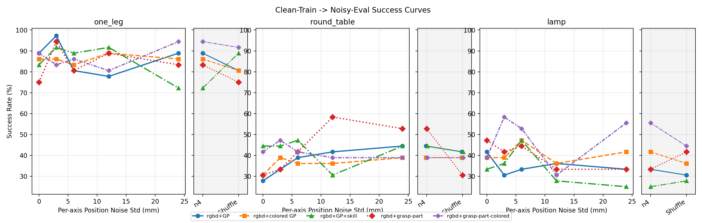
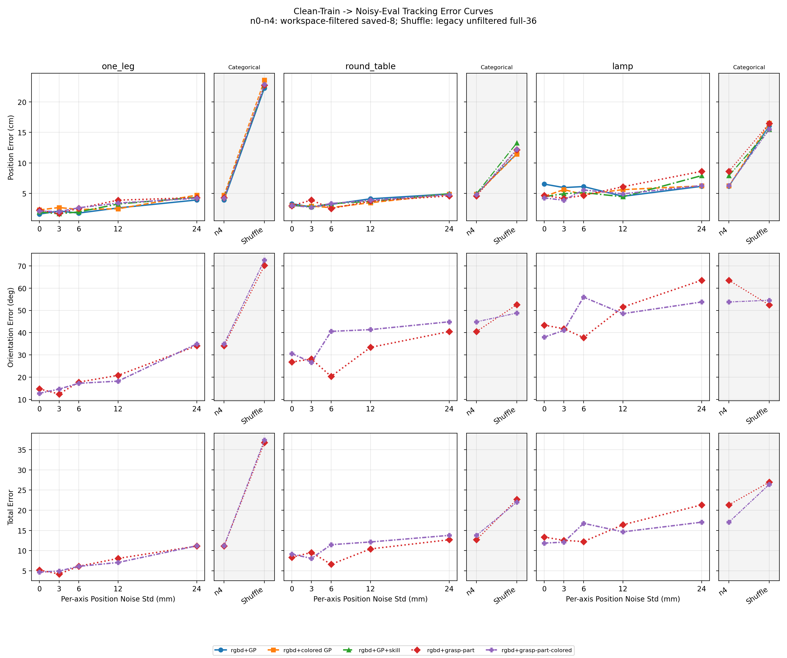

# ICLR 2026 实验结果与论文叙事整理

> 整理日期：2026-08-17 
> 代码基线：`main@19ab7cc3c4eaa841c6c0d4751dba9dc40c3e1889`（整理时与 `origin/main` 一致） 
> 原始文档：`D:\ZJU\研一春夏\ICLR2026\实验结果整理\实验结果整理.md` 
> 说明：实验结果部分仅整理两张源表和两张噪声实验结果图；“原报告结论”均从对应源报告逐字复制，额外判断单独标记为“整理意见”。

## 1. 论文想讲的故事

长时程家具拼装要求机器人在不同装配任务和操作阶段之间切换，同时准确定位当前需要交互的零件及其目标位置。因此，一个共享动作策略必须同时回答两个相互关联的问题：当前应该执行哪一项操作，以及应该在何处执行这一操作。仅依赖 RGB 或 RGB-D 观测时，策略需要从高维视觉输入中隐式恢复任务语义和空间目标，容易在多任务训练中偏向某个数据占优的任务。one-hot skill condition 可以直接提供任务或阶段语义，却不包含目标位置；二维 guidance point（GP）则将任务相关的空间目标显式投影到图像中，为低层连续控制提供一个紧凑、直观且可诊断的接口。

本文以多任务家具拼装为研究场景，系统比较 DiT action expert 的多种条件形式，包括 GP、colored GP、one-hot skill condition 以及 6D grasp-part annotation，并进一步考察这些条件对空间分布变化和标注误差的响应。现有结果并不支持“某一种条件在所有设置下都占优”这一简单结论，而是揭示了一条更具体的规律：显式条件使共享策略获得覆盖多个任务的能力，其中 `rgbd+GP+skill` 在 low randomness 主实验中取得最高总体成功率，而 GP 类条件，尤其是 colored GP，在连续数值噪声下表现出更稳定的成功率。由此，本文的核心主张不是 GP 已经解决了空间泛化，而是 GP 为高层语义定位与低层动作生成之间提供了一个有效且可分析的空间接口，其优势和失效边界可以通过受控扰动实验被直接测量。

实验论证围绕这一主张逐步展开。首先，在不额外改变零件空间分布的多任务评估中，RGB 和 RGB-D 基线只在个别任务上获得成功，而加入 GP 或 one-hot skill condition 后，同一个策略能够覆盖全部三个任务。这一结果与“显式条件缓解了多任务策略中的任务混淆”一致。随后，单任务与多任务对比表明，多任务训练并未系统性提高 round_table 的单任务成功率，因此主实验更适合被解释为“显式条件支持共享策略覆盖多个任务”，而不是“数据合并本身提高了单任务性能”。

为了检验这种能力能否延伸到训练分布之外，我们进一步从零件初始位姿变化和 guidance 噪声两个维度进行评估。在 Low→Med 实验中，用于随机化零件初始位姿的最大外力由 0.2 提高到 0.5，最大扰动力矩由 0.007 提高到 0.01。所有方法的成功率均明显下降，说明当前策略仍然受限于零件初始位姿的分布外变化。带显式条件的多任务策略保留了少量成功案例，而且部分失败 rollout 中仍可观察到目标跟踪行为；然而，每个任务仅有 12 个 rollout，现有结果只能说明空间条件可能提供局部帮助，尚不足以可靠比较不同条件的空间泛化能力。

最后，clean-train → noisy-eval 实验将上游定位误差显式注入空间条件，以检验这一接口在实际部署中的容错性。GP 与 colored GP 在 n0–n4 数值噪声下保持了相对稳定的总体成功率，而更复杂的 grasp-part annotation 呈现更大的 task 内波动。`rgbd+GP+skill` 对连续数值噪声更敏感，却在禁止 same-state donor 的 strong Shuffle 下出现成功率回升，这一现象说明“one-hot skill 导致 shortcut，因而错误 guidance 越强、性能越差”的单调解释并不充分。一个与两组结果同时相容、但仍待验证的假设是，策略可能学习了 skill、场景与 guidance 之间的兼容性判断：数值偏移后的点仍显得语义合理，因而可能持续误导动作；完全置乱的 guidance 则与 skill 或场景明显冲突，使策略降低对该点的依赖并退回到 RGB-D 与 skill 信息。由于不同扰动设置没有使用配对 reset，且该回升只对应 6 次额外成功，当前结果只能用于提出机制假设，不能作为 shortcut 或 gating 已被证实的证据。

这些结果共同指向目标系统 `VLM → 2D guidance point → DiT action expert`：上游 VLM 负责把语义目标转化为空间点，下游 action expert 负责连续控制。后续端到端评估应沿用同一条证据链，分别测量 VLM 的打点误差、action expert 对不同误差类型和幅度的响应，以及完整系统的任务成功率，从而区分定位瓶颈与控制瓶颈。

## 2. 实验结果

> [!NOTE]
> 本节只整理两张源表和两张噪声实验结果图。标记为“原报告结论”的文字均从对应源报告逐字复制；“整理意见”是额外备注，不属于原结论。

### 2.1 多任务 condition 主实验

来源：[`multi_task_condition_eval_0610.md`](./multi_task_condition_eval_0610.md#1-总览)

设置：`one_leg + round_table + lamp` 多任务，DiT diffusion policy，每个任务 100 条训练轨迹；评估使用 `N_ENVS=3, N_ROLLOUTS=36`。

#### 表 1：不同 condition 的多任务成功率

| # | 实验 | RUN_ID | one_leg | round_table | lamp | Overall |
|---|---------|--------|---------|-------------|------|---------|
| 1 | rgbd+only skill | good-serenity-16 | 77.78% (28/36) | 47.22% (17/36) | 33.33% (12/36) | 52.78% (57/108) |
| 2 | rgbd | clear-water-12 | 0.00% (0/36) | 41.67% (15/36) | 0.00% (0/36) | 13.89% (15/108) |
| 3 | rgbd+colored GP | absurd-voice-2 | **91.67% (33/36)** | 27.78% (10/36) | 38.89% (14/36) | 52.78% (57/108) |
| 4a | rgbd+GP | rare-monkey-4 | 83.33% (30/36) | 33.33% (12/36) | 27.78% (10/36) | 48.15% (52/108) |
| 4b | rgbd+GP | autumn-dust-13 | 77.78% (28/36) | 36.11% (13/36) | 41.67% (15/36) | 51.85% (56/108) |
| 4c | rgbd+GP | icy-vortex-9 | 86.11% (31/36) | **55.56% (20/36)** | 30.56% (11/36) | 57.41% (62/108) |
| 5 | rgbd+GP+skill | fresh-tree-11 | 83.33% (30/36) | 50.00% (18/36) | **55.56% (20/36)** | **62.96% (68/108)** |
| 6 | rgb | true-firefly-8 | 0.00% (0/36) | 16.67% (6/36) | 0.00% (0/36) | 5.56% (6/108) |
| 7 | rgbd+grasp-part | morning-glitter-1 | **86.11% (31/36)** | 38.89% (14/36) | 41.67% (15/36) | 55.56% (60/108) |
| 8 | rgbd+grasp-part-colored | eternal-cosmos-2 | 80.56% (29/36) | **44.44% (16/36)** | 33.33% (12/36) | 52.78% (57/108) |

#### 原报告结论（逐字保留）

1. gp, skill one-hot 两种引导信息都能让多任务模型有区分不同任务的能力。
2. 多任务泛化性 rgbd+skill+gp > rgbd+gp = rgbd+colored gp = rgbd+only skill。skill 级别的信息就能够做到辅助拟合，当前实验设定并不能体现出 gp 的优势。
3. 目前 skill = gp，想让 gp > skill 的两个方向：
    1. 提升任务泛化难度，med rand 和 permutation 肯定会有帮助。
    2. gp+grasp，提供 rot 信息。
4. colored 并没有如预期地提供类似 one-hot skill 的信息。可能的原因：
    1. 信号大小：2px 点占图像的 0.008%。ResNet 的 32× 下采样后，这个点变成了 ~0.06 feature-map-pixel。颜色差异（红 vs 黄）在 deep features 里几乎不可区分。
    2. 信息量 vs 通路带宽：skill one-hot 贡献 5 个独占维度（531 维 conditioning 中的 5 维），而 colored GP 的 1 bit 信息和整个场景（物体、机械臂、桌面）"挤"在同一个 512-dim visual feature 空间里竞争。
    - 改成红色和蓝色的点来区分可能更好，单独放两个通道。但是大小无法解决
5. 为什么 rgbd 和 rgb 过拟合到 round_table 而不是最简单的 one_leg？轨迹更长，数据更多。
6. rgbd+skill 为什么做不好 one_leg？瓶颈在 place，失去点的位置引导之后，policy 的插入精度大幅下降。但是其他两个任务因为数据更多而受到的影响更小。

#### 整理意见（不属于原报告结论）

> 表 1 能直接支持显式条件帮助共享策略区分并覆盖多个任务。若后续将 condition 之间的排序写入论文主结论，建议为除纯 GP 外的条件补充多 seed 结果或置信区间；colored GP 的信号尺寸与通路带宽解释目前属于机制假设。

### 2.2 Low-train → Med-eval 空间泛化

来源：[`low2med_generalization.md`](./low2med_generalization.md#results)

**Eval completed: 2026-06-27**. All models trained on low randomness, evaluated on med randomness, 12 rollouts per task.
> Additional med eval appended on 2026-07-04: `good-serenity-16` (checkpoint config is `rgbd-only-skill`).
> Additional med eval appended on 2026-07-07: `morning-glitter-1` (checkpoint config is `rgbd-skill-grasp-part`, `annotate_grasp_part=True`, `annotate_skill_one_hot=False`, `annotate_guidance_point=False`).
> Additional med eval appended on 2026-07-08: `eternal-cosmos-2` (checkpoint config is `rgbd-skill-grasp-part-colored`, `annotate_grasp_part=True`, `annotate_guidance_point_colored=True`, `annotate_grasp_colored=True`, `annotate_skill_one_hot=False`).

#### 表 2：Low → Med Randomness Generalization

| Type | Condition | RUN_ID | one_leg | round_table | lamp | **Overall** |
|------|---------|--------|:---:|:---:|:---:|:---:|
| mt-bc | rgbd+gp | autumn-dust-13 | 25.00% (3/12) | 0.00% (0/12) | 0.00% (0/12) | **8.33% (3/36)** |
| mt-bc | rgbd+gp+skill | fresh-tree-11 | 8.33% (1/12) | 0.00% (0/12) | 0.00% (0/12) | **2.78% (1/36)** |
| mt-bc | rgbd+colored gp | absurd-voice-2 | 16.67% (2/12) | 0.00% (0/12) | 0.00% (0/12) | **5.56% (2/36)** |
| mt-bc | rgbd+only skill | good-serenity-16 | 8.33% (1/12) | 0.00% (0/12) | 0.00% (0/12) | **2.78% (1/36)** |
| mt-bc | rgbd | clear-water-12 | 0.00% (0/12) | 0.00% (0/12) | 0.00% (0/12) | **0.00% (0/36)** |
| mt-bc | rgb | true-firefly-8 | 0.00% (0/12) | 0.00% (0/12) | 0.00% (0/12) | **0.00% (0/36)** |
| mt-bc | rgbd+grasp-part | morning-glitter-1 | 25.00% (3/12) | 0.00% (0/12) | 0.00% (0/12) | **8.33% (3/36)** |
| mt-bc | rgbd+grasp-part-colored | eternal-cosmos-2 | 16.67% (2/12) | 0.00% (0/12) | 8.33% (1/12) | **8.33% (3/36)** |
| rppo | one_leg | — | 25.00% (3/12) | — | — | **25.00% (3/12)** |
| rppo | round_table | — | — | 16.67% (2/12) | — | **16.67% (2/12)** |
| rppo | lamp | — | — | — | 8.33% (1/12) | **8.33% (1/12)** |
| st-bc | rgbd+gp | dauntless-breeze-2 | — | 8.33% (1/12) | — | **8.33% (1/12)** |
| st-bc | rgbd+only skill | misunderstood-firebrand-6 | — | 0.00% (0/12) | — | **0.00% (0/12)** |
| st-bc | rgbd+gp+skill | vocal-bush-11 | — | 0.00% (0/12) | — | **0.00% (0/12)** |
| st-bc | rgbd+colored gp | gentle-fog-7 | — | 8.33% (1/12) | — | **8.33% (1/12)** |
| st-bc | rgbd | breezy-rain-3 | — | 0.00% (0/12) | — | **0.00% (0/12)** |
| st-bc | rgb | fiery-snowball-4 | — | 0.00% (0/12) | — | **0.00% (0/12)** |

#### 原报告结论（逐字保留）

1. 从成功率看起来 guidance point conditioned 更能做空间上的泛化
2. 然后看 failure case 的话，单任务 colored guidance point 会比单色 guidance point 的点跟随更好
3. colored gp 和 gp 主要的 failure case 是 grasp 失败或者 grasp pose OOD 导致 place 失败。
4. 光是空间上随机性增加一点成功率已经掉完了，拼装上 zero-shot 新任务泛化肯定是做不了。

#### 整理意见（不属于原报告结论）

> 每个 task 只有 12 个 rollout，单次成败对应 8.33 个百分点。因此，原报告关于 GP 空间泛化和 failure case 的观察可以保留，但若用于论文中的方法排序，建议增加 rollout 数、配对 reset seed 和多训练 seed。

### 2.3 Clean-train → noisy-eval

来源：[`annotation_noise_clean_train_fresh36.md`](./annotation_noise_clean_train_fresh36.md#1-结果图)

> [!NOTE]
> **成功率与 tracking 的样本量不同。** n0-n4 成功率使用每个 task/setting 的 36 个 rollout；n0-n4 tracking 从每个 task/setting 已保存的 8 个 rollout pickle 重新计算，用作整体 tracking 趋势的估计。Tracking 图照常画出 Shuffle 并与 n4 连线，但该端点来自旧 full-36 summary，无法事后执行 workspace 过滤，只作为 legacy 参考，不进入正式 tracking 表格、拟合或结论。

#### 图 1：Task Overall Success

#### 图 2：Task Overall Tracking

> 图中灰色分类区的 Shuffle tracking 来自 legacy unfiltered full-36 summary；其纵轴与 n0-n4 共享，但不共享数值噪声横轴。

#### 原报告主要结论（逐字保留）

- **`rgbd+colored GP` 是数值噪声下最稳定的 condition。** n0-n4 overall range/std 为 `3.7/1.4 pp`，略优于 `rgbd+GP` 的 `4.6/1.6 pp`；one_leg 与 round_table 的 task 内 range 分别为 `5.6/8.3 pp`，明显小于 GP 的 `19.4/16.7 pp`，lamp 均为 `11.1 pp`。两者 n4 overall 都是 `55.6%`，因此结论为“colored GP 最稳定，GP 在总体上仍稳定但对 task/reset randomization 更敏感”。
- **现有 tracking 不支持推断 GP 与 colored GP 使用了不同机制。** 排除 workspace 外的 guidance target 后，两者 position tracking 与噪声均保持正相关：GP `r=0.945`，colored GP `r=0.921`。原 colored GP round_table n2 极值来自单个部件飞出工作空间的仿真失败，并非噪声响应。由于两个 checkpoint 不同且 tracking 只有 saved-8，当前只能比较经验稳定性，不能据此解释内部机制。
- **`rgbd+GP` 在 round_table 上随噪声上升的现象集中在第一段 screw，并非所有 skill 都受益。** task success 从 `10/36 = 27.8%` 增至 `16/36 = 44.4%`。但 `leg-top-pick` 完成数保持 `33/36 -> 33/36`，`leg-top-place` 反而从 `27/33` 降为 `26/33`；主要变化是 `leg-top-screw` 条件完成率按 n0-n4 呈 `53.8% -> 68.0% -> 78.6% -> 84.6% -> 84.6%`，完成数从 `14/26` 增至 `22/26`。其他 condition 的同一 step 不呈现一致单调提升，因此不是 round_table 对噪声的普遍收益。所有幅度共用 annotation noise seed 0，在相同 env/phase 上相当于将同一噪声方向按 std 放大，可能恰好补偿该 checkpoint 在 screw 上的局部动作偏差；同时各 setting 的 reset 未配对。n0/n4 的 95% Wilson 区间分别为 `[15.8, 44.0]%` 与 `[29.5, 60.4]%`，明显重叠，所以该曲线应解释为 seed/checkpoint-specific 局部补偿加抽样波动，而不是更大噪声能提高成功率。要验证是否存在真实的有益偏移，需要固定一组 paired reset seeds，并对多个 annotation noise seeds 汇总均值。
- **`rgbd+GP+skill` 对连续数值噪声不稳定，但可能更容易拒绝明显错误的 guidance。** 它的 n0-n4 range 为 `13.9 pp`，n4 overall 为 `47.2%`，低于 GP/colored GP；但它是唯一从 n4 到 Shuffle 回升的模型：`47.2% -> 52.8%` (`+5.6 pp`, `51 -> 57`/108)。回升几乎全部来自 one_leg (`72.2% -> 88.9%`)；round_table/lamp 仅变化 `-2.8/+2.8 pp`。一种解释是 n4 仍是“可信但偏移”的点，模型会被误导；Shuffle 与 one-hot skill/场景明显冲突，触发对 guidance 的 gating，退回 RGBD+skill 路径。由于两组 reset 未配对且只差 6 次成功，这不是统计显著性证据。
- **Grasp annotation 总体可容忍噪声，但单 task 波动更大。** grasp-part 与 colored grasp-part 的 n0-n4 overall range 为 `9.3/13.0 pp`；最大 task range 都达到 `27.8 pp`（分别出现在 round_table/lamp）。同时 position/orientation tracking 与噪声保持正相关，更符合“仍围绕视觉语义完成动作，但对零件初始随机化较敏感”的解释。
- **Strong Shuffle 表明语义正确的 guidance 仍然有用，policy 并非只依赖 RGBD。** 五个 condition 合计从 n4 的 `300/540 = 55.6%` 到 Shuffle 的 `284/540 = 52.6%`，只变化 `-3.0 pp`；其中 `4/5` 个 condition 下降：rgbd+GP `-4.6 pp`、rgbd+colored GP `-3.7 pp`、rgbd+grasp-part `-7.4 pp`、rgbd+grasp-part-colored `-4.6 pp`，只有 rgbd+GP+skill 回升 `+5.6 pp`。图像与深度保持不变而 semantic-state guidance 被置乱后，大多数模型同向下降，支持正确 guidance 确实参与决策；Shuffle 后成功率仍约为一半，则说明模型同时保留了视觉/低维 fallback，而不是 guidance 是唯一输入。由于每组只有 108 rollout 且 reset 未配对，单个 condition 的 3.7-7.4 pp 降幅仍应视为趋势证据。

#### 整理意见（不属于原报告结论）

> 两张图均直接复用噪声实验报告中的原始图片文件。Success 图展示完整 36-rollout 成功率；Tracking 图的 n0–n4 使用 workspace-filtered saved-8，而 Shuffle 是 legacy unfiltered full-36 参考端点。后者不应进入正式 tracking 数值比较。

## 3. 仍在进行或计划中的实验

1. 真机实验：形成与表 1 对齐的 condition 对比表，并提供代表性 demo。
2. VLM 接入：报告 VLM 打点误差、按误差区间分桶的 action-expert 成功率，以及完整 pipeline 的端到端成功率。
3. Med-train → high-eval：high randomness 加入零件初始位姿排列组合，预期成功率较低；需要多 seed 和足够 rollout 才能比较 condition。
4. 任务扩展：加入 ManiSkill3 与 Isaac Lab / Isaac Gym 的新任务和数据，验证 guidance point 作为跨任务接口的可扩展性。

## 附录 A：结果来源

- 多任务 condition 主实验：[`multi_task_condition_eval_0610.md`](./multi_task_condition_eval_0610.md#1-总览)
- Low→Med 空间泛化：[`low2med_generalization.md`](./low2med_generalization.md#results)
- Clean-train → noisy-eval：[`annotation_noise_clean_train_fresh36.md`](./annotation_noise_clean_train_fresh36.md#1-结果图)
- 图 1 直接引用 `figures/fresh36/annotation_noise_clean_train_success_vs_noise.png`，SHA-256 为 `27526EA75C9E857B460A0B9F0484C0A33C4BF2705132570687A98869219FA4F1`。
- 图 2 直接引用 `figures/fresh36/annotation_noise_clean_train_tracking_vs_noise.png`，SHA-256 为 `3D415AA9DDE1FAD57ACD410CC3250DB7F47223E5EE925C68C2C72A9D9D2BA219`。
