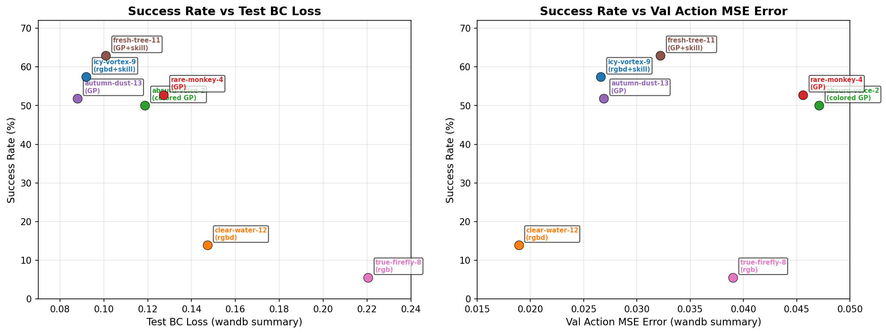

# 多任务 Condition 对比实验 — 评估结果汇总

**日期**: 2026-06-15
**任务**: `one_leg + round_table + lamp` (多任务)
**模型**: DiT (diffusion), 3×100 trajectories
**Project**: `multi-task-rgbd-skill-low-0610`
**Eval Settings**: `N_ENVS=3, N_ROLLOUTS=36`, image-based

---

## 1. 总览

| # | 实验 | RUN_ID | one_leg | round_table | lamp | Overall |
|---|---------|--------|---------|-------------|------|---------|
| 1 | rgbd+only skill | good-serenity-16 | 77.78% (28/36) | 47.22% (17/36) | 33.33% (12/36) | 52.78% (57/108) |
| 2 | rgbd | clear-water-12 | 0.00% (0/36) | 41.67% (15/36) | 0.00% (0/36) | 13.89% (15/108) |
| 3 | rgbd+colored GP | absurd-voice-2 | **91.67% (33/36)** | 27.78% (10/36) | 38.89% (14/36) | 52.78% (57/108) |
| 4a | rgbd+GP | rare-monkey-4 | 83.33% (30/36) | 33.33% (12/36) | 27.78% (10/36) | 48.15% (52/108) |
| 4b | rgbd+GP | autumn-dust-13 | 77.78% (28/36) | 36.11% (13/36) | 41.67% (15/36) | 51.85% (56/108) |
| 4c | rgbd+GP | icy-vortex-9 | 86.11% (31/36) | **55.56% (20/36)** | 30.56% (11/36) | 57.41% (62/108) |
| 5 | rgbd+GP+skill | fresh-tree-11 | 83.33% (30/36) | 50.00% (18/36) | **55.56% (20/36)** | **62.96% (68/108)** |
| 6 | rgb | true-firefly-8 | 0.00% (0/36) | 16.67% (6/36) | 0.00% (0/36) | 5.56% (6/108) |

结论：
1. gp, skill one-hot 两种引导信息都能让多任务模型有区分不同任务的能力。
2. 多任务泛化性 rgbd+skill+gp > rgbd+gp = rgbd+colored gp = rgbd+only skill。skill 级别的信息就能够做到辅助拟合，当前实验设定并不能体现出 gp 的优势。
3. 目前 skill = gp，想让 gp > skill 的两个方向：
    1. 提升任务泛化难度，med rand 和 permutation 肯定会有帮助。
    2. gp+grasp，提供 rot 信息。
4. colored 并没有如预期地提供类似 one-hot skill 的信息。可能的原因：
    1. 信号大小：2px 点占图像的 0.008%。ResNet 的 32× 下采样后，这个点变成了 ~0.06 feature-map-pixel。颜色差异（红 vs 黄）在 deep features 里几乎不可区分。
    2. 信息量 vs 通路带宽：skill one-hot 贡献 5 个独占维度（531 维 conditioning 中的 5 维），而 colored GP 的 1 bit 信息和整个场景（物体、机械臂、桌面）"挤"在同一个 512-dim visual feature 空间里竞争。
    - 改成红色和蓝色的点来区分可能更好，单独放两个通道。但是大小无法解决
5. 为什么 rgbd 和 rgb 过拟合到 round_table 而不是最简单的 one_leg？轨迹更长，数据更多。
6. rgbd+skill 为什么做不好 one_leg？瓶颈在 place，失去点的位置引导之后，policy 的插入精度大幅下降。但是其他两个任务因为数据更多而受到的影响更小。

## 2. 对比

### 2.1 round_table 多任务 vs 单任务

多任务数据 3×100 条，单任务数据 200 条（单任务数据来源：[guidance point ablation](https://app.notion.com/p/guidance-point-ablation-34f6aab8287c802f97c2f0c57337f4ad)）。

| 实验条件 | 单任务 round_table | 多任务 round_table (3000 epoch) | Δ |
|---------|-------------------|-------------------------------|-----|
| rgbd | 41.67% (15/36) | 41.67% (15/36) (clear-water-12) | 0 |
| rgbd+GP | 33.33% (12/36) | 33.33-55.56% (rare-monkey-4 / autumn-dust-13 / icy-vortex-9) | **0 ~ +22.23** |
| rgbd+GP+skill | **63.89% (23/36)** | 50.00% (18/36) (fresh-tree-11) | -13.89 |
| rgb | 36.11% (13/36) | 16.67% (6/36) (true-firefly-8) | -19.44 |
| rgbd+only skill | 52.78% (19/36) | 47.22% (17/36) (good-serenity-16) | -5.56 |
| rgbd+colored GP | 50.00% (18/36) | 27.78% (10/36) (absurd-voice-2) | -22.22 |

结论：

### 2.2 3000 epoch vs 2000 epoch

统一使用 latest checkpoint 在 epoch 2000 和 epoch 3000 的 eval 结果对比（均使用 `N_ENVS=3, N_ROLLOUTS=36`）：

| # | 实验 | RUN_ID | 2000 epoch | 3000 epoch | Δ |
|---|------|--------|-----------|-----------|-----|
| 1 | rgbd+only skill | good-serenity-16 | — | 52.78% (57/108) | — |
| 2 | rgbd | clear-water-12 | 14.81% (16/108) | 13.89% (15/108) | -0.92 |
| 3 | rgbd+colored GP | absurd-voice-2 | 51.85% (56/108) | 52.78% (57/108) | +0.93 |
| 4a | rgbd+GP | rare-monkey-4 | 53.70% (58/108) | 48.15% (52/108) | -5.55 |
| 4b | rgbd+GP | autumn-dust-13 | 55.56% (60/108) | 51.85% (56/108) | -3.71 |
| 4c | rgbd+GP | icy-vortex-9 | 45.37% (49/108) | 57.41% (62/108) | +12.04 |
| 5 | rgbd+GP+skill | fresh-tree-11 | 52.78% (57/108) | 62.96% (68/108) | +10.18 |
| 6 | rgb | true-firefly-8 | 10.19% (11/108) | 5.56% (6/108) | -4.63 |

结论：
1. **GP+skill 和 only skill 在 3000 epoch 显著优于 2000 epoch**（+10~12%），说明 skill-based 方法需要更长的训练。
2. **纯 GP 和 rgb/rgbd 在 epoch 间差异不大**（±5% 以内），2000 epoch 基本收敛。
3. **absurd-voice-2 (colored GP) 在 2000 epoch 为 51.85%**，用错 eval flag (colored=false) 时为 50.00%（复测确认；首次 61.11% 为偶然波动），colored flag 差异在噪声范围内。

### 2.3 sr vs test loss/action mse error

wandb summary 中最后一次 eval 记录的 test loss 和 test action mse error（注：wandb test 数据对应最后一次 eval checkpoint，不一定是 3000 epoch；absurd-voice-2 对应 2000 epoch 训练）：

| # | RUN_ID | 实验 | SR (对应 epoch) | test_bc_loss | val_action_mse |
|---|--------|------|----------------|-------------|----------------|
| 1 | good-serenity-16 | rgbd+only skill | 52.78% (3000) | 0.0808 | 0.0275 |
| 2 | clear-water-12 | rgbd | 13.89% (3000) | 0.1472 | 0.0189 |
| 3 | absurd-voice-2 | colored GP | 51.85% (2000, colored=true) | 0.1186 | 0.0471 |
| 4a | rare-monkey-4 | GP | 48.15% (3000) | 0.1273 | 0.0456 |
| 4b | autumn-dust-13 | GP | 51.85% (3000) | 0.0879 | 0.0269 |
| 4c | icy-vortex-9 | GP | 57.41% (3000) | 0.0920 | 0.0266 |
| 5 | fresh-tree-11 | GP+skill | 62.96% (3000) | 0.1009 | 0.0322 |
| 6 | true-firefly-8 | rgb | 5.56% (3000) | 0.2205 | 0.0390 |

## 3. 分步成功率分析

下表覆盖总览中的 6 个条件组，共 8 条采纳 run 行。数据统一来自 low-rand、3000 epoch、与训练配置一致的 eval JSON；每个单元格均为 `completion_count / state_count`，百分比与 stdout 对齐。

### 3.1 one_leg skill success rates (cascading)

| Condition | RUN_ID | top-leg-pick | top-leg-push | leg-top-pick | leg-top-place | leg-top-insert | leg-top-screw | assembly: top-leg |
|---------|--------|:---:|:---:|:---:|:---:|:---:|:---:|:---:|
| rgbd+only skill | good-serenity-16 | 100.00% (36/36) | 91.67% (33/36) | 100.00% (33/33) | 87.88% (29/33) | 96.55% (28/29) | 100.00% (28/28) | 77.78% (28/36) |
| rgbd | clear-water-12 | 19.44% (7/36) | 0.00% (0/7) | — | — | — | — | 0.00% (0/36) |
| rgbd+colored GP | absurd-voice-2 | 100.00% (36/36) | 100.00% (36/36) | 100.00% (36/36) | 94.44% (34/36) | 100.00% (34/34) | 97.06% (33/34) | 91.67% (33/36) |
| rgbd+GP | rare-monkey-4 | 100.00% (36/36) | 97.22% (35/36) | 100.00% (34/34) | 88.24% (30/34) | 100.00% (30/30) | 96.67% (29/30) | 83.33% (30/36) |
| rgbd+GP | autumn-dust-13 | 100.00% (36/36) | 100.00% (36/36) | 100.00% (36/36) | 83.33% (30/36) | 100.00% (30/30) | 93.33% (28/30) | 77.78% (28/36) |
| rgbd+GP | icy-vortex-9 | 100.00% (36/36) | 97.22% (35/36) | 100.00% (35/35) | 97.14% (34/35) | 100.00% (34/34) | 91.18% (31/34) | 86.11% (31/36) |
| rgbd+GP+skill | fresh-tree-11 | 100.00% (36/36) | 97.22% (35/36) | 100.00% (34/34) | 94.12% (32/34) | 100.00% (32/32) | 90.62% (29/32) | 83.33% (30/36) |
| rgb | true-firefly-8 | 22.22% (8/36) | 0.00% (0/8) | — | — | — | — | 0.00% (0/36) |

### 3.2 round_table skill success rates (cascading)

| Condition | RUN_ID | top-leg-push | leg-top-pick | leg-top-place | leg-top-insert | leg-top-screw | base-leg-pick | base-leg-place | base-leg-insert | base-leg-screw | asm: top-leg | asm: leg-base |
|---------|--------|:---:|:---:|:---:|:---:|:---:|:---:|:---:|:---:|:---:|:---:|:---:|
| rgbd+only skill | good-serenity-16 | 100.00% (36/36) | 83.33% (30/36) | 80.00% (24/30) | 95.83% (23/24) | 86.96% (20/23) | 95.00% (19/20) | 89.47% (17/19) | 100.00% (17/17) | 100.00% (17/17) | 55.56% (20/36) | 85.00% (17/20) |
| rgbd | clear-water-12 | 100.00% (36/36) | 80.56% (29/36) | 79.31% (23/29) | 100.00% (23/23) | 91.30% (21/23) | 90.48% (19/21) | 94.74% (18/19) | 100.00% (18/18) | 83.33% (15/18) | 58.33% (21/36) | 71.43% (15/21) |
| rgbd+colored GP | absurd-voice-2 | 100.00% (36/36) | 97.22% (35/36) | 77.14% (27/35) | 100.00% (27/27) | 77.78% (21/27) | 95.24% (20/21) | 80.00% (16/20) | 93.75% (15/16) | 66.67% (10/15) | 58.33% (21/36) | 47.62% (10/21) |
| rgbd+GP | rare-monkey-4 | 100.00% (36/36) | 83.33% (30/36) | 90.00% (27/30) | 100.00% (27/27) | 81.48% (22/27) | 81.82% (18/22) | 94.44% (17/18) | 100.00% (17/17) | 70.59% (12/17) | 61.11% (22/36) | 54.55% (12/22) |
| rgbd+GP | autumn-dust-13 | 100.00% (36/36) | 91.67% (33/36) | 93.94% (31/33) | 100.00% (31/31) | 64.52% (20/31) | 90.00% (18/20) | 88.89% (16/18) | 93.75% (15/16) | 86.67% (13/15) | 55.56% (20/36) | 65.00% (13/20) |
| rgbd+GP | icy-vortex-9 | 100.00% (36/36) | 91.67% (33/36) | 90.91% (30/33) | 100.00% (30/30) | 90.00% (27/30) | 92.59% (25/27) | 96.00% (24/25) | 100.00% (24/24) | 83.33% (20/24) | 75.00% (27/36) | 74.07% (20/27) |
| rgbd+GP+skill | fresh-tree-11 | 100.00% (36/36) | 91.67% (33/36) | 96.97% (32/33) | 100.00% (32/32) | 75.00% (24/32) | 87.50% (21/24) | 100.00% (21/21) | 100.00% (21/21) | 85.71% (18/21) | 66.67% (24/36) | 75.00% (18/24) |
| rgb | true-firefly-8 | 97.22% (35/36) | 77.14% (27/35) | 81.48% (22/27) | 100.00% (22/22) | 86.36% (19/22) | 68.42% (13/19) | 92.31% (12/13) | 100.00% (12/12) | 50.00% (6/12) | 52.78% (19/36) | 31.58% (6/19) |

### 3.3 lamp skill success rates (cascading)

| Condition | RUN_ID | base-bulb-push | bulb-base-pick | bulb-base-place | bulb-base-insert | bulb-base-screw | hood-base-pick | asm: base-bulb | asm: base-hood |
|---------|--------|:---:|:---:|:---:|:---:|:---:|:---:|:---:|:---:|
| rgbd+only skill | good-serenity-16 | 100.00% (36/36) | 97.22% (35/36) | 51.43% (18/35) | 100.00% (18/18) | 66.67% (12/18) | 100.00% (10/10) | 33.33% (12/36) | 100.00% (10/10) |
| rgbd | clear-water-12 | 44.44% (16/36) | 50.00% (8/16) | 0.00% (0/8) | — | — | — | 0.00% (0/36) | — |
| rgbd+colored GP | absurd-voice-2 | 100.00% (36/36) | 97.22% (35/36) | 65.71% (23/35) | 100.00% (23/23) | 60.87% (14/23) | 100.00% (10/10) | 38.89% (14/36) | 100.00% (10/10) |
| rgbd+GP | rare-monkey-4 | 100.00% (36/36) | 97.22% (35/36) | 65.71% (23/35) | 100.00% (23/23) | 43.48% (10/23) | 100.00% (10/10) | 27.78% (10/36) | 100.00% (10/10) |
| rgbd+GP | autumn-dust-13 | 100.00% (36/36) | 100.00% (36/36) | 66.67% (24/36) | 100.00% (24/24) | 62.50% (15/24) | 100.00% (10/10) | 41.67% (15/36) | 100.00% (10/10) |
| rgbd+GP | icy-vortex-9 | 100.00% (36/36) | 100.00% (36/36) | 52.78% (19/36) | 100.00% (19/19) | 57.89% (11/19) | 100.00% (7/7) | 30.56% (11/36) | 100.00% (7/7) |
| rgbd+GP+skill | fresh-tree-11 | 100.00% (36/36) | 100.00% (36/36) | 75.00% (27/36) | 100.00% (27/27) | 74.07% (20/27) | 100.00% (17/17) | 55.56% (20/36) | 100.00% (17/17) |
| rgb | true-firefly-8 | 25.00% (9/36) | 22.22% (2/9) | 0.00% (0/2) | — | — | — | 0.00% (0/36) | — |

## 附录: 实验数据汇总

统一条件：`N_ENVS=3, N_ROLLOUTS=36`, image-based, checkpoint=latest

### A.1 3000 epoch eval

| # | RUN_ID | 训练配置 | eval GP colored | one_leg | round_table | lamp | Overall |
|---|--------|---------|-----------------|---------|-------------|------|---------|
| 1 | icy-vortex-9 | rgbd+GP | N/A | 86.11% (31/36) | 55.56% (20/36) | 30.56% (11/36) | 57.41% (62/108) |
| 2 | clear-water-12 | rgbd | N/A | 0.00% (0/36) | 41.67% (15/36) | 0.00% (0/36) | 13.89% (15/108) |
| 3 | absurd-voice-2 | colored GP | ❌ false (错) | 94.44% (34/36) | 33.33% (12/36) | 33.33% (12/36) | 53.70% (58/108) |
| 3 | absurd-voice-2 | colored GP | ✅ true (对) | **91.67% (33/36)** | 27.78% (10/36) | 38.89% (14/36) | 52.78% (57/108) |
| 4a | rare-monkey-4 | GP | ❌ true (错) | 83.33% (30/36) | 41.67% (15/36) | 33.33% (12/36) | 52.78% (57/108) |
| 4a | rare-monkey-4 | GP | ✅ false (对) | 83.33% (30/36) | 33.33% (12/36) | 27.78% (10/36) | 48.15% (52/108) |
| 4b | autumn-dust-13 | GP | ✅ false | 77.78% (28/36) | 36.11% (13/36) | 41.67% (15/36) | 51.85% (56/108) |
| 5 | fresh-tree-11 | GP+skill | N/A | 83.33% (30/36) | 50.00% (18/36) | **55.56% (20/36)** | **62.96% (68/108)** |
| 6 | true-firefly-8 | rgb | N/A | 0.00% (0/36) | 16.67% (6/36) | 0.00% (0/36) | 5.56% (6/108) |
| 7 | good-serenity-16 | rgbd-only-skill | N/A | 77.78% (28/36) | 47.22% (17/36) | 33.33% (12/36) | 52.78% (57/108) |

### A.2 2000 epoch eval

| # | RUN_ID | 训练配置 | eval GP colored | one_leg | round_table | lamp | Overall |
|---|--------|---------|-----------------|---------|-------------|------|---------|
| 1 | icy-vortex-9 | rgbd+GP | N/A | 80.56% (29/36) | 36.11% (13/36) | 19.44% (7/36) | 45.37% (49/108) |
| 2 | clear-water-12 | rgbd | N/A | 0.00% (0/36) | 44.44% (16/36) | 0.00% (0/36) | 14.81% (16/108) |
| 3 | absurd-voice-2 | colored GP | ❌ false (错) | 83.33% (30/36) | 38.89% (14/36) | 27.78% (10/36) | 50.00% (54/108) |
| 3 | absurd-voice-2 | colored GP | ✅ true (对) | 86.11% (31/36) | 33.33% (12/36) | 36.11% (13/36) | 51.85% (56/108) |
| 4a | rare-monkey-4 | GP | ❌ true (错) | 80.56% (29/36) | 47.22% (17/36) | 33.33% (12/36) | 53.70% (58/108) |
| 4a | rare-monkey-4 | GP | ✅ false (对) | 88.89% (32/36) | 38.89% (14/36) | 33.33% (12/36) | 53.70% (58/108) |
| 4b | autumn-dust-13 | GP | ✅ false | 91.67% (33/36) | 30.56% (11/36) | 44.44% (16/36) | 55.56% (60/108) |
| 5 | fresh-tree-11 | GP+skill | N/A | 86.11% (31/36) | 33.33% (12/36) | 38.89% (14/36) | 52.78% (57/108) |
| 6 | true-firefly-8 | rgb | N/A | 0.00% (0/36) | 30.56% (11/36) | 0.00% (0/36) | 10.19% (11/108) |

> eval GP colored 标记：✅ = 与训练配置一致，❌ = 与训练配置不一致

### A.3 wandb test metrics

wandb summary 最后一次 eval 记录的值（不一定是 3000 epoch 末尾；absurd-voice-2 来自 2000 epoch 训练）：

| RUN_ID | test_bc_loss | val_action_mse | val_mse_pos | val_mse_rot | val_mse_width |
|--------|-------------|----------------|-------------|-------------|---------------|
| icy-vortex-9 | 0.0920 | 0.0266 | 0.00016 | 0.00761 | 0.2196 |
| clear-water-12 | 0.1472 | 0.0189 | 0.00018 | 0.00643 | 0.1503 |
| absurd-voice-2 | 0.1186 | 0.0471 | 0.00014 | 0.01758 | 0.3653 |
| rare-monkey-4 | 0.1273 | 0.0456 | 0.00025 | 0.00423 | 0.4295 |
| autumn-dust-13 | 0.0879 | 0.0269 | 0.00011 | 0.00581 | 0.2339 |
| fresh-tree-11 | 0.1009 | 0.0322 | 0.00013 | 0.00882 | 0.2687 |
| true-firefly-8 | 0.2205 | 0.0390 | 0.00018 | 0.02559 | 0.2363 |
| good-serenity-16 | 0.0808 | 0.0275 | 0.00012 | 0.00705 | 0.2041 |

### A.4 查证路径

查证根目录：`/home/huyue/projects/robust-rearrangement-custom/logs/evaluate_model/`

下表路径均相对该根目录；`overall` 取自三项 task JSON 汇总，若存在 aggregate JSON，也在最后一列给出。

#### A.4.1 主表与分步表采用的 low-rand / 3000 epoch / 正确 flag 路径

| RUN_ID | 条件 | one_leg JSON | round_table JSON | lamp JSON | aggregate JSON |
|--------|------|--------------|------------------|-----------|----------------|
| good-serenity-16 | rgbd+only skill | `one_leg/multi-task-rgbd-skill-low-0610_good-serenity-16_latest_3000/2026-07-01T20-46-17.json` | `round_table/multi-task-rgbd-skill-low-0610_good-serenity-16_latest_3000/2026-07-03T20-07-26.json` | `lamp/multi-task-rgbd-skill-low-0610_good-serenity-16_latest_3000/2026-07-03T20-35-25.json` | — |
| clear-water-12 | rgbd | `one_leg/multi-task-rgbd-skill-low-0610_clear-water-12_latest_3000/2026-06-15T13-50-06.json` | `round_table/multi-task-rgbd-skill-low-0610_clear-water-12_latest_3000/2026-06-15T14-15-13.json` | `lamp/multi-task-rgbd-skill-low-0610_clear-water-12_latest_3000/2026-06-15T14-39-41.json` | `one_leg+round_table+lamp/multi-task-rgbd-skill-low-0610_clear-water-12_latest_3000/2026-06-15T14-39-42.json` |
| absurd-voice-2 | rgbd+colored GP | `one_leg/multi-task-rgbd-skill-low-0610_absurd-voice-2_latest_3000/2026-06-18T22-18-15.json` | `round_table/multi-task-rgbd-skill-low-0610_absurd-voice-2_latest_3000/2026-06-18T22-44-11.json` | `lamp/multi-task-rgbd-skill-low-0610_absurd-voice-2_latest_3000/2026-06-18T23-08-25.json` | `one_leg+round_table+lamp/multi-task-rgbd-skill-low-0610_absurd-voice-2_latest_3000/2026-06-18T23-08-26.json` |
| rare-monkey-4 | rgbd+GP | `one_leg/multi-task-rgbd-skill-low-0610_rare-monkey-4_latest_3000/2026-06-18T15-28-14.json` | `round_table/multi-task-rgbd-skill-low-0610_rare-monkey-4_latest_3000/2026-06-18T15-54-31.json` | `lamp/multi-task-rgbd-skill-low-0610_rare-monkey-4_latest_3000/2026-06-18T16-20-00.json` | `one_leg+round_table+lamp/multi-task-rgbd-skill-low-0610_rare-monkey-4_latest_3000/2026-06-18T16-20-01.json` |
| autumn-dust-13 | rgbd+GP | `one_leg/multi-task-rgbd-skill-low-0610_autumn-dust-13_latest_3000/2026-06-15T21-25-32.json` | `round_table/multi-task-rgbd-skill-low-0610_autumn-dust-13_latest_3000/2026-06-15T21-51-52.json` | `lamp/multi-task-rgbd-skill-low-0610_autumn-dust-13_latest_3000/2026-06-15T22-15-18.json` | `one_leg+round_table+lamp/multi-task-rgbd-skill-low-0610_autumn-dust-13_latest_3000/2026-06-15T22-15-20.json` |
| icy-vortex-9 | rgbd+GP | `one_leg/multi-task-rgbd-skill-low-0610_icy-vortex-9_latest_3000/2026-06-15T12-28-16.json` | `round_table/multi-task-rgbd-skill-low-0610_icy-vortex-9_latest_3000/2026-06-15T12-54-02.json` | `lamp/multi-task-rgbd-skill-low-0610_icy-vortex-9_latest_3000/2026-06-15T13-22-21.json` | `one_leg+round_table+lamp/multi-task-rgbd-skill-low-0610_icy-vortex-9_latest_3000/2026-06-15T13-22-22.json` |
| fresh-tree-11 | rgbd+GP+skill | `one_leg/multi-task-rgbd-skill-low-0610_fresh-tree-11_latest_3000/2026-06-15T16-58-11.json` | `round_table/multi-task-rgbd-skill-low-0610_fresh-tree-11_latest_3000/2026-06-15T17-23-17.json` | `lamp/multi-task-rgbd-skill-low-0610_fresh-tree-11_latest_3000/2026-06-15T17-44-20.json` | `one_leg+round_table+lamp/multi-task-rgbd-skill-low-0610_fresh-tree-11_latest_3000/2026-06-15T17-44-21.json` |
| true-firefly-8 | rgb | `one_leg/multi-task-rgbd-skill-low-0610_true-firefly-8_latest_3000/2026-06-15T18-06-01.json` | `round_table/multi-task-rgbd-skill-low-0610_true-firefly-8_latest_3000/2026-06-15T18-31-57.json` | `lamp/multi-task-rgbd-skill-low-0610_true-firefly-8_latest_3000/2026-06-15T18-54-11.json` | `one_leg+round_table+lamp/multi-task-rgbd-skill-low-0610_true-firefly-8_latest_3000/2026-06-15T18-54-13.json` |

#### A.4.2 2000 epoch 与 wrong-flag 复核路径

`good-serenity-16` 当前没有 low-rand / 2000 epoch 的对应 eval JSON，因此 §2.2 保持 `—`。

| RUN_ID | epoch / flag | one_leg JSON | round_table JSON | lamp JSON |
|--------|--------------|--------------|------------------|-----------|
| clear-water-12 | 2000 | `one_leg/multi-task-rgbd-skill-low-0610_clear-water-12_latest_2000/2026-06-15T23-43-02.json` | `round_table/multi-task-rgbd-skill-low-0610_clear-water-12_latest_2000/2026-06-16T00-07-36.json` | `lamp/multi-task-rgbd-skill-low-0610_clear-water-12_latest_2000/2026-06-16T00-30-58.json` |
| absurd-voice-2 | 2000, colored=true (correct) | `one_leg/multi-task-rgbd-skill-low-0610_absurd-voice-2_latest_2000/2026-06-18T17-36-35.json` | `round_table/multi-task-rgbd-skill-low-0610_absurd-voice-2_latest_2000/2026-06-18T18-02-23.json` | `lamp/multi-task-rgbd-skill-low-0610_absurd-voice-2_latest_2000/2026-06-18T18-26-19.json` |
| absurd-voice-2 | 2000, colored=false (wrong) | `one_leg/multi-task-rgbd-skill-low-0610_absurd-voice-2_latest_2000/2026-06-19T12-05-09.json` | `round_table/multi-task-rgbd-skill-low-0610_absurd-voice-2_latest_2000/2026-06-19T12-31-04.json` | `lamp/multi-task-rgbd-skill-low-0610_absurd-voice-2_latest_2000/2026-06-19T12-56-28.json` |
| rare-monkey-4 | 2000, colored=false (correct) | `one_leg/multi-task-rgbd-skill-low-0610_rare-monkey-4_latest_2000/2026-06-18T16-32-36.json` | `round_table/multi-task-rgbd-skill-low-0610_rare-monkey-4_latest_2000/2026-06-18T16-57-57.json` | `lamp/multi-task-rgbd-skill-low-0610_rare-monkey-4_latest_2000/2026-06-18T17-22-33.json` |
| rare-monkey-4 | 2000, colored=true (wrong) | `one_leg/multi-task-rgbd-skill-low-0610_rare-monkey-4_latest_2000/2026-06-16T00-45-55.json` | `round_table/multi-task-rgbd-skill-low-0610_rare-monkey-4_latest_2000/2026-06-16T01-11-16.json` | `lamp/multi-task-rgbd-skill-low-0610_rare-monkey-4_latest_2000/2026-06-16T01-36-00.json` |
| autumn-dust-13 | 2000 | `one_leg/multi-task-rgbd-skill-low-0610_autumn-dust-13_latest_2000/2026-06-16T01-48-18.json` | `round_table/multi-task-rgbd-skill-low-0610_autumn-dust-13_latest_2000/2026-06-16T02-14-23.json` | `lamp/multi-task-rgbd-skill-low-0610_autumn-dust-13_latest_2000/2026-06-16T02-37-51.json` |
| icy-vortex-9 | 2000 | `one_leg/multi-task-rgbd-skill-low-0610_icy-vortex-9_latest_2000/2026-06-15T22-31-39.json` | `round_table/multi-task-rgbd-skill-low-0610_icy-vortex-9_latest_2000/2026-06-15T22-57-40.json` | `lamp/multi-task-rgbd-skill-low-0610_icy-vortex-9_latest_2000/2026-06-15T23-20-55.json` |
| fresh-tree-11 | 2000 | `one_leg/multi-task-rgbd-skill-low-0610_fresh-tree-11_latest_2000/2026-06-16T02-51-34.json` | `round_table/multi-task-rgbd-skill-low-0610_fresh-tree-11_latest_2000/2026-06-16T03-17-30.json` | `lamp/multi-task-rgbd-skill-low-0610_fresh-tree-11_latest_2000/2026-06-16T03-40-53.json` |
| true-firefly-8 | 2000 | `one_leg/multi-task-rgbd-skill-low-0610_true-firefly-8_latest_2000/2026-06-16T04-02-43.json` | `round_table/multi-task-rgbd-skill-low-0610_true-firefly-8_latest_2000/2026-06-16T04-27-54.json` | `lamp/multi-task-rgbd-skill-low-0610_true-firefly-8_latest_2000/2026-06-16T04-50-39.json` |
