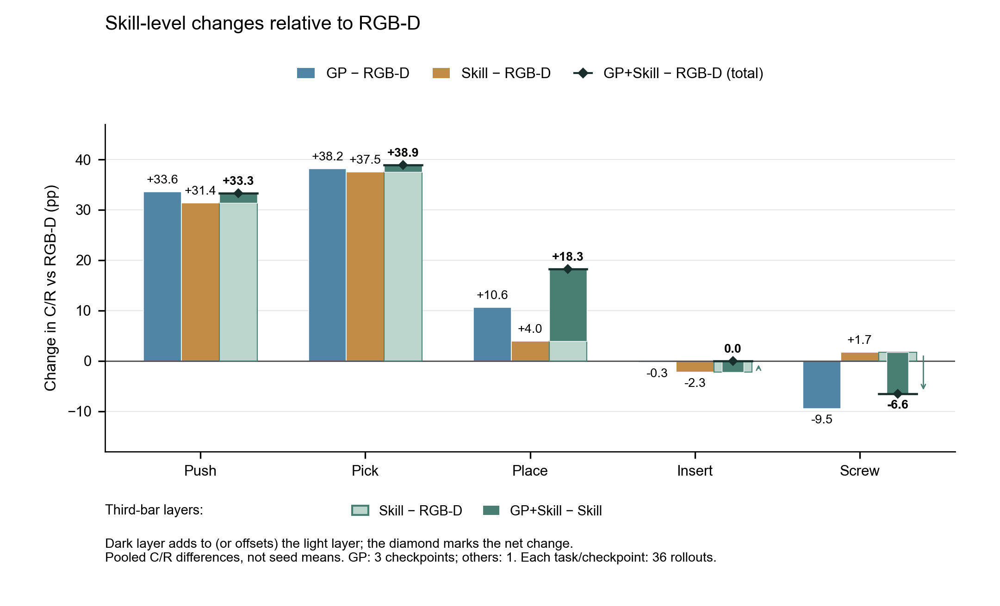
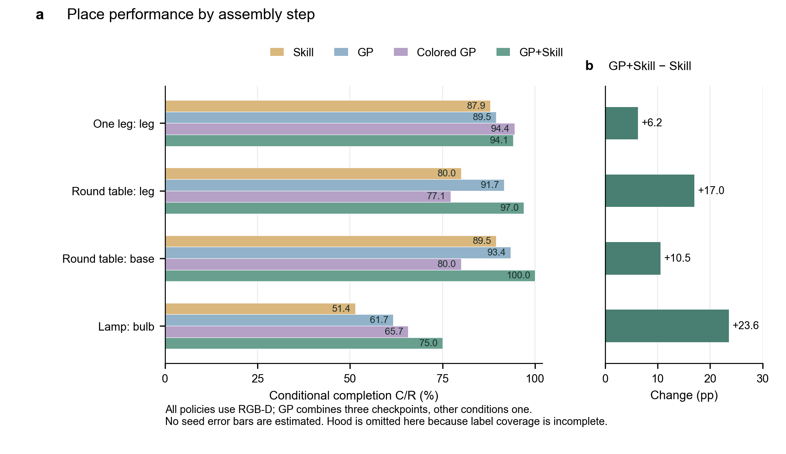

# 多任务 Condition 对比实验 — 评估结果汇总

**日期**: 2026-06-15
**任务**: `one_leg + round_table + lamp` (多任务)
**模型**: DiT (diffusion), 3×100 trajectories
**Project**: `multi-task-rgbd-skill-low-0610`
**Eval Settings**: `N_ENVS=3, N_ROLLOUTS=36`, image-based 
**上次更新**: 2026-07-09 (修正分步成功率说明；lamp hood/base 旧 annotation counts 与 full SR 不一致，不能离线修复)

---

## 1. 总览

| # | 实验 | RUN_ID | one_leg | round_table | lamp | Overall |
|---|---------|--------|---------|-------------|------|---------|
| 1 | rgbd+only skill | good-serenity-16 | 77.78% (28/36) | 47.22% (17/36) | 33.33% (12/36) | 52.78% (57/108) |
| 2 | rgbd | clear-water-12 | 0.00% (0/36) | 41.67% (15/36) | 0.00% (0/36) | 13.89% (15/108) |
| 3 | rgbd+colored GP | absurd-voice-2 | **91.67% (33/36)** | 27.78% (10/36) | 38.89% (14/36) | 52.78% (57/108) |
| 4a | rgbd+GP | rare-monkey-4 | 83.33% (30/36) | 33.33% (12/36) | 27.78% (10/36) | 48.15% (52/108) |
| 4b | rgbd+GP | autumn-dust-13 | 77.78% (28/36) | 36.11% (13/36) | 41.67% (15/36) | 51.85% (56/108) |
| 4c | rgbd+GP | icy-vortex-9 | 86.11% (31/36) | **55.56% (20/36)** | 30.56% (11/36) | 57.41% (62/108) |
| 5 | rgbd+GP+skill | fresh-tree-11 | 83.33% (30/36) | 50.00% (18/36) | **55.56% (20/36)** | **62.96% (68/108)** |
| 6 | rgb | true-firefly-8 | 0.00% (0/36) | 16.67% (6/36) | 0.00% (0/36) | 5.56% (6/108) |
| 7 | rgbd+grasp-part | morning-glitter-1 | **86.11% (31/36)** | 38.89% (14/36) | 41.67% (15/36) | 55.56% (60/108) |
| 8 | rgbd+grasp-part-colored | eternal-cosmos-2 | 80.56% (29/36) | **44.44% (16/36)** | 33.33% (12/36) | 52.78% (57/108) |

结论：
1. gp, skill one-hot 两种引导信息都能让多任务模型有区分不同任务的能力。
2. 多任务泛化性 rgbd+skill+gp > rgbd+gp = rgbd+colored gp = rgbd+only skill。skill 级别的信息就能够做到辅助拟合，当前实验设定并不能体现出 gp 的优势。
3. 目前 skill = gp，想让 gp > skill 的两个方向：
    1. 提升任务泛化难度，med rand 和 permutation 肯定会有帮助。
    2. gp+grasp，提供 rot 信息。
4. colored 并没有如预期地提供类似 one-hot skill 的信息。可能的原因：
    1. 信号大小：2px 点占图像的 0.008%。ResNet 的 32× 下采样后，这个点变成了 ~0.06 feature-map-pixel。颜色差异（红 vs 黄）在 deep features 里几乎不可区分。
    2. 信息量 vs 通路带宽：skill one-hot 贡献 5 个独占维度（531 维 conditioning 中的 5 维），而 colored GP 的 1 bit 信息和整个场景（物体、机械臂、桌面）"挤"在同一个 512-dim visual feature 空间里竞争。
    - 改成红色和蓝色的点来区分可能更好，单独放两个通道。但是大小无法解决
5. 为什么 rgbd 和 rgb 过拟合到 round_table 而不是最简单的 one_leg？轨迹更长，数据更多。
6. rgbd+skill 为什么做不好 one_leg？瓶颈在 place，失去点的位置引导之后，policy 的插入精度大幅下降。但是其他两个任务因为数据更多而受到的影响更小。

## 2. 对比

### 2.1 round_table 多任务 vs 单任务

多任务数据 3×100 条，单任务数据 200 条（单任务数据来源：[guidance point ablation](https://app.notion.com/p/guidance-point-ablation-34f6aab8287c802f97c2f0c57337f4ad)）。

| 实验条件 | 单任务 round_table | 多任务 round_table (3000 epoch) | Δ |
|---------|-------------------|-------------------------------|-----|
| rgbd | 41.67% (15/36) | 41.67% (15/36) (clear-water-12) | 0 |
| rgbd+GP | 33.33% (12/36) | 33.33-55.56% (rare-monkey-4 / autumn-dust-13 / icy-vortex-9) | **0 ~ +22.23** |
| rgbd+GP+skill | **63.89% (23/36)** | 50.00% (18/36) (fresh-tree-11) | -13.89 |
| rgb | 36.11% (13/36) | 16.67% (6/36) (true-firefly-8) | -19.44 |
| rgbd+only skill | 52.78% (19/36) | 47.22% (17/36) (good-serenity-16) | -5.56 |
| rgbd+colored GP | 50.00% (18/36) | 27.78% (10/36) (absurd-voice-2) | -22.22 |
结论：

### 2.2 3000 epoch vs 2000 epoch

统一使用 latest checkpoint 在 epoch 2000 和 epoch 3000 的 eval 结果对比（均使用 `N_ENVS=3, N_ROLLOUTS=36`）：

| # | 实验 | RUN_ID | 2000 epoch | 3000 epoch | Δ |
|---|------|--------|-----------|-----------|-----|
| 1 | rgbd+only skill | good-serenity-16 | — | 52.78% (57/108) | — |
| 2 | rgbd | clear-water-12 | 14.81% (16/108) | 13.89% (15/108) | -0.92 |
| 3 | rgbd+colored GP | absurd-voice-2 | 51.85% (56/108) | 52.78% (57/108) | +0.93 |
| 4a | rgbd+GP | rare-monkey-4 | 53.70% (58/108) | 48.15% (52/108) | -5.55 |
| 4b | rgbd+GP | autumn-dust-13 | 55.56% (60/108) | 51.85% (56/108) | -3.71 |
| 4c | rgbd+GP | icy-vortex-9 | 45.37% (49/108) | 57.41% (62/108) | +12.04 |
| 5 | rgbd+GP+skill | fresh-tree-11 | 52.78% (57/108) | 62.96% (68/108) | +10.18 |
| 6 | rgb | true-firefly-8 | 10.19% (11/108) | 5.56% (6/108) | -4.63 |
结论：
1. **GP+skill 和 only skill 在 3000 epoch 显著优于 2000 epoch**（+10~12%），说明 skill-based 方法需要更长的训练。
2. **纯 GP 和 rgb/rgbd 在 epoch 间差异不大**（±5% 以内），2000 epoch 基本收敛。
3. **absurd-voice-2 (colored GP) 在 2000 epoch 为 51.85%**，用错 eval flag (colored=false) 时为 50.00%（复测确认；首次 61.11% 为偶然波动），colored flag 差异在噪声范围内。

### 2.3 sr vs test loss/action mse error

wandb summary 中最后一次 eval 记录的 test loss 和 test action mse error（注：wandb test 数据对应最后一次 eval checkpoint，不一定是 3000 epoch；absurd-voice-2 对应 2000 epoch 训练）：

| # | RUN_ID | 实验 | SR (对应 epoch) | test_bc_loss | val_action_mse |
|---|--------|------|----------------|-------------|----------------|
| 1 | good-serenity-16 | rgbd+only skill | 52.78% (3000) | 0.0808 | 0.0275 |
| 2 | clear-water-12 | rgbd | 13.89% (3000) | 0.1472 | 0.0189 |
| 3 | absurd-voice-2 | colored GP | 51.85% (2000, colored=true) | 0.1186 | 0.0471 |
| 4a | rare-monkey-4 | GP | 48.15% (3000) | 0.1273 | 0.0456 |
| 4b | autumn-dust-13 | GP | 51.85% (3000) | 0.0879 | 0.0269 |
| 4c | icy-vortex-9 | GP | 57.41% (3000) | 0.0920 | 0.0266 |
| 5 | fresh-tree-11 | GP+skill | 62.96% (3000) | 0.1009 | 0.0322 |
| 6 | true-firefly-8 | rgb | 5.56% (3000) | 0.2205 | 0.0390 |
| 7 | morning-glitter-1 | rgbd+grasp-part | 55.56% (3000) | 0.0848 | 0.0270 |
| 8 | eternal-cosmos-2 | rgbd+grasp-part-colored | 52.78% (3000) | 0.1643 | 0.0562 |

## 3. 分步成功率分析

下表中的 8 条 0610 run 对应主表所用 JSON。Grasp 的 skill-level 展示与待分析数据统一采用带 † 的八月 fresh36 clean `n0`：每个 task 为 low randomness、3 个并行环境、36 条 rollout，无 annotation noise，checkpoint 的训练标记配置与评测解析出的 policy 输入配置一致。七月原始 grasp 批次仍作为主表的历史来源保留在 A.5、A.8，但不与八月合并，也不进入本节的 grasp 待分析对照。原因不是两批成功率不同，而是期间发生过 policy 视觉标记路径修正，尚不能确认七月实际输入与八月兼容（A.8）。

每个单元格为 `completion_count / state_count`；`—` 表示没有 rollout 到达该 state/step。

一致性审计：
1. 8 条 0610 run 中，`one_leg` 的 `asm: top-leg` 与 `n_success` 完全一致，`round_table` 的最终 `asm: leg-base` 与 `n_success` 完全一致。fresh36 grasp 重评中，`rgbd+grasp-part-colored` 的 round_table annotation 记录 `asm: leg-base=13`，但 evaluator 的 `n_success=15`，说明该批 step annotation 也有少量漏计。
2. `lamp` 的旧 JSON 中最终 `asm: base-hood` 与 `n_success` 不一致（例如 `fresh-tree-11`: `n_success=20`, `base-hood=17`）。这说明旧 lamp hood/base annotation 有 undercount；在没有重跑 eval 或更完整逐帧 annotation 输入的前提下，不能可靠修复 hood/base 分步成功率。
3. 因此 assembly annotation 只作为诊断值，不用于替代 task success；task SR 始终以 eval JSON 的 `n_success / n_rollouts` 为准。单个 skill 的 `completion_count <= state_count` 以及 `skill_success_rate = completion_count / state_count` 已逐项复核通过。

### 3.1 one_leg skill success rates (cascading)

| Condition | RUN_ID | top-leg-pick | top-leg-push | leg-top-pick | leg-top-place | leg-top-insert | leg-top-screw | assembly: top-leg |
|---------|--------|:---:|:---:|:---:|:---:|:---:|:---:|:---:|
| rgbd+only skill | good-serenity-16 | 100.00% (36/36) | 91.67% (33/36) | 100.00% (33/33) | 87.88% (29/33) | 96.55% (28/29) | 100.00% (28/28) | 77.78% (28/36) |
| rgbd | clear-water-12 | 19.44% (7/36) | 0.00% (0/7) | — | — | — | — | 0.00% (0/36) |
| rgbd+colored GP | absurd-voice-2 | 100.00% (36/36) | 100.00% (36/36) | 100.00% (36/36) | 94.44% (34/36) | 100.00% (34/34) | 97.06% (33/34) | 91.67% (33/36) |
| rgbd+GP | rare-monkey-4 | 100.00% (36/36) | 97.22% (35/36) | 100.00% (34/34) | 88.24% (30/34) | 100.00% (30/30) | 96.67% (29/30) | 83.33% (30/36) |
| rgbd+GP | autumn-dust-13 | 100.00% (36/36) | 100.00% (36/36) | 100.00% (36/36) | 83.33% (30/36) | 100.00% (30/30) | 93.33% (28/30) | 77.78% (28/36) |
| rgbd+GP | icy-vortex-9 | 100.00% (36/36) | 97.22% (35/36) | 100.00% (35/35) | 97.14% (34/35) | 100.00% (34/34) | 91.18% (31/34) | 86.11% (31/36) |
| rgbd+GP+skill | fresh-tree-11 | 100.00% (36/36) | 97.22% (35/36) | 100.00% (34/34) | 94.12% (32/34) | 100.00% (32/32) | 90.62% (29/32) | 83.33% (30/36) |
| rgb | true-firefly-8 | 22.22% (8/36) | 0.00% (0/8) | — | — | — | — | 0.00% (0/36) |
| rgbd+grasp-part † | morning-glitter-1 | 100.00% (36/36) | 80.56% (29/36) | 100.00% (29/29) | 100.00% (29/29) | 96.55% (28/29) | 96.43% (27/28) | 75.00% (27/36) |
| rgbd+grasp-part-colored † | eternal-cosmos-2 | 100.00% (36/36) | 94.44% (34/36) | 100.00% (34/34) | 94.12% (32/34) | 100.00% (32/32) | 100.00% (32/32) | 88.89% (32/36) |

### 3.2 round_table skill success rates (cascading)

| Condition | RUN_ID | top-leg-push | leg-top-pick | leg-top-place | leg-top-insert | leg-top-screw | base-leg-pick | base-leg-place | base-leg-insert | base-leg-screw | asm: top-leg | asm: leg-base |
|---------|--------|:---:|:---:|:---:|:---:|:---:|:---:|:---:|:---:|:---:|:---:|:---:|
| rgbd+only skill | good-serenity-16 | 100.00% (36/36) | 83.33% (30/36) | 80.00% (24/30) | 95.83% (23/24) | 86.96% (20/23) | 95.00% (19/20) | 89.47% (17/19) | 100.00% (17/17) | 100.00% (17/17) | 55.56% (20/36) | 85.00% (17/20) |
| rgbd | clear-water-12 | 100.00% (36/36) | 80.56% (29/36) | 79.31% (23/29) | 100.00% (23/23) | 91.30% (21/23) | 90.48% (19/21) | 94.74% (18/19) | 100.00% (18/18) | 83.33% (15/18) | 58.33% (21/36) | 71.43% (15/21) |
| rgbd+colored GP | absurd-voice-2 | 100.00% (36/36) | 97.22% (35/36) | 77.14% (27/35) | 100.00% (27/27) | 77.78% (21/27) | 95.24% (20/21) | 80.00% (16/20) | 93.75% (15/16) | 66.67% (10/15) | 58.33% (21/36) | 47.62% (10/21) |
| rgbd+GP | rare-monkey-4 | 100.00% (36/36) | 83.33% (30/36) | 90.00% (27/30) | 100.00% (27/27) | 81.48% (22/27) | 81.82% (18/22) | 94.44% (17/18) | 100.00% (17/17) | 70.59% (12/17) | 61.11% (22/36) | 54.55% (12/22) |
| rgbd+GP | autumn-dust-13 | 100.00% (36/36) | 91.67% (33/36) | 93.94% (31/33) | 100.00% (31/31) | 64.52% (20/31) | 90.00% (18/20) | 88.89% (16/18) | 93.75% (15/16) | 86.67% (13/15) | 55.56% (20/36) | 65.00% (13/20) |
| rgbd+GP | icy-vortex-9 | 100.00% (36/36) | 91.67% (33/36) | 90.91% (30/33) | 100.00% (30/30) | 90.00% (27/30) | 92.59% (25/27) | 96.00% (24/25) | 100.00% (24/24) | 83.33% (20/24) | 75.00% (27/36) | 74.07% (20/27) |
| rgbd+GP+skill | fresh-tree-11 | 100.00% (36/36) | 91.67% (33/36) | 96.97% (32/33) | 100.00% (32/32) | 75.00% (24/32) | 87.50% (21/24) | 100.00% (21/21) | 100.00% (21/21) | 85.71% (18/21) | 66.67% (24/36) | 75.00% (18/24) |
| rgb | true-firefly-8 | 97.22% (35/36) | 77.14% (27/35) | 81.48% (22/27) | 100.00% (22/22) | 86.36% (19/22) | 68.42% (13/19) | 92.31% (12/13) | 100.00% (12/12) | 50.00% (6/12) | 52.78% (19/36) | 31.58% (6/19) |
| rgbd+grasp-part † | morning-glitter-1 | 100.00% (36/36) | 77.78% (28/36) | 78.57% (22/28) | 100.00% (22/22) | 81.82% (18/22) | 94.44% (17/18) | 94.12% (16/17) | 87.50% (14/16) | 78.57% (11/14) | 50.00% (18/36) | 61.11% (11/18) |
| rgbd+grasp-part-colored † | eternal-cosmos-2 | 100.00% (36/36) | 94.44% (34/36) | 82.35% (28/34) | 100.00% (28/28) | 71.43% (20/28) | 83.33% (15/18) | 86.67% (13/15) | 100.00% (13/13) | 100.00% (13/13) | 55.56% (20/36) | 72.22% (13/18) |

### 3.3 lamp skill success rates (cascading)

| Condition | RUN_ID | base-bulb-push | bulb-base-pick | bulb-base-place | bulb-base-insert | bulb-base-screw | hood-base-pick | hood-base-place | asm: base-bulb | asm: base-hood |
|---------|--------|:---:|:---:|:---:|:---:|:---:|:---:|:---:|:---:|:---:|
| rgbd+only skill | good-serenity-16 | 100.00% (36/36) | 97.22% (35/36) | 51.43% (18/35) | 100.00% (18/18) | 66.67% (12/18) | 100.00% (10/10) | 100.00% (10/10) | 33.33% (12/36) | 100.00% (10/10) |
| rgbd | clear-water-12 | 44.44% (16/36) | 50.00% (8/16) | 0.00% (0/8) | — | — | — | — | 0.00% (0/36) | — |
| rgbd+colored GP | absurd-voice-2 | 100.00% (36/36) | 97.22% (35/36) | 65.71% (23/35) | 100.00% (23/23) | 60.87% (14/23) | 100.00% (10/10) | 100.00% (10/10) | 38.89% (14/36) | 100.00% (10/10) |
| rgbd+GP | rare-monkey-4 | 100.00% (36/36) | 97.22% (35/36) | 65.71% (23/35) | 100.00% (23/23) | 43.48% (10/23) | 100.00% (10/10) | 100.00% (10/10) | 27.78% (10/36) | 100.00% (10/10) |
| rgbd+GP | autumn-dust-13 | 100.00% (36/36) | 100.00% (36/36) | 66.67% (24/36) | 100.00% (24/24) | 62.50% (15/24) | 100.00% (10/10) | 100.00% (10/10) | 41.67% (15/36) | 100.00% (10/10) |
| rgbd+GP | icy-vortex-9 | 100.00% (36/36) | 100.00% (36/36) | 52.78% (19/36) | 100.00% (19/19) | 57.89% (11/19) | 100.00% (7/7) | 100.00% (7/7) | 30.56% (11/36) | 100.00% (7/7) |
| rgbd+GP+skill | fresh-tree-11 | 100.00% (36/36) | 100.00% (36/36) | 75.00% (27/36) | 100.00% (27/27) | 74.07% (20/27) | 100.00% (17/17) | 100.00% (17/17) | 55.56% (20/36) | 100.00% (17/17) |
| rgb | true-firefly-8 | 25.00% (9/36) | 22.22% (2/9) | 0.00% (0/2) | — | — | — | — | 0.00% (0/36) | — |
| rgbd+grasp-part † | morning-glitter-1 | 97.22% (35/36) | 97.14% (34/35) | 64.71% (22/34) | 100.00% (22/22) | 81.82% (18/22) | 100.00% (9/9) | 88.89% (8/9) | 50.00% (18/36) | 88.89% (8/9) |
| rgbd+grasp-part-colored † | eternal-cosmos-2 | 97.22% (35/36) | 97.14% (34/35) | 50.00% (17/34) | 100.00% (17/17) | 88.24% (15/17) | 92.31% (12/13) | 100.00% (12/12) | 41.67% (15/36) | 92.31% (12/13) |

† fresh36 clean `n0` 重评，不是主表 grasp 行的原始 rollout batch。对应 task SR 为：`rgbd+grasp-part` = one_leg `27/36`、round_table `11/36`、lamp `17/36`；`rgbd+grasp-part-colored` = one_leg `32/36`、round_table `15/36`、lamp `14/36`。

### 3.4 Cross-task skill-type success rates

下表把同类型 skill 跨三个 task 汇总，每个值为 `Σ完成数 / Σ到达数`，不是 task success。plain GP 合并三个主实验 checkpoint，其余各一个；grasp 统一采用 † fresh36 clean n0，七月旧行移至 A.8 留档。该表用于比较阶段性表现；grasp 与 point 的同协议数据单列于 §3.7 的待分析小节，留待联合 tracking error 解读，不混用两个评测批次的差值。

| Condition | Source batch | Push | Pick | Place | Insert | Screw |
|---|---|---:|---:|---:|---:|---:|
| rgb | 0610 main | 55.00% (44/80) | 50.51% (50/99) | 80.95% (34/42) | 100.00% (34/34) | 73.53% (25/34) |
| rgbd | 0610 main | 65.82% (52/79) | 57.80% (63/109) | 73.21% (41/56) | 100.00% (41/41) | 87.80% (36/41) |
| rgbd+only skill | 0610 main | 97.22% (105/108) | 95.32% (163/171) | 77.17% (98/127) | 97.73% (86/88) | 89.53% (77/86) |
| rgbd+colored GP | 0610 main | 100.00% (108/108) | 98.29% (172/175) | 80.88% (110/136) | 99.00% (99/100) | 78.79% (78/99) |
| rgbd+GP | 0610 main, 3 runs pooled | 99.38% (322/324) | 96.00% (504/525) | 83.84% (332/396) | 99.67% (304/305) | 78.29% (238/304) |
| rgbd+GP+skill | 0610 main | 99.07% (107/108) | 96.72% (177/183) | **91.49% (129/141)** | 100.00% (112/112) | 81.25% (91/112) |
| rgbd+grasp-part † | fresh36 clean n0 | 92.59% (100/108) | 93.87% (153/163) | 82.91% (97/117) | 96.63% (86/89) | 86.05% (74/86) |
| rgbd+grasp-part-colored † | fresh36 clean n0 | 97.22% (105/108) | 95.93% (165/172) | 79.07% (102/129) | 100.00% (90/90) | 88.89% (80/90) |

这组聚合最清楚的观察是：在 `rgbd+only skill` 的基础上加入 GP，增益主要集中在 Place，从 77.17% 提高到 91.49%（+14.32 pp），Push/Pick 的额外变化较小。Insert 不作为 condition 区分能力的证据：本实验的 Place 成功判据同时约束位置与朝向，只有完成较严格空间对准的样本才进入 Insert；到位后的插入相对简单，其高 C/R 主要反映这种阶段划分。Screw 则没有因加入 GP 获得一致提升。

### 3.5 分任务的 condition × skill-type 成功率（工作稿，待确认）

为检查 §3.4 的整体趋势在单任务中是否仍成立，下表保持 task 和 condition 不变，仅将该 task 内同类型的完整语义步骤合并。例如，round_table 的 Pick 合并 `leg-top-pick` 与 `base-leg-pick`，Place 合并 `leg-top-place` 与 `base-leg-place`；lamp 的 Place 合并 bulb 与 hood，one_leg 的 Pick 合并 Push 前后的两个 Pick。每个单元格为 `100 × ΣC/ΣR % (ΣC/ΣR)`，不是不同步骤百分比的简单平均。该表与 §3.4 的六种非 grasp 主实验 condition 采用同一口径，区别仅在于不再跨 task 求和。按表 3.7 的清晰版排版，不在表内重复列出相同的 source batch。

| Task | Condition | Push | Pick | Place | Insert | Screw |
|---|---|---:|---:|---:|---:|---:|
| one_leg | RGB | 0.00% (0/8) | 22.22% (8/36) | —（0 次到达） | —（0 次到达） | —（0 次到达） |
| one_leg | RGB-D | 0.00% (0/7) | 19.44% (7/36) | —（0 次到达） | —（0 次到达） | —（0 次到达） |
| one_leg | RGB-D+skill | 91.67% (33/36) | 100.00% (69/69) | 87.88% (29/33) | 96.55% (28/29) | 100.00% (28/28) |
| one_leg | RGB-D+colored GP | 100.00% (36/36) | 100.00% (72/72) | 94.44% (34/36) | 100.00% (34/34) | 97.06% (33/34) |
| one_leg | RGB-D+GP（3 runs pooled） | 98.15% (106/108) | 100.00% (213/213) | 89.52% (94/105) | 100.00% (94/94) | 93.62% (88/94) |
| one_leg | RGB-D+GP+skill | 97.22% (35/36) | 100.00% (70/70) | 94.12% (32/34) | 100.00% (32/32) | 90.62% (29/32) |
| round_table | RGB | 97.22% (35/36) | 74.07% (40/54) | 85.00% (34/40) | 100.00% (34/34) | 73.53% (25/34) |
| round_table | RGB-D | 100.00% (36/36) | 84.21% (48/57) | 85.42% (41/48) | 100.00% (41/41) | 87.80% (36/41) |
| round_table | RGB-D+skill | 100.00% (36/36) | 87.50% (49/56) | 83.67% (41/49) | 97.56% (40/41) | 92.50% (37/40) |
| round_table | RGB-D+colored GP | 100.00% (36/36) | 96.49% (55/57) | 78.18% (43/55) | 97.67% (42/43) | 73.81% (31/42) |
| round_table | RGB-D+GP（3 runs pooled） | 100.00% (108/108) | 88.70% (157/177) | 92.36% (145/157) | 99.31% (144/145) | 79.17% (114/144) |
| round_table | RGB-D+GP+skill | 100.00% (36/36) | 90.00% (54/60) | 98.15% (53/54) | 100.00% (53/53) | 79.25% (42/53) |
| lamp | RGB | 25.00% (9/36) | 22.22% (2/9) | 0.00% (0/2) | —（0 次到达） | —（0 次到达） |
| lamp | RGB-D | 44.44% (16/36) | 50.00% (8/16) | 0.00% (0/8) | —（0 次到达） | —（0 次到达） |
| lamp | RGB-D+skill | 100.00% (36/36) | 97.83% (45/46) | 62.22% (28/45) | 100.00% (18/18) | 66.67% (12/18) |
| lamp | RGB-D+colored GP | 100.00% (36/36) | 97.83% (45/46) | 73.33% (33/45) | 100.00% (23/23) | 60.87% (14/23) |
| lamp | RGB-D+GP（3 runs pooled） | 100.00% (108/108) | 99.26% (134/135) | 69.40% (93/134) | 100.00% (66/66) | 54.55% (36/66) |
| lamp | RGB-D+GP+skill | 100.00% (36/36) | 100.00% (53/53) | 83.02% (44/53) | 100.00% (27/27) | 74.07% (20/27) |

来源与批次：本表沿用表 3.7 的 18 个主实验行，全部来自 `0610 main`，对应 base 上八条 run 的 24 份 task JSON，路径见 A.4.1、节点核验见 A.5。plain GP 每 task 合并三条 run，共 108 rollout，其余 condition/task 为 36 rollout。Grasp 不纳入此分任务主实验表，其八月 fresh36 clean n0 完整步骤数据仍保留在 §3.1–3.3，跨任务汇总见 §3.4，同协议 point/grasp 对照见 §3.7；七月问题批次仍仅在 A.8 留档。

— 表示记录中到达数为 0，而不是成功率为 0%；Pick/Place 分母可以大于 36，因为一条轨迹可贡献两个不同语义步骤。本表 18 行、90 个 skill 单元格与表 3.7 一致；三个 task 的 C、R 分别相加，与 §3.4 中六种非 grasp 主实验 condition 的 30 项对应。Insert 数值保留以便审计，但因其入口已由严格 Place 判据筛选，不用于推断独立插入能力或比较 condition 的主要收益。

### 3.6 统计口径审计与解释边界（工作稿，待确认）

#### 统计口径审计：RGB / RGB-D 的 Push 与 Pick 分母

> 核验状态（2026-09-04）：已连接并核对 `r218` 与 `base` 的节点身份。下列 RGB / RGB-D 数值已直接从 `base` 的六份原始评测 JSON 复算，与[主实验报告 §3.1–3.3](./multi_task_condition_eval_0610.md#3-分步成功率分析)一致；不能把它们的来源写成 `r218`。本轮还核对了 `base` 上全部八条主实验 run 的 24 份 task JSON、176 个 skill 单元格，以及噪声实验 30 份 aggregate JSON 对应的 660 个 skill 单元格，未发现计数或比率不一致。`r218` 则找到了两条 grasp run 的六份七月原始 task JSON。节点、根目录、精确文件路径及哈希见附录 A.5。本次验证的是原始评测汇总数值，没有重放逐帧 annotation，也没有将既有计数规则视为独立的物理成功判定。

这里统计的不是控制命令数，也不是将 108 个 rollout 依次通过 `Push → Pick → Place → Insert → Screw` 的单一流程。每个完整标签（例如 `top-leg-pick` 或 `leg-top-pick`）的条件完成率为 `skill_completion_counts[label] / skill_state_counts[label]`：分母是在 rollout 中至少出现过该标签的 episode 数，同一 episode 的同一标签只计一次；分子由记录到后续不同标签、或最终任务成功来推定。因此它是基于 annotation 的进度诊断量，不是独立的物理动作成功判定。代码依据为 [`accumulate_episode_skill_stats`](../src/eval/progress_schema.py)；同文件的 `TASK_PROGRESS_SCHEMA` 给出了各任务的标签顺序。

关键区别在于 one_leg 先经历 `top-leg-pick → top-leg-push → leg-top-pick`，而 round_table 和 lamp 从 Push 开始。三个任务又都包含两个不同的 Pick 标签：one_leg 有桌面和桌腿的 Pick，round_table 有桌腿和底座的 Pick，lamp 有灯泡和灯罩的 Pick。将这些标签按 skill 类型合并后，同一 episode 可以为 Pick 列贡献两次到达，列与列之间不再构成逐级递减的级联关系。

下表保留完整标签，数值均为“完成数 / 到达数”；`—` 表示报告未记录到达，不表示成功率为 0%。

| Task | 完整 skill 标签 | RGB | RGB-D |
|---|---|---:|---:|
| one_leg | top-leg-pick（Push 前） | 8/36 | 7/36 |
| one_leg | top-leg-push | 0/8 | 0/7 |
| one_leg | leg-top-pick（Push 后） | —（到达 0） | —（到达 0） |
| round_table | top-leg-push | 35/36 | 36/36 |
| round_table | leg-top-pick | 27/35 | 29/36 |
| round_table | base-leg-pick（后续第二次 Pick） | 13/19 | 19/21 |
| lamp | base-bulb-push | 9/36 | 16/36 |
| lamp | bulb-base-pick | 2/9 | 8/16 |
| lamp | hood-base-pick（后续第二次 Pick） | —（到达 0） | —（到达 0） |

由此，RGB 的 Push 为 `(0+35+9)/(8+36+36)=44/80`，RGB-D 为 `(0+36+16)/(7+36+36)=52/79`。分母没有达到 108，是因为 one_leg 的 36 个 episode 中分别只有 8 个和 7 个完成前置 Pick 并到达 Push，其余 28 个和 29 个不能作为“已经到达 Push 的样本”计入分母。

三个任务确实共有六个 Pick 标签。按 `one_leg 的两个 Pick → round_table 的两个 Pick → lamp 的两个 Pick` 的顺序，RGB 的 Pick 为 `(8+0+27+13+2+0)/(36+0+35+19+9+0)=50/99`，RGB-D 为 `(7+0+29+19+8+0)/(36+0+36+21+16+0)=63/109`。先前求和省略了两个到达数为 0 的项，并不是只统计四个 Pick 标签。它们同时包含 one_leg 的前置 Pick，以及 round_table 的第二次 Pick，因此 Pick 总到达数可以大于 Push 总到达数。四个汇总值均可从原始 JSON 复现；这解释了表格的合并口径，但不能据此证明每条轨迹没有跳步、回退或 annotation 漏记，逐轨迹审计状态须另行报告。

后续分析只报告 `C/R` 及其完成数、到达数，不再增加 `R/36` 或 `C/36`。跨任务统一汇总用于识别总体差异，单任务汇总与完整步骤拆解用于定位具体困难；这些结果仍用于形成结论，局限性统一放在 §3.7 的结论之后。

### 3.7 skill-level 分析的动机、对照与暂定结论（工作稿，待确认）

长时程家具拼装的任务级成功率同时受多个操作阶段影响，因而无法揭示 condition 的收益是否普遍分布于各个步骤。为解释主实验中整体性能提升的来源，我们首先比较 RGB-D+GP 与 RGB-D、RGB-D+skill 与 RGB-D 的 skill-level 条件完成率，考察额外 condition 是否使不同步骤普遍改善，还是主要改变了某些阶段的表现。随后比较 RGB-D+GP+skill 与 RGB-D+skill，进一步判断在已有阶段信息时，空间 point 还能帮助哪些操作。分析同时覆盖跨任务汇总和单任务拆解，以检验总体趋势是否适用于不同家具，并定位单任务中特别困难或差异更突出的步骤。

实验基于 FurnitureBench 的 one_leg、round_table 和 lamp 三个家具拼装任务，从随机化的初始零件分布出发执行完整任务，并依据评测记录的完整语义标签计算条件完成率 C/R。其中 R 为到达该标签的 rollout 数，C 为按既定进度规则完成该标签的 rollout 数；同一 rollout 内同一标签至多计一次。主分析比较 RGB、RGB-D、RGB-D+skill、RGB-D+GP、RGB-D+colored GP 和 RGB-D+GP+skill，在 task 内或跨 task 分别对同类步骤求 ΣC/ΣR，而不平均不同步骤的百分比。每个 checkpoint/task 评测 36 条 rollout；plain GP 汇总三个 checkpoint，其余主实验 condition 各一个。`skill` 专指显式低维阶段信息。主实验的原始来源见 A.4–A.5。Grasp 的协议、审计和待补分析单列于本节正文之后，不用于支撑下述主结论。

两类 condition 的收益并不是各步骤的普遍、均匀提升，而是在跨任务汇总中最集中于 Push 和 Pick。相对 RGB-D，RGB-D+GP 的 Push 从 52/79（65.82%）提高到 322/324（99.38%），Pick 从 63/109（57.80%）提高到 504/525（96.00%），分别增加 33.56 和 38.20 个百分点；RGB-D+skill 对应为 105/108（97.22%）和 163/171（95.32%），分别增加 31.40 和 37.52 个百分点。相比之下，Place 的增幅分别为 10.62 和 3.95 pp，Screw 则未呈现一致提升（图 3.7）。因此，“主要改善前段操作”是这一比较得到的结果，而不是预先限定的实验问题。

分任务结果进一步说明，整体趋势并不意味着每个家具都以相同方式受益（表 3.7）。one_leg 的前置 `top-leg-pick` 在 RGB-D 下仅为 7/36，加入 skill 或 GP 后均达到 100%；lamp 的 Push 从 16/36 提高到两种 condition 下的 100%。round_table 的 RGB-D Push 已为 36/36，因此没有同样的提升空间；而 lamp 的 Place 在两种 condition 下也有较大的变化，不能将所有收益都归于前段。一个可能的解释是，GP 和 skill 都有助于 policy 区分当前任务或操作阶段，但完成前序步骤并不意味着后续操作已经获得了标准化的入口状态。

例如，Pick 达到成功判据，只说明零件已被抓起，并不保证每次抓取后零件相对于夹爪的位置、角度都相同。前序 Push 或 Pick 即使成功，也可能留下不同的零件位姿与抓取偏差，使后续步骤需要适应额外的状态变异。这里的“随机性”指 policy 执行过程产生的状态差异，而不是中途新增的环境随机化。阶段标签能够说明接下来做什么，却不能单独说明在当前抓取状态下如何调整动作；空间 point 是否能进一步帮助处理这些差异，需要在已经提供 skill 的条件下检验。

图 3.7 | Condition 收益的阶段分布。每个 skill 的三个最终差值统一以 RGB-D 为减数，分别比较 RGB-D+GP、RGB-D+skill、RGB-D+GP+skill。第三根柱的浅绿色层表示 skill−RGB-D，深绿色层表示 GP+skill−skill；两者按带符号差值相加，菱形和加粗数字标出相对 RGB-D 的最终差值。Insert、Screw 的两层方向相反，深色窄层与箭头保留抵消关系，不把绝对值相加。分层只是三个观测比例的代数分解，不是独立因果贡献估计。每个 checkpoint/task 为 36 rollout，GP 合并三个 checkpoint，其余各一个；先分别求 ΣC/ΣR，再作差，单位为百分点（pp），不作轨迹配对或 seed 均值解释。沿用 §3.4 的 pooled 分组，包括原记录中的 hood 计数；Insert 仅为完整呈现保留。不显示训练 seed 误差条或显著性标记；原始 C/R 见 §3.1–3.5，分任务结果直接列于下表。

表 3.7 | 同一 task 内不同 condition 的 skill-level 条件完成率。单元格为 100×ΣC/ΣR % (ΣC/ΣR)，同类完整步骤先相加计数，再求比例。仅列主实验六种非 grasp condition；grasp 的同协议对照单列于本节末。

| Task | Condition | Push | Pick | Place | Insert | Screw |
|---|---|---:|---:|---:|---:|---:|
| one_leg | RGB | 0.00% (0/8) | 22.22% (8/36) | —（0 次到达） | —（0 次到达） | —（0 次到达） |
| one_leg | RGB-D | 0.00% (0/7) | 19.44% (7/36) | —（0 次到达） | —（0 次到达） | —（0 次到达） |
| one_leg | RGB-D+skill | 91.67% (33/36) | 100.00% (69/69) | 87.88% (29/33) | 96.55% (28/29) | 100.00% (28/28) |
| one_leg | RGB-D+colored GP | 100.00% (36/36) | 100.00% (72/72) | 94.44% (34/36) | 100.00% (34/34) | 97.06% (33/34) |
| one_leg | RGB-D+GP（3 runs pooled） | 98.15% (106/108) | 100.00% (213/213) | 89.52% (94/105) | 100.00% (94/94) | 93.62% (88/94) |
| one_leg | RGB-D+GP+skill | 97.22% (35/36) | 100.00% (70/70) | 94.12% (32/34) | 100.00% (32/32) | 90.62% (29/32) |
| round_table | RGB | 97.22% (35/36) | 74.07% (40/54) | 85.00% (34/40) | 100.00% (34/34) | 73.53% (25/34) |
| round_table | RGB-D | 100.00% (36/36) | 84.21% (48/57) | 85.42% (41/48) | 100.00% (41/41) | 87.80% (36/41) |
| round_table | RGB-D+skill | 100.00% (36/36) | 87.50% (49/56) | 83.67% (41/49) | 97.56% (40/41) | 92.50% (37/40) |
| round_table | RGB-D+colored GP | 100.00% (36/36) | 96.49% (55/57) | 78.18% (43/55) | 97.67% (42/43) | 73.81% (31/42) |
| round_table | RGB-D+GP（3 runs pooled） | 100.00% (108/108) | 88.70% (157/177) | 92.36% (145/157) | 99.31% (144/145) | 79.17% (114/144) |
| round_table | RGB-D+GP+skill | 100.00% (36/36) | 90.00% (54/60) | 98.15% (53/54) | 100.00% (53/53) | 79.25% (42/53) |
| lamp | RGB | 25.00% (9/36) | 22.22% (2/9) | 0.00% (0/2) | —（0 次到达） | —（0 次到达） |
| lamp | RGB-D | 44.44% (16/36) | 50.00% (8/16) | 0.00% (0/8) | —（0 次到达） | —（0 次到达） |
| lamp | RGB-D+skill | 100.00% (36/36) | 97.83% (45/46) | 62.22% (28/45) | 100.00% (18/18) | 66.67% (12/18) |
| lamp | RGB-D+colored GP | 100.00% (36/36) | 97.83% (45/46) | 73.33% (33/45) | 100.00% (23/23) | 60.87% (14/23) |
| lamp | RGB-D+GP（3 runs pooled） | 100.00% (108/108) | 99.26% (134/135) | 69.40% (93/134) | 100.00% (66/66) | 54.55% (36/66) |
| lamp | RGB-D+GP+skill | 100.00% (36/36) | 100.00% (53/53) | 83.02% (44/53) | 100.00% (27/27) | 74.07% (20/27) |

来源：§3.5 的 18 个主实验行，来自 base 上八条 run 的 24 份 task JSON（A.4.1、A.5），90 个单元格与源表一致。每个 task/checkpoint 为 36 rollout，plain GP 为三个 checkpoint 合计 108 rollout。— 表示 R=0，不能解释为 0%；同一 rollout 可贡献多个 Pick/Place，故这些列的 R 可超过 36。主表保留既有 hood 聚合计数，但不据其推断灯罩步骤已可靠解决。

在已经提供 skill 信息后，GP 的主要额外收益集中在 Place。pooled Place 从 98/127（77.17%）提高到 129/141（91.49%），增加 14.32 个百分点，而 Push/Pick 的剩余变化较小。Insert 的入口已经满足 Place 对位置和朝向的严格要求，到位后较易完成，因此本节不将其高 C/R 解释为独立技能能力，也不用于支持 condition 的优势。按单任务合并同类型步骤后，one_leg Place 从 29/33（87.88%）提高到 32/34（94.12%），round_table 从 41/49（83.67%）提高到 53/54（98.15%），lamp 从 28/45（62.22%）提高到 44/53（83.02%）。三个任务方向一致，lamp 的增幅最大。再拆到完整 Place 步骤，可以定位这种收益具体发生在哪里：

表 3.8 | 四个完整 Place 步骤的条件完成率及在 skill 基础上加入 GP 的变化。单元格保留 C/R；最后一列由未四舍五入的比率作差。

| Task / Place 步骤 | RGB-D | RGB-D+skill | RGB-D+GP，3 runs pooled | RGB-D+colored GP | RGB-D+GP+skill | 在 skill 基础上加入 GP 的差值 |
|---|---:|---:|---:|---:|---:|---:|
| one_leg / leg-top-place | —（0 次到达） | 87.88% (29/33) | 89.52% (94/105) | 94.44% (34/36) | 94.12% (32/34) | +6.24 pp |
| round_table / leg-top-place | 79.31% (23/29) | 80.00% (24/30) | 91.67% (88/96) | 77.14% (27/35) | 96.97% (32/33) | +16.97 pp |
| round_table / base-leg-place | 94.74% (18/19) | 89.47% (17/19) | 93.44% (57/61) | 80.00% (16/20) | 100.00% (21/21) | +10.53 pp |
| lamp / bulb-base-place | 0.00% (0/8) | 51.43% (18/35) | 61.68% (66/107) | 65.71% (23/35) | 75.00% (27/36) | +23.57 pp |

正文仅比较上述四个 Place 步骤；hood 因标签覆盖不足，不作为独立论证行或绘图类别，原始记录仍保留在 §3.3 与审计附录中。

lamp 的 bulb Place 是最突出的局部例子。skill-only 的 C/R 为 51.43%，低于同一 policy 的 one_leg Place（87.88%）与 round_table 两个 Place（80.00%、89.47%）；加入 GP 后提高到 75.00%，+23.57 pp 是四个主要可比较 Place 步骤中最大的观测差值。这将 task-level 的改善定位到需要更精确空间调整的放置过程，而不是所有操作阶段的均匀提升。

这组结果进一步引出一个问题：为什么 Place 比已得到改善的 Push/Pick 更难，且在已有 skill 信息后，从 point 获得的增益最大？关键在于，Place 不仅需要选对当前动作，还需要把“前一步成功但状态并不标准”的被抓零件送到满足装配约束的位置与朝向。即使目标装配关系相同，只要零件在夹爪中的位置或角度不同，所需的末端运动就会改变。因而，前段成功率升高并不会自动消除放置困难：后段仍需补偿前序操作留下的空间偏差。

Point 对 Place 的帮助可能正来自这一状态依赖性。Skill 标签只给出“现在应执行 Place”，而本实验中的 point 随目标零件位姿及当前零件—夹爪相对关系调整，给出当前状态下末端应移向的位置。因此，不同抓取状态不必对应同一个固定运动目标；policy 获得了一个可以随状态变化的空间参照。这为“已有阶段信息后，GP 的额外收益在 Place 上最大”提供了可能解释。当前实现中的目标换算支持这种解释（A.8），但单个位置点并不包含完整旋转目标，也不能仅凭 C/R 确认 policy 已通过这一机制消除了抓取偏差。

Lamp 的灯泡放置提供了具体例子。根据任务执行观察，灯泡在抓取后可能形成不同的 grasp pose；即使都满足 Pick 成功判据，随后要把灯泡对准底座时，需要补偿的偏移与朝向仍不相同。这与 bulb Place 在 skill-only 下较低、加入 GP 后增幅较大的结果相容。当前尚未量化抓取后姿态分布，因而这里解释的是一种可能的困难来源，不把“姿态多样 → 放置困难 → point 缓解”的完整链条写成已验证机制。

图 3.8 | 不同家具放置步骤对空间 point 的响应。a 四种 condition 的完整 Place 步骤 C/R，b 在 RGB-D+skill 基础上加入 GP 的差值（pp）。所有 policy 均使用 RGB-D，图例仅标记额外输入；GP 合并三条主实验 run，其余各一条，每条 run/task 为 36 rollout。柱长表示记录中的条件完成率，不是跨 seed 均值；无训练 seed 误差条或显著性标记，分子与分母见上表。仅展示四个标签覆盖可用于本轮比较的 Place 步骤，hood 的独立行按上述规则排除；grasp 留待联合 tracking 分析，不纳入本图。

colored GP 可视为同时包含空间位置和一定对象/阶段区分线索的 condition，但其收益具有任务依赖性。相对 skill-only，单任务 Place 在 one_leg 从 87.88% 提高到 94.44%，在 lamp 从 62.22% 提高到 73.33%，在 round_table 却从 83.67% 降到 78.18%；round_table Pick 则从 87.50% 提高到 96.49%。因此，颜色提供的区分线索与显式 skill 并不是可直接互换的输入：它可能帮助选择操作对象，但并未在所有任务的 Place 上复现显式 skill 与 GP 组合的收益。

同一 policy 内部的比较还揭示了改善之后剩余的瓶颈。以 RGB-D+GP+skill 为例，round_table Place 已达 53/54（98.15%），Screw 则为 42/53（79.25%）；lamp 的 Place 和 Screw 分别为 44/53（83.02%）和 20/27（74.07%）。回到完整步骤，round_table 的 leg Place 为 32/33，紧随其后的 leg Screw 为 24/32；lamp 的 bulb Place 为 27/36，Screw 为 20/27。总体上，condition 缓解前段 Push/Pick 困难后，放置与旋拧仍是更值得进一步分析的阶段，而它们的重要程度随家具任务改变。

**Grasp：前序状态变异与 tracking error 的待分析问题**

前置步骤留下的状态变异，不仅可能要求调整末端位置，也可能要求调整朝向。由此需要进一步考察：当成功的前置操作产生不同入口状态时，额外的旋转提示是否能帮助后续操作适应这些差异，以及 policy 是否实际跟随了这些提示。灯泡是一个具体例子：不同 grasp pose 都可能满足 Pick 成功，但对准底座时所需的位置与朝向补偿不同。这个问题不限定于灯泡，也不能仅通过某一行 Place 成功率回答。

本节 grasp 数据仅采用已核验的八月 fresh36 clean n0 的 point/grasp 对照：三个任务、low randomness、每 task 36 rollout、3 个并行环境、每条最多 1000 步，每个 condition 一个 checkpoint。八月数据中的 policy 输入配置可核验；七月批次存在视觉标记是否进入 policy 图像的历史兼容性疑问，不用于本节表格或结论，仅在 A.8 留档；此前覆盖不足或口径不一致的 tracking 也不作为本节证据。下表保留同协议 C/R 作为待解释的数据，不据此得出“旋转信息冗余”“grasp 没有帮助”或“point 已足以解决姿态变化”的结论。

表 3.9 | 八月 clean n0 的 point/grasp 同协议对照（待解释）。五种 condition 均为每 task 完整 36 rollout、三个 task 共 108 rollout；以下 R 是这些轨迹到达相应步骤的次数之和，不是额外 rollout。GP 在此仅使用 icy-vortex-9 的 n0 重评，不使用主实验的三次运行 pooled 值。精确来源与哈希见 A.4.3 和 A.8 的“统一 clean n0 对照的精确来源”；数值来自完整评测的 C/R 字段，不读取 tracking 字段。

| Condition | Pooled Pick | Pooled Place | Pooled Screw | lamp / bulb-base-place |
|---|---:|---:|---:|---:|
| rgbd+GP | 96.99% (161/166) | 83.20% (104/125) | 75.53% (71/94) | 71.43% (25/35) |
| rgbd+colored GP | 93.82% (167/178) | 80.62% (104/129) | 85.87% (79/92) | 62.86% (22/35) |
| rgbd+GP+skill | 95.95% (166/173) | 82.03% (105/128) | 82.65% (81/98) | 61.76% (21/34) |
| rgbd+grasp-part | 93.87% (153/163) | 82.91% (97/117) | 86.05% (74/86) | 64.71% (22/34) |
| rgbd+grasp-part-colored | 95.93% (165/172) | 79.07% (102/129) | 88.89% (80/90) | 50.00% (17/34) |

现有 C/R 不能区分：额外旋转提示没有提供所需信息、policy 没有准确跟随提示，或两种 policy 在进入 Place 前已经产生不同的抓取状态。下一步需在这组完整 36-rollout 评测的可用轨迹上，逐条连接入口状态、位置/朝向 tracking error 与成功/失败；若原始记录不足，则另行补齐统一协议数据，不能用此前的 saved-8 子集代替完整覆盖。比较前还需统一坐标系、参考目标、目标时刻、片段选择规则和有效样本范围；缺失朝向指标不补零。本轮不使用旧 tracking 数值解释 C/R，也不将 grasp 纳入正文主结论。

Grasp-part 仅在 Pick/Place 绘制 grasp，其余阶段仍绘制 point，因此 Screw 的 C/R 差异不能直接归因于该阶段收到额外旋转提示。当前可确认的是所选评测的样本规模、配置与计数来源；这不等同于所有语义标签或逐轨迹物理成功判定已经验证，已知标签覆盖风险仍见下述局限性。

**上述结论的局限性**

上述结论基于各 policy 从任务起点执行时记录的 C/R，仍用于比较 condition 的阶段性表现，但不等同于固定入口状态下的独立 skill 能力。即使环境只在初始零件分布上随机化，上游 policy 产生的抓取姿态、零件位姿和机器人状态仍可能结构性地影响后续表现；同一 policy 的不同阶段、不同噪声设置也有各自的入口状态分布。增加 rollout 可以减少固定 checkpoint 估计的抽样波动，却不能消除这种结构性差异。同一 policy 的低 C/R 可用于定位当前执行流程的瓶颈，但仅凭这一排序不能确定修复某个 skill 对最终 task success 的收益最大。

跨 task 或同 task 内合并同类型 skill 都会改变各完整步骤的权重，且同一轨迹可以贡献多个 Pick/Place；ΣR 不是独立轨迹数。特别是 lamp 的 hood 标签存在覆盖不足，不能将其较高 C/R 解释为该阶段已经可靠解决。§3.8 保留了历史轨迹证据，§3.9 进一步在当前代码中复现了 `done` 回退旧标签的风险。因此表中的加总已核对，但标签完整性尚未全面通过验证；相关 grasp、lamp 结论仍需复核，不能因 C≤R 或汇总一致就升级为物理成功判定已验证。

当前训练重复不均衡，多数 condition 只有一个 checkpoint；plain GP 的 pooled 三次运行不是统一的 mean ± std 比较。以上“最大增幅”“主要收益”等指本批记录中的差值，不是统计显著性或机制因果检验。此外，grasp 与 point 对照同时改变了视觉标记形式，且来自不同 checkpoint，并不是同一 policy 仅开关旋转通道的严格消融，相关解释须待 tracking error 与入口状态分析补足；本轮不保留旋转冗余或计算效率结论。RGB-D 在 round_table 的较高 Place 数值也保留为当前观察，因此总体结论限定为阶段和任务依赖的收益，而不是“所有 GP condition 在所有 Place 步骤都优于无 GP”。

**多 training seed 复验计划与暂不展开的 RGB-D Place 高值**

现阶段不以 RGB-D 的较高 Place 值作为讨论主线，先按上述结果形成大致结论；所有表格仍保留原始计数，不删样本、不改数值，也不预设它是统计离群点。后续应对各 condition 采用多个独立 training seed、统一评测预算和初始状态采样规则，在每个 seed 内分别计算跨任务及单任务的 ΣC/ΣR，再报告这些 seed-level 比率的 mean ± sample std，同时列出训练 seed 数和各 seed 的原始 C/R。某个 seed 的 R=0 时该比率未定义，应标注有效 seed 数，不能补成 0%。不能把不同任务、rollout 或同一 checkpoint 的重复评测当作训练 seed，也不能将先合并全部 seed 的计数所得比例标为 mean ± std。

多 seed 的目的是检验结论是否稳定，而不是让 RGB-D 的数值朝预期方向变化；目前没有数据保证其均值会下降。新增评测应预先确定预算与停止规则，保留所有 seed 和评测结果。若后续需要区分 GP 的直接局部作用与前置状态质量影响，则另行设置共同中间状态的 skill 实验；这与从起点增加 rollout 回答不同问题。本轮只记录计划，不启动训练或评测。

为保留后续复核依据，RGB-D Place 的原始分解如下：

| Task / Place 步骤 | RGB-D 完成数 C | RGB-D 到达数 R | C/R |
|---|---:|---:|---:|
| one_leg / leg-top-place | 0 | 0 | — |
| round_table / leg-top-place | 23 | 29 | 79.31% |
| round_table / base-leg-place | 18 | 19 | 94.74% |
| lamp / bulb-base-place | 0 | 8 | 0.00% |
| lamp / hood-base-place | 0 | 0 | — |
| 合并 | 41 | 56 | 73.21% |

其 48/56（85.71%）的到达记录来自 round_table，并贡献全部 41 次完成；one_leg 没有到达，lamp 为 0/8。RGB 也有相近的组成现象：pooled Place 为 34/42（80.95%），其中 round_table 为 34/40、lamp 为 0/2，one_leg 没有到达。组成差异是解释这些 pooled 高值时需要保留的因素；round_table 自身的 23/29 与 18/19 仍是真实记录，等待多 seed 复验，而不在当前工作稿中据此否定或强行强化总体趋势。

### 3.8 逐轨迹审计：已核实的事实与尚未完成的验证（2026-09-04）

本节保留前一轮逐轨迹审计记录，区分三个层次：报告是否忠实抄录了汇总 JSON；汇总计数能否从每条轨迹的原始语义标签独立重算；标签转换是否对应物理上完成了该 skill。第一层已通过，不能据此宣称后两层通过。§3.4–3.7 保留原始数据与待确认的结论；本轮新增的统计代码审计见 §3.9。

| 原始批次 | 应有轨迹数 | 当前定位到的逐轨迹材料 | 不能据此宣称的验证 |
|---|---:|---|---|
| base：8 条 0610 主实验 run × 3 task | 864 | 24 份 JSON 的 `rollout_path_hint` 均未找到对应目录；在已查的 base 数据树及 r218 两个相关数据树中未找到这八条 run 的原始轨迹目录 | 尚不能从原始逐帧标签重算主实验，包括 RGB / RGB-D 的 Push、Pick 和 Place |
| r218：2 条七月 grasp run × 3 task | 216 | 六组均有 36 个唯一时间戳、每条四路视频；现存 pickle 共 87 个，逐组分布见下表 | 视频文件存在、目录 outcome 一致，不等于逐帧检查了物理成功；缺失 pickle 与未保存的语义标签仍阻止全量独立重算 |
| base：fresh36 噪声实验 5 condition × 6 setting × 3 task | 3240 | 30 份 aggregate JSON、90 个 task/setting 可核对；所查 base 旧 GP/grasp 数据目录下未找到该批 pickle/video，r218 两个数据树未找到对应 noise/shuffle 备份目录 | 660 行 CSV 与汇总一致不等于 3240 条轨迹已核验；n0–n4 的启动命令还限制 `--max-saved-rollouts 8`，即使找回该保存集也不是完整 36 条 |

| r218 原始 run | Task | 唯一视频轨迹数 | success / failure 目录中的轨迹数 | 现存且已逐份读取的 pickle 数 |
|---|---|---:|---:|---:|
| morning-glitter-1 | one_leg | 36 | 31 / 5 | 10 |
| morning-glitter-1 | round_table | 36 | 14 / 22 | 10 |
| morning-glitter-1 | lamp | 36 | 15 / 21 | 10 |
| eternal-cosmos-2 | one_leg | 36 | 29 / 7 | 17 |
| eternal-cosmos-2 | round_table | 36 | 16 / 20 | 20 |
| eternal-cosmos-2 | lamp | 36 | 12 / 24 | 20 |

每条视频轨迹按共同时间戳合并 `_cam1.mp4`、`_cam2.mp4`、`_dep1.mp4`、`_dep2.mp4`，不把四路视频当作四条 rollout。目录中的 success 数与六份七月 JSON 的 `n_success` 一致；这只核对了保存结果的身份和 outcome 一致性，不是独立视觉判定。现存 pickle 也不是均匀或随机抽取的完整评测样本，不能用其子集重算值替代 36-rollout 汇总。

本轮已逐份读取全部 87 个现存 pickle，计算各文件 SHA-256，检查全部 observation 中保存的标签字段、完整通用 skill 转换序列、task 标识、success 字段、reward 总和和数组长度。87 份均能解析，task 与目录一致，success 与 success/failure 目录一致，并与 reward 总和达到任务要求的判定一致；但 87 份均没有完整语义标签字段，7 份 reward/action 长度不等。216 条视频记录的四路文件齐全，pickle 均能按时间戳匹配到视频；其余 129 条只有视频、没有找到对应 pickle。本轮没有完整观看全部视频，没有得到可与六份 36-rollout JSON 独立逐项对照的全量语义计数。

已读取的七月 pickle 在 observation 中保存的是通用 `skill`（例如 `pick`、`place`），而没有 `skill_state` / `assembly_step` 完整语义标签。现有 [`recompute_saved_rollout_tracking.py`](../scripts/recompute_saved_rollout_tracking.py) 会根据任务模板把通用标签段映射回语义步骤，但这是重建规则，不是独立保存的原始标签，尤其不能拿它与同一模板计算结果互相印证、然后称为统计脚本的独立验证。r218 当前代码已支持在 `save_raw_rollout` 中传入完整语义字段；这不意味着七月的旧文件已经包含它们，也不能用当前 Git HEAD 冒充旧评测运行时的代码版本。

真实标签序列确实存在回退。例如 r218 的 `eternal-cosmos-2 / one_leg / success / 2026-07-08T03-19-54.156698.pkl` 在零基帧索引 126 进入 Place、144 回到 Pick、146 再进入 Place、167 再回到 Pick、169 再进入 Place，最终任务成功。它说明不能将每条轨迹预设为无重试的单向阶段链，但“出现回退”本身还不能证明计数错误：若指标定义为曾经通过某个阶段，之后回退并不必然取消此前的完成。需要审计的是原始语义标签转换与事先定义的 skill 完成事件是否相符。

对本地实际 `accumulate_episode_skill_stats` 的三个现有基础测试直接执行均通过（未安装 pytest，故没有宣称整套测试运行通过）。补充的合成输入表明：失败序列 `A → B → A` 会计 A 完成、B 未完成；成功序列 `A → None` 会计 A 完成，但不会恢复没有被记录的后续阶段；`A → C` 也不会检查是否遗漏 B。r218 当前同名函数采用相同的首次出现去重规则。这些测试验证了实现语义及其边界，不证明历史轨迹一定发生了相同错误，也不能据此自动修改旧表数字。

比合成例子更直接的缺口出现在 lamp。`morning-glitter-1 / lamp / success / 2026-07-07T20-12-35.755058.pkl` 的 evaluator success 为 True、reward 总和为 2；667 个 observation、666 个 action 与 666 个 reward 中，保存的通用 skill 仅经历 `push(0) → pick(41) → place(119) → insert(179) → screw(180)`，之后没有出现灯罩对应的第二段 Pick/Place。这直接显示“评测任务成功”与“末段 skill 标签覆盖”不一致，与七月 lamp hood 汇总漏计的方向一致；尚不能仅凭该文件确定是 annotation 状态机、同步还是保存环节造成，也没有重新判定视频中的物理成功。该问题不能解释为增加样本就会自动消失的抽样误差。另有保存文件的 reward 数与 action 数不等，例如 morning one_leg 的 `2026-07-07T19-17-13.755773.pkl` 为 455 个 reward、425 个 action、426 个 observation；在确认历史 padding/裁剪规则前，也不能默认所有数组可直接按同一帧号对齐重放。

因此，本轮不能标记“全部轨迹审计通过”。要完成历史 C/R 的独立重算，需要找回覆盖全部 episode 的原始 `skill_state` / `assembly_step` 序列及其与 reward、done、success 的对应关系；物理判定还需要检查阶段完成条件及其所需输入，或按预先约定的判据复核视频。如果没有这类备份，则只能在另行授权后重评并保留完整记录。增加 rollout 数量、修正汇总展示与修正 annotation 判定属于不同工作，不能用其中一项替代其余两项。

### 3.9 统计代码审计：计数、标签生成与 grasp 分支（2026-09-04）

本轮将检查重点从缺失历史轨迹转到实际统计代码：读取本地与 r218 当前源码，沿“语义标签生成 → 按 episode 汇总 → task/condition 聚合 → 表格展示”检查，并对实际函数体执行受控输入测试。结论是：已测试的加总、去重和除法没有发现算术错误，但标签生成存在可复现的遗漏路径；grasp 没有独立计数器，也不能绕过这个风险。没有因此修改历史数值或评测代码。

| 检查环节 | 实际检查方法 | 结果与含义 |
|---|---|---|
| 每条轨迹的到达计数与去重 | 分别运行本地、r218 的实际 `accumulate_episode_skill_stats`；穷举长度 0–5、标签取 None/A/B、success 为真/假的各 728 组输入 | 到达集合等于出现过的非空标签；每条轨迹每个完整标签至多计一次；C≤R 均通过。此处测试的是计数不变量，不是物理成功 |
| 完成规则与不同 Pick 的区分 | 测试重复标签、正常前进序列，以及 `top-leg-pick → top-leg-push → leg-top-pick` | 正常前进时计入此前阶段；两个 Pick 保持不同完整标签，不会因同名 skill 提前合并。首次出现去重规则记录的是阶段进度，不是重试次数 |
| 并行环境、跨批加总与比率 | 2 个时间步 × 3 env 的标签转置测试，字典加总和 C/R 测试 | 所测案例通过；未发现把 env 维当成 step 维或先平均百分比的错误 |
| rollout 保存上限 | 静态检查 `rollout.py` 的收集、统计与保存分支 | 统计遍历全部 env，位于保存数量限制之前；`max_saved_rollouts` 不作为 C/R 分母。当前每 task 36 rollout、3 env 整除，不涉及最后不足一批的问题 |
| 零到达与同类 skill 汇总 | 检查 `compute_success_rates`、`_task_skill_type_rows`；新表从源计数独立求和后交叉核对 | 代码在 R=0 时返回 0.0 占位，报告必须显示 —；没有该类型标签时聚合函数会省略该项。当前 §3.5 为六种主实验 condition 的 90 个单元格，汇入 §3.4 的 30 项；八月 grasp 的 10 项另列于 §3.4，完整步骤保留于 §3.1–3.3；七月旧行移至 A.8，数值保留 |
| grasp / grasp-colored 分支 | 对实际 `_draw_grasp_part_annotations_for_all_envs` 用受控图像与绘制替身测试两种颜色开关 | Pick/Place 走 grasp 绘制，Push/Insert/Screw 走 point 绘制；输入 bundle 的语义标签未改变。颜色改变视觉呈现，不另建或筛选 skill 计数 |
| terminal / `done` 标签处理 | 对实际 `SkillAnnotator.step` 注入受控 assembled 状态与底层 FSM 输出，再送入实际计数函数 | 复现了沿用上一步标签、没有记录末段 Pick/Place 的路径，详见下表 |

标签风险位于 [`SkillAnnotator.step`](../src/eval/skill_annotation_util.py) 的 `if skill is None or skill_state == "done"` 分支（本地行 809–815）：它同时沿用 `previous_skill_state` 和 `previous_assembly_step`。以 lamp 的当前装配对已经切换到 base–hood 为测试条件，底层 FSM 返回 `done` 且 assembled mask 表示两个装配对已完成时，方法可以推进装配索引，却仍返回旧标签。下面执行的是实际方法体；环境几何、底层物理 FSM 输出和绘制依赖使用受控替身，并非完整仿真重放。

| 前一条语义标签 | 当前底层 FSM / assembled | 实际返回的语义标签 / assembly step | 后续计数行为 |
|---|---|---|---|
| bulb-base-screw | pick / False（对照） | hood-base-pick / base-hood | 正常记录 hood Pick 的到达 |
| bulb-base-screw | done / True | bulb-base-screw / base-bulb | 装配索引已到末尾，但没有新 hood 标签；success 只使已有最后标签计为完成 |
| hood-base-pick | done / True | hood-base-pick / base-hood | 没有 hood Place 标签；success 使 Pick 计为完成，不补出 Place |
| hood-base-place | done / True（对照） | hood-base-place / base-hood | 保留已经出现的 Place，按最终 success 计为完成 |

这个复现说明，计数器即使正确执行 C/R，也不能恢复未生成的标签；首次出现去重后序列的最后一个标签是否计为完成，又依赖最终 task success，而不是单独 skill 的物理判定。它提供了与 §3.8 中 lamp 成功轨迹缺失第二段 Pick/Place 相容的代码解释，但尚未证明该历史实例一定走过同一路径，也没有确定历史漏计数量。真实的 Place → Pick 回退同样不能直接等同于算错：如果定义是“曾通过该阶段”，重试可以与此前的完成记录共存；若要统计每次尝试或最终稳定完成，则需要另定指标，不能静默改写当前 C/R 的含义。

grasp 的核对还覆盖了调用链：annotation 收集开关包含 `grasp_part_annotate`，完整语义标签进入与其他 condition 相同的 episode 计数函数，并非只统计画出 grasp 的 Pick/Place。A.5 所列两条七月启动日志使用 `--annotate-skill --grasp-part-annotate`，colored run 再启用相应颜色设置。因此本轮没有发现“grasp 使用另一套分母”或“彩色绘制直接修改计数字段”的问题；其 §3.7 中 Place/Pick 差异可继续作为暂定结果讨论，但仍受共同标签链路与上游状态差异的限制。对绘制分支的测试不代表完成了图像几何正确性或 grasp pose 质量验证。

**历史调用链补充核验：** 上述结论只适用于所检查的当前函数，不能追溯证明七月 policy 输入正确。继续检查 Git 历史发现，`44616fd3ebf1f10cfe9be4d16230326f37595b92`（2026-07-08 14:46:32 +0800）增加了 `_apply_policy_visual_annotations`：修正前 grasp-part 绘制用于独立的 `video_obs`，policy 的 `obs` 路径仅处理 `annotate_guidance_point`；修正后才将 grasp-part 显式纳入 policy 图像路径。七月日志记录 `annotate_guidance_point=false`、`annotate_grasp_part=true`，且早于该提交。旧运行的工作区快照仍缺失，故这是不能忽略的历史输入兼容性风险，而不是已证实每条七月轨迹都未接收 grasp。本轮据此统一使用可核验的八月 clean n0 进行 grasp 分析，并将七月数据移至 A.8，不执行合并。

本地与 r218 抽取的 12 个相关函数体在 AST 层面一致，以上受控测试两版结果相同；这不是整份源码或历史执行环境一致的证明。审计时本地 HEAD 为 `0893096b05db3d2015df06a3f6ef24c34b2d0fe3`，r218 HEAD 为 `cc10423b78229de2cc7d89c69d33d61d4aa2c185`。七月 JSON 未提供足以确认运行时 commit 的信息，本轮也没有运行完整 Isaac 仿真或整套 pytest。精确文件来源、哈希和复现材料见 A.7；本轮仅审计，不启动实验、不修复生产统计代码。

## 附录: 实验数据汇总

统一条件：`N_ENVS=3, N_ROLLOUTS=36`, image-based, checkpoint=latest

`eval annotations` 列记录的是评测时根据 checkpoint 内 training config 还原到 policy 输入的 annotation 条件；未列出的 annotation flag 一律视为 `False`。

### A.1 3000 epoch eval

| # | RUN_ID | 训练配置 | eval annotations | one_leg | round_table | lamp | Overall |
|---|--------|---------|-----------------|---------|-------------|------|---------|
| 1 | icy-vortex-9 | rgbd+GP | `GP=true` | 86.11% (31/36) | 55.56% (20/36) | 30.56% (11/36) | 57.41% (62/108) |
| 2 | clear-water-12 | rgbd | `none` | 0.00% (0/36) | 41.67% (15/36) | 0.00% (0/36) | 13.89% (15/108) |
| 3 | absurd-voice-2 | colored GP | `GP=true, GP-colored=false` ❌ | 94.44% (34/36) | 33.33% (12/36) | 33.33% (12/36) | 53.70% (58/108) |
| 3 | absurd-voice-2 | colored GP | `GP=true, GP-colored=true` ✅ | **91.67% (33/36)** | 27.78% (10/36) | 38.89% (14/36) | 52.78% (57/108) |
| 4a | rare-monkey-4 | GP | `GP=true, GP-colored=true` ❌ | 83.33% (30/36) | 41.67% (15/36) | 33.33% (12/36) | 52.78% (57/108) |
| 4a | rare-monkey-4 | GP | `GP=true` ✅ | 83.33% (30/36) | 33.33% (12/36) | 27.78% (10/36) | 48.15% (52/108) |
| 4b | autumn-dust-13 | GP | `GP=true` ✅ | 77.78% (28/36) | 36.11% (13/36) | 41.67% (15/36) | 51.85% (56/108) |
| 5 | fresh-tree-11 | GP+skill | `GP=true, SKILL=true` | 83.33% (30/36) | 50.00% (18/36) | **55.56% (20/36)** | **62.96% (68/108)** |
| 6 | true-firefly-8 | rgb | `none` | 0.00% (0/36) | 16.67% (6/36) | 0.00% (0/36) | 5.56% (6/108) |
| 7 | good-serenity-16 | rgbd-only-skill | `SKILL=true` | 77.78% (28/36) | 47.22% (17/36) | 33.33% (12/36) | 52.78% (57/108) |
| 8 | morning-glitter-1 | rgbd+grasp-part | `GRASP_PART=true` | 86.11% (31/36) | 38.89% (14/36) | 41.67% (15/36) | 55.56% (60/108) |
| 9 | eternal-cosmos-2 | rgbd+grasp-part-colored | `GRASP_PART=true, GP-colored=true, grasp-colored=true` | 80.56% (29/36) | 44.44% (16/36) | 33.33% (12/36) | 52.78% (57/108) |

### A.2 2000 epoch eval

| # | RUN_ID | 训练配置 | eval annotations | one_leg | round_table | lamp | Overall |
|---|--------|---------|-----------------|---------|-------------|------|---------|
| 1 | icy-vortex-9 | rgbd+GP | `GP=true` | 80.56% (29/36) | 36.11% (13/36) | 19.44% (7/36) | 45.37% (49/108) |
| 2 | clear-water-12 | rgbd | `none` | 0.00% (0/36) | 44.44% (16/36) | 0.00% (0/36) | 14.81% (16/108) |
| 3 | absurd-voice-2 | colored GP | `GP=true, GP-colored=false` ❌ | 83.33% (30/36) | 38.89% (14/36) | 27.78% (10/36) | 50.00% (54/108) |
| 3 | absurd-voice-2 | colored GP | `GP=true, GP-colored=true` ✅ | 86.11% (31/36) | 33.33% (12/36) | 36.11% (13/36) | 51.85% (56/108) |
| 4a | rare-monkey-4 | GP | `GP=true, GP-colored=true` ❌ | 80.56% (29/36) | 47.22% (17/36) | 33.33% (12/36) | 53.70% (58/108) |
| 4a | rare-monkey-4 | GP | `GP=true` ✅ | 88.89% (32/36) | 38.89% (14/36) | 33.33% (12/36) | 53.70% (58/108) |
| 4b | autumn-dust-13 | GP | `GP=true` ✅ | 91.67% (33/36) | 30.56% (11/36) | 44.44% (16/36) | 55.56% (60/108) |
| 5 | fresh-tree-11 | GP+skill | `GP=true, SKILL=true` | 86.11% (31/36) | 33.33% (12/36) | 38.89% (14/36) | 52.78% (57/108) |
| 6 | true-firefly-8 | rgb | `none` | 0.00% (0/36) | 30.56% (11/36) | 0.00% (0/36) | 10.19% (11/108) |

> `eval annotations` 中的 ✅ = 与 checkpoint 训练配置一致，❌ = 与 checkpoint 训练配置不一致。

### A.3 wandb test metrics

wandb summary 最后一次 eval 记录的值（不一定是 3000 epoch 末尾；absurd-voice-2 来自 2000 epoch 训练）：

| RUN_ID | test_bc_loss | val_action_mse | val_mse_pos | val_mse_rot | val_mse_width |
|--------|-------------|----------------|-------------|-------------|---------------|
| icy-vortex-9 | 0.0920 | 0.0266 | 0.00016 | 0.00761 | 0.2196 |
| clear-water-12 | 0.1472 | 0.0189 | 0.00018 | 0.00643 | 0.1503 |
| absurd-voice-2 | 0.1186 | 0.0471 | 0.00014 | 0.01758 | 0.3653 |
| rare-monkey-4 | 0.1273 | 0.0456 | 0.00025 | 0.00423 | 0.4295 |
| autumn-dust-13 | 0.0879 | 0.0269 | 0.00011 | 0.00581 | 0.2339 |
| fresh-tree-11 | 0.1009 | 0.0322 | 0.00013 | 0.00882 | 0.2687 |
| true-firefly-8 | 0.2205 | 0.0390 | 0.00018 | 0.02559 | 0.2363 |
| good-serenity-16 | 0.0808 | 0.0275 | 0.00012 | 0.00705 | 0.2041 |
| morning-glitter-1 | 0.0848 | 0.0270 | 0.00019 | 0.00837 | 0.2192 |
| eternal-cosmos-2 | 0.1643 | 0.0562 | 0.00032 | 0.01224 | 0.4881 |

### A.4 查证路径

查证根目录：`/home/huyue/projects/robust-rearrangement-custom/logs/evaluate_model/`

下表路径均相对该根目录；`overall` 取自三项 task JSON 汇总，若存在 aggregate JSON，也在最后一列给出。

#### A.4.1 主表采用的 low-rand / 3000 epoch / 正确 flag 路径

第 3 节分步表只采用当前本地存在的 JSON。`morning-glitter-1` 和 `eternal-cosmos-2` 的路径保留为主表追溯记录，但当前 workspace 缺少这些 JSON，因此未用于分步表。

| RUN_ID | 条件 | one_leg JSON | round_table JSON | lamp JSON | aggregate JSON |
|--------|------|--------------|------------------|-----------|----------------|
| good-serenity-16 | rgbd+only skill | `one_leg/multi-task-rgbd-skill-low-0610_good-serenity-16_latest_3000/2026-07-01T20-46-17.json` | `round_table/multi-task-rgbd-skill-low-0610_good-serenity-16_latest_3000/2026-07-03T20-07-26.json` | `lamp/multi-task-rgbd-skill-low-0610_good-serenity-16_latest_3000/2026-07-03T20-35-25.json` | — |
| clear-water-12 | rgbd | `one_leg/multi-task-rgbd-skill-low-0610_clear-water-12_latest_3000/2026-06-15T13-50-06.json` | `round_table/multi-task-rgbd-skill-low-0610_clear-water-12_latest_3000/2026-06-15T14-15-13.json` | `lamp/multi-task-rgbd-skill-low-0610_clear-water-12_latest_3000/2026-06-15T14-39-41.json` | `one_leg+round_table+lamp/multi-task-rgbd-skill-low-0610_clear-water-12_latest_3000/2026-06-15T14-39-42.json` |
| absurd-voice-2 | rgbd+colored GP | `one_leg/multi-task-rgbd-skill-low-0610_absurd-voice-2_latest_3000/2026-06-18T22-18-15.json` | `round_table/multi-task-rgbd-skill-low-0610_absurd-voice-2_latest_3000/2026-06-18T22-44-11.json` | `lamp/multi-task-rgbd-skill-low-0610_absurd-voice-2_latest_3000/2026-06-18T23-08-25.json` | `one_leg+round_table+lamp/multi-task-rgbd-skill-low-0610_absurd-voice-2_latest_3000/2026-06-18T23-08-26.json` |
| rare-monkey-4 | rgbd+GP | `one_leg/multi-task-rgbd-skill-low-0610_rare-monkey-4_latest_3000/2026-06-18T15-28-14.json` | `round_table/multi-task-rgbd-skill-low-0610_rare-monkey-4_latest_3000/2026-06-18T15-54-31.json` | `lamp/multi-task-rgbd-skill-low-0610_rare-monkey-4_latest_3000/2026-06-18T16-20-00.json` | `one_leg+round_table+lamp/multi-task-rgbd-skill-low-0610_rare-monkey-4_latest_3000/2026-06-18T16-20-01.json` |
| autumn-dust-13 | rgbd+GP | `one_leg/multi-task-rgbd-skill-low-0610_autumn-dust-13_latest_3000/2026-06-15T21-25-32.json` | `round_table/multi-task-rgbd-skill-low-0610_autumn-dust-13_latest_3000/2026-06-15T21-51-52.json` | `lamp/multi-task-rgbd-skill-low-0610_autumn-dust-13_latest_3000/2026-06-15T22-15-18.json` | `one_leg+round_table+lamp/multi-task-rgbd-skill-low-0610_autumn-dust-13_latest_3000/2026-06-15T22-15-20.json` |
| icy-vortex-9 | rgbd+GP | `one_leg/multi-task-rgbd-skill-low-0610_icy-vortex-9_latest_3000/2026-06-15T12-28-16.json` | `round_table/multi-task-rgbd-skill-low-0610_icy-vortex-9_latest_3000/2026-06-15T12-54-02.json` | `lamp/multi-task-rgbd-skill-low-0610_icy-vortex-9_latest_3000/2026-06-15T13-22-21.json` | `one_leg+round_table+lamp/multi-task-rgbd-skill-low-0610_icy-vortex-9_latest_3000/2026-06-15T13-22-22.json` |
| fresh-tree-11 | rgbd+GP+skill | `one_leg/multi-task-rgbd-skill-low-0610_fresh-tree-11_latest_3000/2026-06-15T16-58-11.json` | `round_table/multi-task-rgbd-skill-low-0610_fresh-tree-11_latest_3000/2026-06-15T17-23-17.json` | `lamp/multi-task-rgbd-skill-low-0610_fresh-tree-11_latest_3000/2026-06-15T17-44-20.json` | `one_leg+round_table+lamp/multi-task-rgbd-skill-low-0610_fresh-tree-11_latest_3000/2026-06-15T17-44-21.json` |
| true-firefly-8 | rgb | `one_leg/multi-task-rgbd-skill-low-0610_true-firefly-8_latest_3000/2026-06-15T18-06-01.json` | `round_table/multi-task-rgbd-skill-low-0610_true-firefly-8_latest_3000/2026-06-15T18-31-57.json` | `lamp/multi-task-rgbd-skill-low-0610_true-firefly-8_latest_3000/2026-06-15T18-54-11.json` | `one_leg+round_table+lamp/multi-task-rgbd-skill-low-0610_true-firefly-8_latest_3000/2026-06-15T18-54-13.json` |
| morning-glitter-1 | rgbd+grasp-part | `one_leg/multi-task-rgbd-skill-low-grasp-annotation_morning-glitter-1_last/2026-07-07T19-21-11.json` | `round_table/multi-task-rgbd-skill-low-grasp-annotation_morning-glitter-1_last/2026-07-07T19-51-10.json` | `lamp/multi-task-rgbd-skill-low-grasp-annotation_morning-glitter-1_last/2026-07-07T20-18-00.json` | `one_leg+round_table+lamp/multi-task-rgbd-skill-low-grasp-annotation_morning-glitter-1_last/2026-07-07T20-18-02.json` |
| eternal-cosmos-2 | rgbd+grasp-part-colored | `one_leg/multi-task-rgbd-skill-low-grasp-annotation_eternal-cosmos-2_last/2026-07-08T03-20-08.json` | `round_table/multi-task-rgbd-skill-low-grasp-annotation_eternal-cosmos-2_last/2026-07-08T03-49-43.json` | `lamp/multi-task-rgbd-skill-low-grasp-annotation_eternal-cosmos-2_last/2026-07-08T04-15-38.json` | `one_leg+round_table+lamp/multi-task-rgbd-skill-low-grasp-annotation_eternal-cosmos-2_last/2026-07-08T04-15-42.json` |

#### A.4.2 2000 epoch 与 wrong-flag 复核路径

`good-serenity-16`、`morning-glitter-1`、`eternal-cosmos-2` 当前都没有 low-rand / 2000 epoch 的对应 eval JSON，因此 §2.2 保持 `—`。

| RUN_ID | epoch / flag | one_leg JSON | round_table JSON | lamp JSON |
|--------|--------------|--------------|------------------|-----------|
| clear-water-12 | 2000 | `one_leg/multi-task-rgbd-skill-low-0610_clear-water-12_latest_2000/2026-06-15T23-43-02.json` | `round_table/multi-task-rgbd-skill-low-0610_clear-water-12_latest_2000/2026-06-16T00-07-36.json` | `lamp/multi-task-rgbd-skill-low-0610_clear-water-12_latest_2000/2026-06-16T00-30-58.json` |
| absurd-voice-2 | 2000, colored=true (correct) | `one_leg/multi-task-rgbd-skill-low-0610_absurd-voice-2_latest_2000/2026-06-18T17-36-35.json` | `round_table/multi-task-rgbd-skill-low-0610_absurd-voice-2_latest_2000/2026-06-18T18-02-23.json` | `lamp/multi-task-rgbd-skill-low-0610_absurd-voice-2_latest_2000/2026-06-18T18-26-19.json` |
| absurd-voice-2 | 2000, colored=false (wrong) | `one_leg/multi-task-rgbd-skill-low-0610_absurd-voice-2_latest_2000/2026-06-19T12-05-09.json` | `round_table/multi-task-rgbd-skill-low-0610_absurd-voice-2_latest_2000/2026-06-19T12-31-04.json` | `lamp/multi-task-rgbd-skill-low-0610_absurd-voice-2_latest_2000/2026-06-19T12-56-28.json` |
| rare-monkey-4 | 2000, colored=false (correct) | `one_leg/multi-task-rgbd-skill-low-0610_rare-monkey-4_latest_2000/2026-06-18T16-32-36.json` | `round_table/multi-task-rgbd-skill-low-0610_rare-monkey-4_latest_2000/2026-06-18T16-57-57.json` | `lamp/multi-task-rgbd-skill-low-0610_rare-monkey-4_latest_2000/2026-06-18T17-22-33.json` |
| rare-monkey-4 | 2000, colored=true (wrong) | `one_leg/multi-task-rgbd-skill-low-0610_rare-monkey-4_latest_2000/2026-06-16T00-45-55.json` | `round_table/multi-task-rgbd-skill-low-0610_rare-monkey-4_latest_2000/2026-06-16T01-11-16.json` | `lamp/multi-task-rgbd-skill-low-0610_rare-monkey-4_latest_2000/2026-06-16T01-36-00.json` |
| autumn-dust-13 | 2000 | `one_leg/multi-task-rgbd-skill-low-0610_autumn-dust-13_latest_2000/2026-06-16T01-48-18.json` | `round_table/multi-task-rgbd-skill-low-0610_autumn-dust-13_latest_2000/2026-06-16T02-14-23.json` | `lamp/multi-task-rgbd-skill-low-0610_autumn-dust-13_latest_2000/2026-06-16T02-37-51.json` |
| icy-vortex-9 | 2000 | `one_leg/multi-task-rgbd-skill-low-0610_icy-vortex-9_latest_2000/2026-06-15T22-31-39.json` | `round_table/multi-task-rgbd-skill-low-0610_icy-vortex-9_latest_2000/2026-06-15T22-57-40.json` | `lamp/multi-task-rgbd-skill-low-0610_icy-vortex-9_latest_2000/2026-06-15T23-20-55.json` |
| fresh-tree-11 | 2000 | `one_leg/multi-task-rgbd-skill-low-0610_fresh-tree-11_latest_2000/2026-06-16T02-51-34.json` | `round_table/multi-task-rgbd-skill-low-0610_fresh-tree-11_latest_2000/2026-06-16T03-17-30.json` | `lamp/multi-task-rgbd-skill-low-0610_fresh-tree-11_latest_2000/2026-06-16T03-40-53.json` |
| true-firefly-8 | 2000 | `one_leg/multi-task-rgbd-skill-low-0610_true-firefly-8_latest_2000/2026-06-16T04-02-43.json` | `round_table/multi-task-rgbd-skill-low-0610_true-firefly-8_latest_2000/2026-06-16T04-27-54.json` | `lamp/multi-task-rgbd-skill-low-0610_true-firefly-8_latest_2000/2026-06-16T04-50-39.json` |

#### A.4.3 Grasp condition 的 verified fresh36 clean n0 来源

此前补录时，A.4.1 中 grasp condition 的 7 月 JSON 路径在 `base` 与当前 workspace 均不存在，因此第 3 节标记 † 的行采用下列 fresh36 clean `n0` 重评。2026-09-04 已在 r218 找到七月原始 JSON，见 A.5；两个批次保持分离。对本节八月重评的逐文件审计确认：`eval_randomness=low`、`N_ENVS=3`、每 task 36 rollouts、`annotation_noise_config.enabled=false`、`perturb_mode=none`；policy 的 grasp/grasp-colored flags 与 checkpoint training config 一致，且 `annotate_skill_one_hot=false`、`annotate_guidance_point=false`。

查证根目录仍为 `/home/huyue/projects/robust-rearrangement-custom/logs/evaluate_model/`。

| Condition | Task | JSON path | SHA-256 |
|---|---|---|---|
| rgbd+grasp-part | one_leg | `one_leg/multi-task-rgbd-skill-low-grasp-annotation_morning-glitter-1_last/2026-08-04T13-38-38.json` | `de11a9d16a0332b6dc3394e71a90409555187c1e0d0534f891fabc18bc916de4` |
| rgbd+grasp-part | round_table | `round_table/multi-task-rgbd-skill-low-grasp-annotation_morning-glitter-1_last/2026-08-04T14-02-16.json` | `b3ab4c9a74e463306292f02d2069207e9a223684764555eb57e583e6790ce92f` |
| rgbd+grasp-part | lamp | `lamp/multi-task-rgbd-skill-low-grasp-annotation_morning-glitter-1_last/2026-08-04T14-24-39.json` | `ed329a8d3df549cdec06c74fba12b13741d5a02290eb0ffdefbd1fe6020553bf` |
| rgbd+grasp-part | aggregate | `one_leg+round_table+lamp/multi-task-rgbd-skill-low-grasp-annotation_morning-glitter-1_last/2026-08-04T14-24-40.json` | `cb54b5e936b863d449b10582c32809a909fda95e0d960271c5e41ac30533846f` |
| rgbd+grasp-part-colored | one_leg | `one_leg/multi-task-rgbd-skill-low-grasp-annotation_eternal-cosmos-2_last/2026-08-04T18-22-00.json` | `233fa5b41b017656da11c0abf4c5459baec969c0e31f7bddeb5d29f8dc40010e` |
| rgbd+grasp-part-colored | round_table | `round_table/multi-task-rgbd-skill-low-grasp-annotation_eternal-cosmos-2_last/2026-08-04T18-46-02.json` | `10cee7ede534e0a55d30cd5ea0adf7eba1736d3b810b09fb9340b77a047f5d49` |
| rgbd+grasp-part-colored | lamp | `lamp/multi-task-rgbd-skill-low-grasp-annotation_eternal-cosmos-2_last/2026-08-04T19-07-05.json` | `396d8e5344512eb306da44c0d17047641bc80929297f293d313dc2da216843ef` |
| rgbd+grasp-part-colored | aggregate | `one_leg+round_table+lamp/multi-task-rgbd-skill-low-grasp-annotation_eternal-cosmos-2_last/2026-08-04T19-07-07.json` | `967bae9250236ff8bbc5cc367737af40af16aea3f2a31e6b378c863e4def699a` |

验证结果：6 个 task JSON 与 aggregate 内嵌的 `per_task` 记录逐字段一致；44 个 `(condition, task, skill_state)` 的 completion/reached count 与 `reports/data/fresh36/annotation_noise_clean_train_per_step.csv` 逐行一致；10 个 `(condition, skill_type)` 聚合值与 `annotation_noise_clean_train_skill_type.csv` 的求和结果一致。已知 annotation 缺口为 `rgbd+grasp-part-colored / round_table` 的 `asm: leg-base=13` 与 evaluator `n_success=15` 不一致，以及两个 lamp run 的 `base-hood` 均低于 evaluator `n_success`；因此 assembly annotation 不用于替代 task SR。

### A.5 skill-level 原始来源与汇总层核验范围（2026-09-04）

本轮采用只读 SSH 核验，不修改服务器实验数据。每次访问先检查 hostname、登录用户和 Tailscale IP。数值来源分为三部分，不能混用批次：

| 数据 | 实际来源节点 | 原始文件根目录 | 本轮核验范围 |
|---|---|---|---|
| 八条 0610 主实验 run | `base`，hostname `31`，用户 `huyue`，IP `100.79.197.122` | `/home/huyue/projects/robust-rearrangement-custom/logs/evaluate_model/` | 主报告 A.4.1 中非 grasp 的 24 份 task JSON；176 个 skill 单元格与报告逐项一致 |
| 两条 grasp 主实验 run | `r218`，hostname `lht-3060-12G`，用户 `hy`，IP `100.97.142.107` | `/data/hy/robust-rearrangement/logs/evaluate_model/` | 六份七月 task JSON；44 个 skill 单元格的完成数不大于到达数，比率均等于两者之商 |
| fresh36 clean-train → noisy-eval | `base`，同上 | `/home/huyue/projects/robust-rearrangement-custom/` | manifest 指定的 30 份 aggregate JSON、90 个 task/setting，与分步 CSV 的 660 行计数及比率一致；同时核对 low randomness、3 env、每 task 36 rollout 和 n0–n4 position noise 幅度 |

主实验全部文件名沿用[主报告 A.4.1](./multi_task_condition_eval_0610.md#a41-主表采用的-low-rand--3000-epoch--正确-flag-路径)；非 grasp 与 grasp 分别使用上表不同根目录。condition 命名沿用主报告的 run/checkpoint 对照；旧 JSON 的共享 `rollout_path_hint` 后缀不能单独用于识别输入 condition。以下列出本轮分母争议涉及的六份文件，路径相对于 `base` 的 `logs/evaluate_model/`：

| Condition | Task | JSON 相对路径 | SHA-256 |
|---|---|---|---|
| RGBD | one_leg | `one_leg/multi-task-rgbd-skill-low-0610_clear-water-12_latest_3000/2026-06-15T13-50-06.json` | `530f6fc9f7d065e1eeb8f6d970736a9a6f2843ec05b0e4cd559f9f655581eb08` |
| RGBD | round_table | `round_table/multi-task-rgbd-skill-low-0610_clear-water-12_latest_3000/2026-06-15T14-15-13.json` | `977d191cda77093644a7c1eb7c2f1d43269770c1bc7b66fd624b902fb304a2f8` |
| RGBD | lamp | `lamp/multi-task-rgbd-skill-low-0610_clear-water-12_latest_3000/2026-06-15T14-39-41.json` | `0ee5330afbb69c3eb81fd87a2ee353b91b7a94674c6670c5238dc88166fb6ad8` |
| RGB | one_leg | `one_leg/multi-task-rgbd-skill-low-0610_true-firefly-8_latest_3000/2026-06-15T18-06-01.json` | `e6a99a493a662027822a7eee7852ae4bc16725799ac17ae1db2fd1c920b52d5d` |
| RGB | round_table | `round_table/multi-task-rgbd-skill-low-0610_true-firefly-8_latest_3000/2026-06-15T18-31-57.json` | `4428913590ba50e624e0d22504df2595c77e6242bf3737c35f1eb2be474ba75f` |
| RGB | lamp | `lamp/multi-task-rgbd-skill-low-0610_true-firefly-8_latest_3000/2026-06-15T18-54-11.json` | `3b3051575fe501ea81d43d96f41c781ab4e4ffe2a95eae9753eb164cd376e14d` |

在 `r218` 核验的七月 grasp 原始批次，task success 分别为 `morning-glitter-1: 31/36、14/36、15/36 = 60/108` 和 `eternal-cosmos-2: 29/36、16/36、12/36 = 57/108`，与主表一致。此前从 `base` 补录的八月 fresh36 clean n0 分别为 `55/108` 与 `61/108`，仍是独立重评，不能替代七月批次。七月 lamp 的最终 hood assembly annotation 仅为 `9` 与 `7`，小于 task success 的 `15` 与 `12`；因此找到原文件并没有消除 hood 阶段 annotation 漏计问题。

下表路径相对于 `r218` 的 `/data/hy/robust-rearrangement/logs/evaluate_model/`：

| Run | Task | JSON 相对路径 | SHA-256 |
|---|---|---|---|
| morning-glitter-1 | one_leg | `one_leg/multi-task-rgbd-skill-low-grasp-annotation_morning-glitter-1_last/2026-07-07T19-21-11.json` | `ba6708d249bcf5677e14ae506cf513c525f4c5a31611a73cf8b02809863d442e` |
| morning-glitter-1 | round_table | `round_table/multi-task-rgbd-skill-low-grasp-annotation_morning-glitter-1_last/2026-07-07T19-51-10.json` | `0c3a31f1c826c811762849d91d08dee44a29defc1537244af8cce68403fc0768` |
| morning-glitter-1 | lamp | `lamp/multi-task-rgbd-skill-low-grasp-annotation_morning-glitter-1_last/2026-07-07T20-18-00.json` | `505a941ca9a9bef5b87ed3da3eeaf908b66b043761af3dd59bb311f64d6daa68` |
| eternal-cosmos-2 | one_leg | `one_leg/multi-task-rgbd-skill-low-grasp-annotation_eternal-cosmos-2_last/2026-07-08T03-20-08.json` | `17140f9405ce9d471c7d41a1b545ab7801a8a69c19f552d1b93f10a3a0eacc9a` |
| eternal-cosmos-2 | round_table | `round_table/multi-task-rgbd-skill-low-grasp-annotation_eternal-cosmos-2_last/2026-07-08T03-49-43.json` | `6fcdeea31a4c6e5a4cba925575027268fcaaeafd659bdb74db3a4917aef10b9a` |
| eternal-cosmos-2 | lamp | `lamp/multi-task-rgbd-skill-low-grasp-annotation_eternal-cosmos-2_last/2026-07-08T04-15-38.json` | `55837967fffdeb6829337cd601c6e438f8928e43aec3530b158cbacb6a4c6c34` |

上述六个路径还与 `r218` 的 `/data/hy/robust-rearrangement/logs/eval_runs/morning-glitter-1_low.log` 和 `eternal-cosmos-2_low.log` 中的 “Saved evaluation stats log” 记录匹配；日志记录为 low randomness、3 env、36 rollouts。没有将其他时间的同名 checkpoint 评测混入。

噪声实验通过 `base:/home/huyue/projects/robust-rearrangement-custom/logs/annotation_noise_clean_train_fresh36_manifest.jsonl` 中每条记录的 `summary_json` 定位原始 aggregate JSON，再核对其 `per_task[task].skill_state_counts / skill_completion_counts / skill_success_rates`，不是从图中读数，也不使用 saved-8 tracking 的样本数充当成功率分母。manifest 的 SHA-256 为 `4c6dd2ce9f5ad2d30806be2d4381f0ccde85cfc75c4196acf3470b6e68bab690`。本地[分步数据 CSV](./data/fresh36/annotation_noise_clean_train_per_step.csv)与服务器版本只存在 CRLF/LF 换行差异；将换行统一为 LF 后，UTF-8 内容 SHA-256 均为 `ea6bfea5496e01cc53e76bfb64cca3dbdad7b74540875719169d2b7971543f27`。本轮只核验分步成功率及相关样本量，不重新验证 tracking 指标或重建逐帧物理成功标签。

### A.6 逐轨迹审计的可追溯来源

r218 原始 grasp 轨迹路径采用以下确定模板（尖括号表示下表中对应值，不是另一个实验批次）：

`/data/hy/robust-rearrangement/raw/raw/diffik/sim/<task>/rollout/low/<suffix>/one_leg+round_table+lamp/<checkpoint>/<success-or-failure>/<timestamp>.pkl`

| Run | suffix | checkpoint 目录名 |
|---|---|---|
| morning-glitter-1 | rgbd-grasp-part | multi-task-rgbd-skill-low-grasp-annotation_morning-glitter-1_last_ |
| eternal-cosmos-2 | rgbd-grasp-part-colored | multi-task-rgbd-skill-low-grasp-annotation_eternal-cosmos-2_last_ |

视频与 pickle 使用相同时间戳，四路视频追加 `_cam1.mp4`、`_cam2.mp4`、`_dep1.mp4`、`_dep2.mp4`。六个目录的时间戳范围与 A.5 的七月日志和 JSON 对齐，目录内 success 数分别为 31、14、15、29、16、12，不混入八月重评。§3.8 引用的三个实例均在 success 子目录，文件 SHA-256 如下：

| Run / task / timestamp | SHA-256 | 证据用途 |
|---|---|---|
| eternal-cosmos-2 / one_leg / 2026-07-08T03-19-54.156698 | `46ee0f8f6635569836237fe731cbdaa9c359ba7d21769b0e22106a8dfd74453f` | 实际 Place → Pick 回退 |
| morning-glitter-1 / lamp / 2026-07-07T20-12-35.755058 | `306b38ea208c88c109708d18c818c9a66da76641c8da9e46a1f331a1767d3072` | task success 与末段标签覆盖不一致 |
| morning-glitter-1 / one_leg / 2026-07-07T19-17-13.755773 | `289015c9d76bded062672d39bed48e4dce5490c0d268c3d857efc0c2d7b90b07` | reward/action/observation 长度差异 |

检查过的 base 轨迹根目录为 `/home/huyue/projects/robust-rearrangement-custom/data/raw/diffik/sim/<task>/rollout/low/`。旧 `rgbd-point`、`rgbd-point-colored`、`rgbd-grasp-part`、`rgbd-grasp-part-colored` 子树仍保留部分 noise setting 目录，但检查时没有文件或通往备份的子目录软链接；VLM 新实验目录未作为旧批次替代数据。r218 还检查了 `/data/hy/robust-rearrangement/raw/raw/diffik/sim/` 与 `/data/hy/robust-rearrangement/data/raw/diffik/sim/`，未找到八条非 grasp 主实验 run 或对应 noise/shuffle 备份。

base 的 `logs/rollout_cleanup_candidates_oldest_first_20260719_192700.tsv` 包含历史评测目录候选项，但“在清理候选表中”不是“已经删除”的证明；`logs/annotation_noise_clean_train_shuffle36_pickle_cleanup.log` 只记录 cleanup service 启动，也不提供逐文件删除清单。因此这里只报告本轮检索范围内未找到文件，不将缺失原因或全局不可恢复性写成已查明事实。

统计实现的只读对照包括本地 `src/eval/progress_schema.py` 与 r218 同路径；r218 审计时 HEAD 为 `cc10423b78229de2cc7d89c69d33d61d4aa2c185`，工作区该文件 SHA-256 为 `b86421a059bf0f71af99776fdd35c94a82e2afe6f248f480c33574665a0faade`。这只是本轮检查到的代码状态，七月原始 JSON 没有提供可据此确认的运行时 commit，故未声称重建了历史完整软件环境。所有 SSH 操作只读；未启动评测、修改服务器数据或修复统计代码。

逐轨迹清单与各 pickle 的完整哈希、通用标签段、数组长度及核验状态保存在本地任务目录 [`logs/skill_sr_audit_20260904/trajectory_audit.json`](../logs/skill_sr_audit_20260904/trajectory_audit.json)，SHA-256 为 `f4963cd32c400677152f6e8f3f66021e0422cb6fa2b57bab7b7949ffed71dbc0`。只读检查脚本为 [`logs/skill_sr_audit_20260904/tools/audit_saved_grasp.py`](../logs/skill_sr_audit_20260904/tools/audit_saved_grasp.py)，SHA-256 为 `5b906c2a33fb771505a599e539b73e99766ab2698313eb00a23a4a1b9ad55a35`。这两个文件属于被 Git 忽略的本地审计材料，不随报告提交；本节保留了可独立定位原始数据的服务器路径、实例及哈希，不把本地临时文件作为唯一来源。

### A.7 本轮统计代码审计来源与复现范围

远程源码读取自 `hy@r218:/data/hy/robust-rearrangement/`，访问时先核对 hostname `lht-3060-12G`、用户 `hy` 与 Tailscale IP `100.97.142.107`。下表哈希对应本次读取的 r218 工作区文件原始字节；本地文件的换行或其他函数可能不同，不以整个文件哈希相同为前提。

| r218 根目录下的相对路径 | SHA-256 | 与本地作 AST 对照并执行测试的函数 |
|---|---|---|
| `src/eval/progress_schema.py` | `b86421a059bf0f71af99776fdd35c94a82e2afe6f248f480c33574665a0faade` | `ordered_unique_non_null`、`accumulate_episode_skill_stats`、`compute_success_rates` |
| `src/eval/skill_annotation_util.py` | `7def19ccd4162a1eabf506b3c5d720f03ca0db15211ea35c0d5bb9055b9dd506` | `_short_part_name`、`_assembly_step_label`、`_skill_state_label`、`_assembled`、`step` |
| `src/eval/rollout.py` | `3b23369c025ae73dc53b866a23ef8a6009209d1a33b02827657db38bd6e86b5e` | `_draw_grasp_part_annotations_for_all_envs`、`_transpose_step_env_annotations` |
| `src/eval/evaluate_model.py` | `4b9749f664eeb368c404bb590b3caf86be69e40aa564f1aa7b02da7be8264372` | `_merge_count_dicts`、`_build_success_rate_dict` |

本地聚合函数来源为 `D:\projects\robust-rearrangement-custom\scripts\generate_annotation_noise_report.py`（`_task_skill_type_rows`，行 670），文件 SHA-256 为 `0f21575d2ac03d63efeb6bee90a6ddf04f9fb358fa7e63a15a62647a3faed0bb`。前一版 36 份 task 记录（base 主实验 24 份、r218 七月 grasp 6 份、base fresh36 clean n0 grasp 6 份）均已核对。当前 §3.5 已按表 3.7 的清晰版调整，仅列主实验 24 份 task 记录对应的 18 行；fresh36 clean n0 grasp 的六份记录仍用于 §3.1–3.4 及 §3.7 同协议对照。七月六份转入 A.8，仅作历史审计，不混入当前 grasp 结论。

本地辅助材料位于被 Git 忽略的 `logs/skill_sr_audit_20260904/`：`remote_functions.json` 保存远程函数体与来源，`tools/audit_statistics.py` 执行 §3.9 的受控测试，`statistics_code_audit.json` 保存输出；`table_inputs.json`、`table_expected.json` 与 `tools/verify_task_skill_table.py` 用于新表交叉核对。测试脚本 SHA-256 为 `6a5568e683327b1a367a3213994317a0083e1793b0f9a913c19466a3d3bb785a`，代码审计输出 SHA-256 为 `0bee0c0c4ba5a9ac376a86990a297947d242613bb2105f40282bd12096a26343`。这些临时材料不随报告提交；正文保留了关键受控输入、实际输出、来源路径及实现语义，避免只凭一条“测试通过”记录支持结论。

### A.8 Grasp 统一分析口径、18/36 的含义与合并敏感性（2026-09-04 补充）

#### 当前采用的统一口径

当前 skill-level 表格与结论仅采用八月 fresh36 clean n0 的 grasp 结果；涉及旋转信息的 point/grasp 对照也使用同一 n0 协议，而非把 grasp 的 n0 与主实验三次 GP pooled 直接作差。七月原始结果作为历史材料保留，不删数值，但退出当前 skill-level 结论；§1 的历史主表未在本轮修改，仍需在最终定稿前确认其 grasp 行采用的批次。

本轮重新读取了 base 的六份 grasp task JSON 以及五种 condition 的五份 n0 aggregate JSON。前者每份 `n_rollouts=36`、`n_envs=3`、`eval_randomness=low`、`rollout_max_steps=1000`、`perturb_mode=none`、`annotation_noise_config.enabled=false`；aggregate 的每个 task 也均为 36，合计 108。两条 grasp checkpoint 的训练 seed 分别为 1574954007 和 3651007064；每种 condition 仍只有一个训练 seed。八月评测解析字段明确记录 `policy_grasp_part_annotate=true`，颜色开关与各自训练配置一致。

#### 为什么暂不合并七月与八月

七月日志与 JSON 同样显示每 task 36、low、3 env、1000 步，checkpoint 名称也与八月对应，但名义配置相同不等于实际 policy 输入相同。Git 提交 `44616fd3ebf1f10cfe9be4d16230326f37595b92` 的时间为 2026-07-08 14:46:32 +0800，晚于七月两组测试；其父版本 `rollout.py` 中，`video_obs = deepcopy(obs)` 后，grasp-part 标记只绘制在 `video_obs`，policy `obs` 路径仅在 `annotate_guidance_point` 为真时绘制 point。该提交新增 `_apply_policy_visual_annotations`，将 grasp-part 纳入 policy 图像路径。r218 七月启动日志明确打印 `annotate_guidance_point=false`、`annotate_grasp_part=true`。这意味着“视频有 grasp 图形”与“policy 实际收到 grasp 图形”必须区分。

本轮没有七月运行时的完整工作区快照，不能仅用提交时间断言其实际执行了哪个源码版本；反过来，也不能在发现这条明确历史差异后仍将两批当作仅 reset 不同的同质重复。当前决定是不合并，统一采用可核验 policy 标记配置的八月 clean n0；七月数据只作留档。这里是数据兼容性问题，不是依据结果高低决定取舍，也未将多个评测批次冒充多个 training seed。

#### 18 与 36 并不是两种 rollout 预算

在本节讨论的两组 grasp 数据中，36 都是每个 task 的完整评测 rollout 数，七月与八月各自都是 `36 × 3=108`。表中的 18 则必须按所在单元格解释。例如八月 round_table 的 `base-leg-pick` 分别为 `17/18`（grasp-part）和 `15/18`（colored grasp-part）：18 是记录到达该语义步骤的轨迹数 R，不是只评测了 18 条轨迹。八月 lamp 的 grasp `bulb-base-screw=18/22` 中，18 又是完成数 C，而非总测试量。因此不能将 18 与 36 相加，也不能将 C、R 当作两批独立样本。saved-8 则是保存的 tracking 子集上限，不是成功率的评测分母。

#### 若仅作算术合并，数值会怎样变化？

下表仅回答合并对数值和排序的影响，不作为正式合并估计。假设将两批计数直接相加，每个 condition 每 task 将有 72 条、跨 task 216 条 rollout；其未解决的输入兼容性问题仍然存在。

| Condition | 七月 task SR | 八月 task SR | 假设合并 task SR | 假设合并 pooled Place | 假设合并 bulb Place |
|---|---:|---:|---:|---:|---:|
| grasp-part | 55.56% (60/108) | 50.93% (55/108) | 53.24% (115/216) | 84.36% (205/243) | 64.71% (44/68) |
| grasp-part-colored | 52.78% (57/108) | 56.48% (61/108) | 54.63% (118/216) | 76.17% (195/256) | 47.06% (32/68) |

合并并非对所有结论都没有影响：task SR 中，七月为不带颜色更高，八月及假设合并值则为带颜色更高。Place 中，不带颜色高于带颜色的方向未变，但差值大小会改变。故不能写成“合并后结果完全相同”，更不能用假设合并数值消除协议差异。当前讨论统一以八月 clean n0 为依据，上表只保留合并敏感性检查。

#### 七月原始 skill-type 汇总留档

以下为上一版 §3.4–3.5 的八行七月记录，原始计数不变；它们不进入当前统一 grasp 结论。JSON 路径与 SHA-256 仍见 A.5。

| Condition | Source batch | Push | Pick | Place | Insert | Screw |
|---|---|---:|---:|---:|---:|---:|
| rgbd+grasp-part ‡ | July main (r218) | 98.15% (106/108) | 93.64% (162/173) | 85.71% (108/126) | 98.99% (98/99) | 83.67% (82/98) |
| rgbd+grasp-part-colored ‡ | July main (r218) | 98.15% (106/108) | 96.45% (163/169) | 73.23% (93/127) | 100.00% (86/86) | 89.53% (77/86) |

| Task | Condition | Source batch | Push | Pick | Place | Insert | Screw |
|---|---|---|---:|---:|---:|---:|---:|
| one_leg | rgbd+grasp-part ‡ | July main (r218) | 94.44% (34/36) | 100.00% (70/70) | 94.12% (32/34) | 96.88% (31/32) | 100.00% (31/31) |
| one_leg | rgbd+grasp-part-colored ‡ | July main (r218) | 94.44% (34/36) | 98.57% (69/70) | 87.88% (29/33) | 100.00% (29/29) | 100.00% (29/29) |
| round_table | rgbd+grasp-part ‡ | July main (r218) | 100.00% (36/36) | 84.48% (49/58) | 91.84% (45/49) | 100.00% (45/45) | 80.00% (36/45) |
| round_table | rgbd+grasp-part-colored ‡ | July main (r218) | 100.00% (36/36) | 94.64% (53/56) | 79.25% (42/53) | 100.00% (42/42) | 85.71% (36/42) |
| lamp | rgbd+grasp-part ‡ | July main (r218) | 100.00% (36/36) | 95.56% (43/45) | 72.09% (31/43) | 100.00% (22/22) | 68.18% (15/22) |
| lamp | rgbd+grasp-part-colored ‡ | July main (r218) | 100.00% (36/36) | 95.35% (41/43) | 53.66% (22/41) | 100.00% (15/15) | 80.00% (12/15) |

#### 统一 clean n0 对照的精确来源

下列路径相对于 `base:/home/huyue/projects/robust-rearrangement-custom/logs/evaluate_model/`。五份文件的 `per_task` 共 110 个语义 skill 单元格，与本地 fresh36 per-step CSV 的 n0 行逐项一致；使用的是完整 36-rollout 计数，不是从图中估算。Grasp 六份 task JSON 的路径与哈希见 A.4.3。

| Condition | Aggregate JSON 相对路径 | SHA-256 |
|---|---|---|
| rgbd+GP | `one_leg+round_table+lamp/multi-task-rgbd-skill-low-0610_icy-vortex-9_latest_3000/2026-08-04T00-22-56.json` | `d9cb2322dca97208a46538e32dc0eae504486291cea269e278485402c796de53` |
| rgbd+colored GP | `one_leg+round_table+lamp/multi-task-rgbd-skill-low-0610_absurd-voice-2_latest_3000/2026-08-04T05-05-14.json` | `9174373af6c2dd1e63342ba175d92ddc086deaccd7b98e5a6362ca50b24b5e3c` |
| rgbd+GP+skill | `one_leg+round_table+lamp/multi-task-rgbd-skill-low-0610_fresh-tree-11_latest_3000/2026-08-04T09-45-21.json` | `e80d6770f0e22d61366b2c1417e2af19d752c5be36002b001c4f73e9524908dd` |
| rgbd+grasp-part | `one_leg+round_table+lamp/multi-task-rgbd-skill-low-grasp-annotation_morning-glitter-1_last/2026-08-04T14-24-40.json` | `cb54b5e936b863d449b10582c32809a909fda95e0d960271c5e41ac30533846f` |
| rgbd+grasp-part-colored | `one_leg+round_table+lamp/multi-task-rgbd-skill-low-grasp-annotation_eternal-cosmos-2_last/2026-08-04T19-07-07.json` | `967bae9250236ff8bbc5cc367737af40af16aea3f2a31e6b378c863e4def699a` |

Place 解释的实现依据为当前工作区 `furniture-bench/furniture_bench/furniture/parts/leg.py`、`round_table_base.py` 与 `lamp_bulb.py`：Place 转移条件同时检查位置与朝向误差，目标末端位姿由目标装配位姿、当前零件位姿和当前末端位姿换算。灯泡的 `_compute_skill_place_target` 使用 `target_hole_pose_robot @ inverse(bulb_pose_robot) @ ee_pose_robot`；`update_skill_state` 的 Place→Insert 需同时满足位置与朝向条件。这支持说明 point 会随当前几何状态调整，但不证明单个位置点包含完整旋转信息。Insert 的解释采用作者对实验阶段定义的说明，并以当前实现作一致性核对；未据此声称重建了所有历史运行时判据。

灯泡抓取后姿态可能不同，是作者提供的任务观察与机制解释；本轮未新增姿态方差或几何消融测量。正文将其与成功率证据分开表述。Grasp 现仅保留为待结合 tracking error 的分析问题，不据当前 C/R 得出旋转冗余、姿态信息无用或计算效率提升的结论。

#### 接入 tracking error 前还需对齐的统计规则（本轮补充）

本轮重新读取本地 fresh36 per-step CSV 和当前 `src/eval/progress_schema.py`，核对的是已有记录与实现，不是新增评测。以 clean n0 的 lamp / bulb-base-place 为例，GP、colored GP、GP+skill、grasp、colored grasp 的 C/R 分母分别为 35、35、34、34、34，而有效 tracking 数分别为 6、8、7、8、8，均标为 `saved_rollouts_8`。这些数量不能互换；也不能由字段 `tracking_complete=True` 推断已经覆盖全部 36 条 rollout。

当前 `compute_episode_tracking_errors` 并非对整段轨迹所有帧求平均：它先取每个连续 skill 片段的末帧，检查目标是否在 robot-base 工作区内，再在同一轨迹重复出现的同一语义 skill 中选取误差最小片段。position 模式按位置误差选取；pose 模式按 `位置误差/0.01 m + 朝向误差/5°` 选取。随后才对有效的 episode-skill 记录汇总均值。因此它是“按当前规则选取的片段末帧误差”，不是整个 skill 的平均轨迹偏差，也不一定是最后一次尝试的误差。

对实际函数的受控测试进一步确认了选择规则差异：构造同一 skill 的两次尝试，第一次末帧位置误差 1 cm、朝向误差 90°，第二次 3 cm、0°，两次目标均在工作区内。position 模式返回第一次的 1 cm；pose 模式返回第二次的 3 cm、0°。这是合成审计输入，绝非实验数据；它证明两种模式可能选中不同片段，未证明历史数据中该差异的发生频率。复现脚本位于 `logs/skill_sr_audit_20260904/tools/audit_tracking_selection_revision4.py`，本轮执行通过，未修改生产实现。

后续分析应明确统一的片段选择规则和有效样本范围，并在逐轨迹层面连接误差、skill 成功与入口状态。point 的朝向误差与 pose 总误差当前为空，不能按零补齐；若要比较旋转对准，需要在共同参考目标下计算两组朝向误差。现有 mean tracking 与 C/R 可暂作独立的描述性记录，但不足以判断“旋转提示冗余”或“grasp 已更好地消除前置状态变异”。

本轮只读核验的精简元数据保存在本地忽略目录 `logs/skill_sr_audit_20260904/grasp_batch_metadata_revision3.json`，不随报告提交。未启动训练、重评或修复生产代码。

### A.9 本轮 Python 配图来源与质量检查

图 3.7 按最新对照要求重新生成：原 a 图的三个最终差值全部统一为 condition−RGB-D，第三根柱按 skill−RGB-D 与 GP+skill−skill 作带符号分层；原 b 热图删除，改为表 3.7 的 18 行、90 个主实验 skill 单元格。图 3.8 的 Place 对比沿用已确认版本，PNG、SVG、PDF 三份文件 SHA-256 在本轮修改前后完全一致。

使用 Python / matplotlib 3.10.9、NumPy 2.4.6，未使用图像生成模型。图 3.7 为 183 × 111 mm，图 3.8 为 183 × 106 mm；PNG 为 300 dpi 文档预览，SVG/PDF 为可编辑矢量输出。本轮不是期刊最终提交，不额外生成 TIFF。绘图前从源计数复算并核对 §3.4–3.5 的 120 个非 grasp 主实验单元格，未从截图读数。

图 3.7 包含 15 个相对 RGB-D 的 pooled 差值及第三柱的 5 个 GP 增量，程序逐项验证“skill−RGB-D + GP+skill−skill = GP+skill−RGB-D”。Push、Pick、Place 的增量与基础层同向；Insert 为 −2.27 + 2.27 = 0.00 pp，Screw 为 +1.73 − 8.28 = −6.55 pp，两者用较窄深色层、方向箭头和净值端点保留抵消。未取绝对值堆叠，也未将分层解释为独立因果贡献。

本轮未删改任何源计数。图 3.7 仍采用原 pooled 口径，包括既有 hood 计数。图 3.8 仍展示 4 condition × 4 完整 Place 步骤的 16 个 C/R 与 4 个差值；独立 Place 类别只排除标签覆盖不足的 hood。RGB 和 colored GP 不属于图 3.7 指定的三个对照，但均保留于表 3.7；colored GP 也保留于图 3.8。Grasp 只用八月 clean n0 的完整 36-rollout C/R，在表 3.9 单列，不使用七月记录或旧 tracking 子集支撑当前结论。

| 图表 | 唯一作用 | 统计定义与样本 | 检查结果 |
|---|---|---|---|
| 图 3.7 | 比较不同 skill 相对 RGB-D 的变化，并显示加入 GP 后的额外变化 | pooled C/R 差值；GP 三个 checkpoint，其余一个；36 rollout/checkpoint/task | 15 个最终差值与 5 个有符号分解核对；零线、负值、净值标记完整 |
| 表 3.7 | 比较主实验收益的任务依赖性 | task 内同类步骤的 ΣC/ΣR，保留 C、R | 18 行、90 项与 §3.5 完全一致，R=0 保持未定义 |
| 图 3.8a | 比较四个完整 Place 步骤 | 各语义步骤 C/R，原计数见表 3.8 | 沿用原图；四种 condition、零起点与较低值均保留 |
| 图 3.8b | 定位已有 skill 后 GP 的 Place 增幅 | GP+skill−skill，pp | 沿用原图；+6.2、+17.0、+10.5、+23.6 与步骤对应 |

各图均为现有计数的描述性比较，无训练 seed mean ± std、误差条或显著性星号。源代码预检 16 PASS、4 WARN、0 FAIL；警告分别涉及无 TIFF、PNG 300 而非 600 dpi、静态解析器误读宽度表达式和无 seed 误差条，原因如上，实际 PDF 页宽另行验证为 183 mm。PDF 字号扫描的最小值分别为 6.5 pt、6.3 pt，均高于 5 pt；已检查最终尺寸下的标签、图例、正负值与排版。字体可编辑，未修改实验照片或视频。

文件位于 `reports/figures/skill_level/`，两组文件名为 `skill_level_condition_contrasts` 与 `skill_level_place_comparison`，每组含 PNG/SVG/PDF。一次性脚本位于被 Git 忽略的 `logs/skill_sr_audit_20260904/tools/plot_skill_level_revision4.py`，本轮使用 `--overview-only` 保持 Place 文件不变。精确 C/R 和远程原始数据来源保留于正文与 A.4–A.5、A.8，不以临时脚本作为唯一来源。
