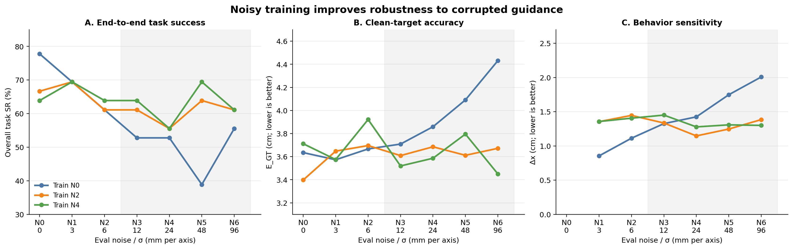

# Noisy training robustness：full rollout 与 state bank 联合分析

## 数据与协议

- Full rollout 来源：`reports/noisy_train_noisy_eval_full_rollout_pilot12_results_20260926.md`；每个 Train×Eval×Task 为 12 次 rollout，每个 Train×Eval 合并三个任务后为 36 次。
- State bank 来源：`reports/noisy_train_noisy_eval_state_bank_n24_m1_results_20260926.md`；18 个 task-stage、每 stage 24 个固定 expert state、`m=1`，每个 Train×Eval 为 432 条 short rollout。
- 两套实验都使用 N0/main-formal、N2/2026092201、N4/2026092201 三个 checkpoint，并测试 N0–N6 eval noise。
- Full rollout 测量从任务起点开始的端到端成功率，包含 compounding error；state bank 从统一 expert 中间状态恢复，主要测当前阶段的局部操控和 spatial grounding。

## 核心结果图

主图只保留 full-rollout overall SR、state-bank `E_GT` 和 `Δx`。三者分别对应最终任务鲁棒性、相对 clean target 的局部准确性和行为对错误 guidance 的敏感度；完整呈现与图注方案见 [`noisy_training_robustness_figure_plan_20260926.md`](./noisy_training_robustness_figure_plan_20260926.md)。

## Full-rollout overall SR

| Train | N0 | N1 | N2 | N3 | N4 | N5 | N6 | All eval |
|---|---:|---:|---:|---:|---:|---:|---:|---:|
| N0 | **77.8%** | **69.4%** | 61.1% | 52.8% | 52.8% | 38.9% | 55.6% | 58.3% |
| N2 | 66.7% | **69.4%** | 61.1% | 61.1% | **55.6%** | 63.9% | **61.1%** | 62.7% |
| N4 | 63.9% | **69.4%** | **63.9%** | **63.9%** | **55.6%** | **69.4%** | **61.1%** | **63.9%** |

把 N3–N6 定义为高噪声区间，可以更清楚地看到 robustness–clean performance trade-off：

| Train | Clean N0 SR | N3–N6 mean SR | 相对 clean 的变化 | Worst eval SR | All-eval SR |
|---|---:|---:|---:|---:|---:|
| N0 | **77.8%** | 50.0% | -27.8 pp | 38.9% | 58.3% |
| N2 | 66.7% | 60.4% | -6.3 pp | **55.6%** | 62.7% |
| N4 | 63.9% | **62.5%** | **-1.4 pp** | **55.6%** | **63.9%** |

这组结果支持以下判断：

1. N0 在 clean eval 上最好，但随 eval noise 增大显著退化。N0 从 77.8% clean SR 降到 50.0% high-noise mean，N5 只有 38.9%。
2. N2/N4 的 clean SR 较低，但噪声下退化小得多。高噪声平均 SR 相对 N0 分别提高 10.4 和 12.5 pp；worst-eval SR 都提高 16.7 pp。
3. N4 的 all-eval SR 最高，为 63.9%；N2 为 62.7%，均高于 N0 的 58.3%。因此从平均性能、worst-case 和 degradation slope 三个角度，noisy training 都表现出更强的抗 eval-noise 能力。
4. 代价是 clean performance：N2/N4 在 N0 eval 下分别比 N0 低 11.1/13.9 pp。这更符合 robustness–accuracy trade-off，而不是无代价的全面提升。

## State-bank n=24：SR 与四个连续指标

### 高噪声 N3–N6 汇总

距离单位为 cm。`G_parallel=<xδ-x0,δ>/||δ||` 是末端位移沿 guidance-noise 方向的有符号投影长度；`P(G>0)` 是逐 rollout 正方向响应的比例。

| Train | Current-stage SR | E_GT ↓ | E_input ↓ | Δx ↓ | G_parallel | P(G>0) |
|---|---:|---:|---:|---:|---:|---:|
| N0 | 86.92% | 4.023 | 8.997 | 1.627 | 0.008 | 49.42% |
| N2 | 86.46% | 3.645 | 8.723 | **1.279** | -0.034 | 48.55% |
| N4 | **87.73%** | **3.588** | **8.695** | 1.335 | **0.149** | **51.56%** |

相对 N0：

- N2：E_GT 降低 0.378 cm（9.4%），E_input 降低 0.274 cm（3.0%），Δx 降低 0.349 cm（21.4%）；SR 基本不变（-0.46 pp）。
- N4：E_GT 降低 0.435 cm（10.8%），E_input 降低 0.302 cm（3.4%），Δx 降低 0.292 cm（18.0%）；SR 提高 0.81 pp。

### 四个指标分别说明什么

1. **Current-stage SR：**三个策略都约为 86–88%，存在明显 ceiling effect，因此 state bank SR 对小差异不敏感。N4 虽排名第一，但相对 N0 只高 0.81 pp；逐 eval-noise 的 paired McNemar 检验没有确认显著差异。这里更适合用 SR 证明 noisy training 没有破坏当前阶段完成能力，而不是单靠它证明明显提升。
2. **E_GT：**这是最直接的任务正确性指标。高噪声下 N2/N4 的终点比 N0 更接近 clean GT，且 N4 最低。尤其在 N6，N4 为 3.451 cm，N0 为 4.431 cm。它支持 noisy training 减少了错误引导点造成的实际定位偏差。
3. **E_input：**随着 eval noise 从 N3 增到 N6，三种策略的 E_input 都从约 4 cm 增到约 16 cm，而 E_GT 保持在约 3.5–4.4 cm。这说明 policy 并没有把末端直接移动到严重偏移的输入点。N2/N4 的 E_input 略低于 N0，但差异远小于噪声幅度本身；它需要和 E_GT、Δx 联合解释。
4. **Δx：**N2/N4 的实际行为终点相对 clean rollout 移动更少，高噪声平均分别比 N0 低 21.4%/18.0%。这是“同一个中间 state 遇到错误标注时，动作受影响更小”的直接证据。N2 在这一指标上优于 N4。
5. **G_parallel：**该指标满足 `G_parallel=Δx cosθ` 和 `|G_parallel|≤Δx`，所以不会再因小 `||δ||` 产生旧 gain 的极端值。正值表示 noisy guidance 对行为产生正确方向的影响，负值表示相反方向，绝对值表示沿该方向实际移动了多少厘米；垂直方向的位移仍由 Δx 补充。

### G_parallel 与 E_input 的联合解释

| 现象 | G_parallel | E_input | E_GT | 解释 |
|---|---:|---:|---:|---|
| 正确且充分 following | 正且较大 | 低 | 取决于噪声是否正确 | policy 正确使用 guidance |
| 正确但弱响应 | 正但较小 | 较高 | 较低 | policy 部分抑制 noisy guidance |
| 对 guidance 不敏感 | 约 0 | 高 | 可保持较低 | policy 忽略或过滤输入扰动 |
| 反向/异常响应 | 负 | 通常较高 | 通常较高 | guidance influence 未被正确识别 |
| 盲目跟随错误点 | 正且接近 `||δ||` | 低 | 高 | tracking 成功但 task grounding 错误 |

重算后，N0 的 N1–N6 mean G_parallel 只在 -0.033 至 0.082 cm 间波动，P(G>0) 大多约 50%，没有稳定方向性。N2 的高噪声 G_parallel 为 -0.034 cm、P(G>0)=48.55%，结合最低 Δx，说明其 robustness 更像来自降低对 guidance 的敏感度。N4 的高噪声 G_parallel 为 0.149 cm、P(G>0)=51.56%；N1–N5 的 mean 均为正，而 N6 接近 0。这提示 N4 保留了更多正确方向的 following，同时对极端噪声降低响应。

该信号仍具有 stage 异质性。N4 的 high-noise mean G_parallel 在 one_leg、round_table、lamp 分别为 0.390、0.031、0.085 cm，对应 P(G>0)=52.7%、53.4%、48.4%。总体正均值主要受 `one_leg/leg-top-place`（1.782 cm）和 `lamp/bulb-base-screw`（0.987 cm）影响。关键的 `round_table/base-leg-pick` 虽有 56.2% 正方向比例，但 mean 为 -0.094 cm，说明多数小幅正向响应与少数较大反向响应可以同时存在；mean G_parallel 和 P(G>0) 必须并列报告。

不过三个策略的 P(G>0) 都非常接近 50%，median G_parallel 也接近 0，当前 `m=1` 不能证明稳定的 directional following。正式 `m=2` 应使用 clean-vs-clean endpoint jitter 标定 dead zone `τ`，报告 correct (`G>τ`)、opposite (`G<−τ`) 和 insensitive (`|G|≤τ`) 三类比例。策略鲁棒性仍由 SR、E_GT 和 Δx 主导，G_parallel 用于区分“正确利用 guidance”和“通过不敏感获得鲁棒性”。

## 两套实验如何形成一致证据

state bank 去掉了前序错误，显示 noisy training 的局部作用机制：在相同 expert state 和相同噪声向量下，N2/N4 的 E_GT 与 Δx 更低，即当前阶段对错误 guidance 的响应更稳定。

full rollout 保留了 compounding error，显示局部稳定性如何转化为最终任务结果：N0 在高噪声下连续阶段的偏差更容易累积，overall SR 降到 50.0%；N2/N4 分别维持在 60.4%/62.5%。因此可以形成如下因果叙事：

> noisy training regularizes the policy response to corrupted guidance. It reduces local endpoint deviation from the clean target and limits behavior displacement from the clean rollout; over long-horizon execution, these local gains reduce compounding failures and improve average and worst-case task success under guidance noise.

## Task/stage 异质性

总体提升不是三个任务均匀贡献的，而是主要来自 round_table：

| Experiment / metric，N3–N6 | N0 | N2 | N4 |
|---|---:|---:|---:|
| Full rollout one_leg SR | **89.6%** | 85.4% | 87.5% |
| Full rollout round_table SR | 16.7% | 54.2% | **66.7%** |
| Full rollout lamp SR | **43.8%** | 41.7% | 33.3% |
| State bank round_table stage SR | 82.74% | 87.65% | **88.69%** |
| State bank round_table E_GT (cm) | 3.824 | 3.133 | **2.817** |
| State bank round_table Δx (cm) | 1.979 | 1.104 | **1.062** |

在 state bank 中，N4 相对 N0 最大的 SR 增益来自 `round_table/base-leg-pick`（+44.8 pp）。去掉该 stage 后，高噪声 pooled SR 重新由 N0 领先。full rollout 中也只有 round_table 出现非常大的提升：N4 相对 N0 提高 50.0 pp；one_leg 与 lamp 没有提高。

因此现有结果支持的是：

> noisy training 在平均意义上提高了对 guidance noise 的鲁棒性，且收益集中在需要精确 spatial grounding、错误容易累积的任务阶段。

现有结果不支持以下更强表述：

> noisy training 对所有任务、所有阶段都能提高成功率。

## N2 与 N4 的选择

- Full rollout 的 average、high-noise mean 和 worst-case 指标整体偏向 N4。
- State bank 的 E_GT、E_input、SR 和正向 G_parallel 偏向 N4；Δx 偏向 N2。
- N3–N6 的 N4 与 N2 连续指标 paired bootstrap 区间均跨 0，当前不能证明 N4 显著优于 N2。

因此当前可以把 N4 称为“端到端 robustness 且保留更多正确 following 的最佳候选”，把 N2 称为“通过降低行为敏感度获得稳定性的候选”；不能下结论说训练噪声越大越好，也不能把 N4 宣称为确定最优幅度。

## 结论边界与下一步

当前证据来自一个 checkpoint/condition、full rollout 每任务 12 次、state bank `n=24,m=1`。此外，当前 registry 使用的 N0 是 `main-formal`，而 N2/N4 是 `2026092201` noisy campaign checkpoint；在作严格的“训练噪声导致提升”因果表述前，应再次确认三者的数据域、样本量和训练协议完全匹配。

最稳妥的论文结论是：

1. noisy training 明显降低了模型对高幅度 guidance corruption 的性能退化；
2. state-bank 连续指标表明这一收益来自更低的 GT endpoint error 和更小的行为扰动；
3. full rollout 表明这些局部收益能够在部分长序列任务中减少 compounding failures；
4. 收益具有明显 task/stage specificity，N2 与 N4 的最优性仍需 `m=2` 和 3 seeds 验证。
